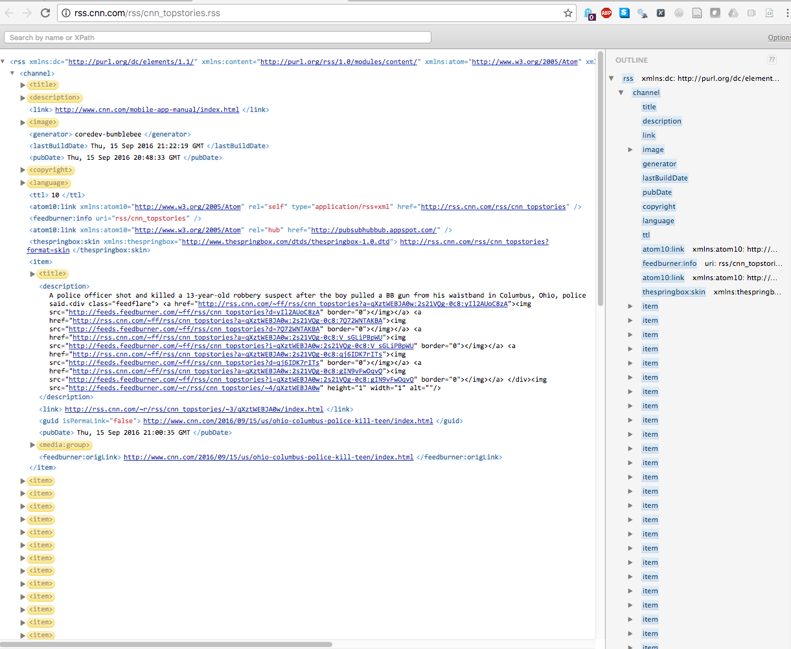
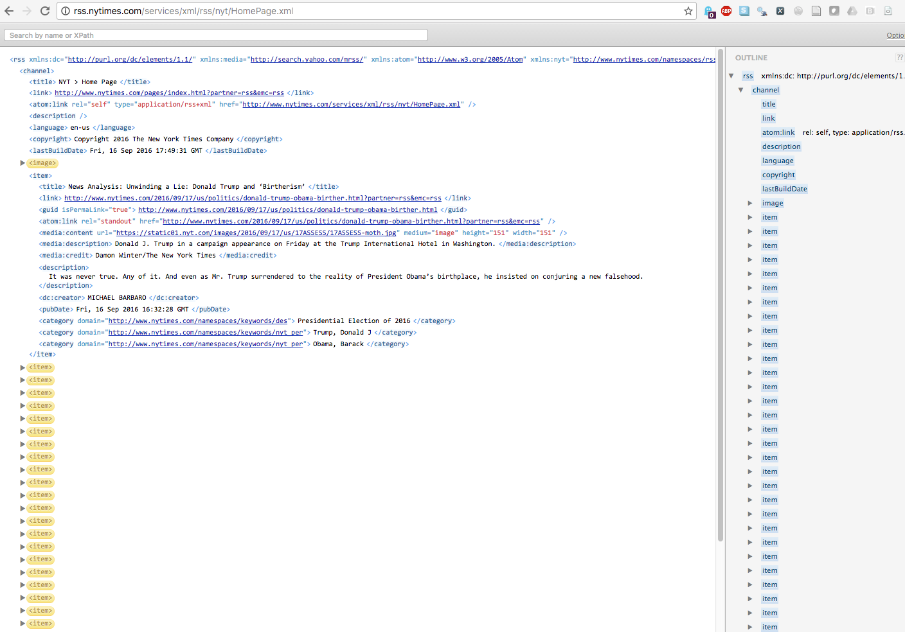
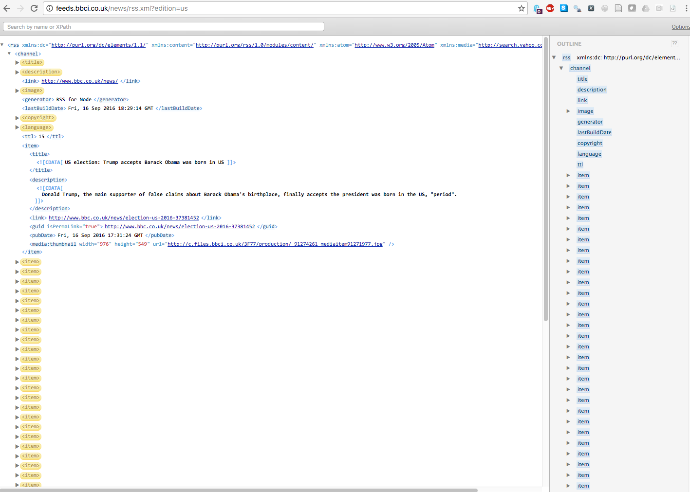

## Other Data types

Not all data is rectangular. In this lab, we will deal with a
non-rectangular data set and reshape it for some simple analysis.

## RSS data feeds

On most phones, you can see that you can get the latest headlines and
a short description of current news articles. How does this happen?

News organizations such as the New York Times, CNN, BBC etc., provide
Rich Site Summary (RSS) feeds via a URL. News aggregators can query
that URL to get the latest headlines and summaries. (Some may be
behind paywalls.)

For example, [http://www.nytimes.com/services/xml/rss/index.html](here
is the RSS feed) of the [New York Times](http://www.nytimes.com).

In this lab exercise, we will explore how these data are actually
structured and how one may write programs to consume such data and do
something useful.

### The XML data format

RSS feed data are stored in an XML (e__X__tensible __M__arkup
__L__anguage) format. What exactly is this format? Let us look at a
simple example of XML data.

```
<?xml version="1.0"?>
<scientist>
  <name>
    <first_name>Ronald</first_name>
    <middle_name>Aylmer</middle_name>
    <last_name>Fisher</last_name>
  </name>
  <dates dob="1890-02-17" dod="1962-07-29" />
  <profession>statistician</profession>
  <profession>mathematician</profession>
  <profession>geneticist</profession>
</scientist>
```

- There is a first line that signifies that this is an XML
  document. We take it, as is.
- The rest of the data consists of character data or strings.
- Some strings beginning with angled brackets come in _matched pairs_,
  indicating _markup tag_, i.e., they enclose a data value between
  them. Example: `<first_name>` and `</first_name>` are markup tags
  that enclose a first name. Thus, a program should be able to extract
  the first name by merely extracting the string between these two
  tags. Similarly `<scientist>` and `</scientist>` enclose several
  _children_ (`<name>`, `<dates>`, `<profession>`) and grandchildren
  tags, namely `<first_name>`, `<middle_name>`, `<last_name>`).
- One tag, `<dates>`, has no further children and is used in an
  abbreviated form (ending in `/>`)
- One tag, `<dates>` has some _attributes_ `dob` and `dod` indicating
  dates of birth and death

We omit many other details and this short introduction will suffice for
us. Further reading is indicated below, if you are interested.

Note that XML is really a sort of hierarchical data format with
arbitrary tags but some strict rules (matched tags, etc.). The tags
can be conceptually thought of as nodes in a tree with branches
containing further nodes or terminating in a leaf node. (Indeed, with
most non-trivial data, we quickly have large and/or bushy trees.)
HyperText Markup Language (or HTML) is also a dialect of XML, except
that it has a prescribed set of tags and is less strict about rules
and is also mostly interpreted by browsers.

Despite the fact that one can use arbitary tags in XML and nest them,
the structure can be made quite precise and therefore programs can
readily consume and produce them. This accounts for their popularity
among other things. For example, everytime you play a song on your
iPhone, the file `iTunes Music Library.xml` (located under the
subfolder `iTunes` of `Music` in your home folder on a Mac) is
updated, incrementing a counter for that song that is marked up by a
tag.

Aside: The extensibility of XML---you can make up your own tags---and
the automatic processing of XML by programs are conflicting in a
way. A deterministic program requires knowledge of which tags to
expect and which tags are allowable as children of which other tags,
in order to perform without errors. We merely remark that there are
ways to validate XML documents by pre-specifying the expected
structure; we don't discuss them here as that would take us too far
off course.

## Lab Exercise

Here are the RSS feeds of
[CNN](http://rss.cnn.com/rss/cnn_topstories.rss) and
[New York Times](http://rss.nytimes.com/services/xml/rss/nyt/HomePage.xml)
and [BBC](http://feeds.bbci.co.uk/news/rss.xml?edition=us).

We will explore reading, cleaning and manipulating the data for the
following tasks.

1. Figure out how many stories are there in each RSS feed.
2. See what percent of stories feature presidential candidates Donald
   Trump and Hilary Rodham Clinton.
3. Think of a good way to organize all of news data.
4. Visualize the focus of the stories in a simple way by creating a
   wordcloud for the three sites.

### Step 1. Understand the XML structure

Let us try to understand how the RSS feed data actually looks. You
would think that by just visiting the RSS feed site, you might be able
to discern the structure. Unfortunately, this is not very
straightforward since most RSS feed sites detect that a browser is
being used and automatically present the contents as a web page. So
here is a picture with the structure.

#### CNN RSS Structure



#### NYTimes RSS Structure



#### BBC RSS Structure



####
__Aside__: Do this on your own time. If you want to view the XML in a nice
way, use an
[XML viewer plugin](https://chrome.google.com/webstore/detail/xv-%E2%80%94-xml-viewer/eeocglpgjdpaefaedpblffpeebgmgddk)
and configure its options to intercept any RSS feeds in a
browser. Then, if you open the
[CNN URL](http://rss.cnn.com/rss/cnn_topstories.rss) in a browser, the
structure will be shown as in the picture above.

####

A quick examination shows that the stories are marked up using
`<item>` tags. And within an item, the headline is marked up with
`<title>` and the summary with `<description>`. Therefore, we are only
interested in parts of the XML tree containing these tags; the rest of
the data is to be ignored. This means we need a way to match part of
the tree of interest to us. We do this in fashion analogous to how we
locate files or folders in a computer.

To specify the `iTunes` subfolder of your `Music` folder, we can use
the construct (called the _path_ expression) `Music/iTunes`, where the
`/` is used as a separator. The home directory for a user `joe` on a
Mac, for example is `/Users/joe`.  The latter is an unambiguous
construct since it begins with a `/` specifying the root of the
directory structure. Continuing, the unambiguous path for user `joe`'s
iTunes directory would be `/Users/joe/Music/iTunes`.

The analogs for titles and descriptions are `item/title` and
`item/description` and these are called, naturally enough, _Xpath_
expressions.  The precise Xpath constructs, however, are
`/rss/channel/item/title` and `/rss/channel/item/description`,
specifying the full pedigree of the tags. The starting slash
indicates that we want to start from the root of the tree. A lazier
Xpath construct would be `//item/title` for title and
`//item/description` for description. The double slashes indicate that
we are not specifying what may occur between the two slashes. Thus
`/foo/item/title` would be a match and included as would
`/bar/item/title`. Thus `//item/title` shortcut ensures that we would
match _every_ `title` tag that is a child of an `item` tag, no matter
how deep or where in the tree it occurs. (Note that this may not be
what one desires in every situation, but it would certainly suffice in
our case since the title tag is always a child of an item tag.)

In order to avoid issues with real time feeds, we downloaded the feeds
at 2:19pm on September 27, 2016, after the first presidential debate
from CNN, NYT and BBC. The source for the live feeds is left commented
(using leading `##`) in the code below. If you wish to use the real
time feed, uncomment the line as noted.

### 1. How many stories?

We will use a library called `xml2` to handle the processing of the
RSS XML data. So we load the library and call the `read_xml` function
from `xml2` to read the data, starting with CNN.

```{r}
library(xml2)
cnn_feed <- "./data/cnn-rss.xml"
## Uncomment the next line to use real time CNN feed!
##cnn_feed <- 'http://rss.cnn.com/rss/cnn_topstories.rss'
cnn_xml <- read_xml(x = cnn_feed)
```

We parse out the titles and descriptions using the Xpath expressions
using the `xml_find_all` function.

```{r}
title_xpath <- "/rss/channel/item/title"
description_xpath <- "/rss/channel/item/description"
cnn_titles <- xml_find_all(x = cnn_xml, xpath = title_xpath)
print(cnn_titles)
```

Ok, we've narrowed down the nodes, but we still find the printed items
containing the markup tags like `<title>` and `<description>`. The
function `xml_text` will remove that for us and provide us just the
text.

```{r}
cnn_titles <- xml_text(x = cnn_titles)
print(cnn_titles)
```

There, finally.

Note that we had to call a series of functions in order to process
this data and that naturally fits into the pipeline pattern. Thus, all
of the above processing may be succinctly performed using the piping
operator `%>%`:

```{r}
library(magrittr)
cnn_titles <- cnn_xml %>%
    xml_find_all(xpath = title_xpath) %>%
    xml_text
```

We can repeat this for the NYT and BBC.

```{r}
## NYT
nyt_feed <- "./data/nyt-rss.xml"
## Uncomment the next line to use real time NYT feed!
##nyt_feed <- 'http://rss.nytimes.com/services/xml/rss/nyt/HomePage.xml'
nyt_xml <- read_xml(x = nyt_feed)
nyt_titles <- nyt_xml %>%
    xml_find_all(xpath = title_xpath) %>%
    xml_text

## BBC
bbc_feed <- "./data/bbc-rss.xml"
## Uncomment the next line to use real time BBC feed!
##bbc_feed <- 'http://feeds.bbci.co.uk/news/rss.xml?edition=us'
bbc_xml <- read_xml(x = bbc_feed)
bbc_titles <- bbc_xml %>%
    xml_find_all(xpath = title_xpath) %>%
    xml_text
```

So the answer to question 1.

```{r}
print(paste("# CNN Stories:",
            length(cnn_titles),
            "# NYT Stories:",
            length(nyt_titles),
            "# BBC Stories:",
            length(bbc_titles)))
```

The above method of concatenating a bunch of things to print is so
common that there is a built-in function called `cat` (for conatenate
and print) that we can use; the only catch is that we have to also
provide a new line character (`"\n"`) so that the cursor moves to the
next line after printing. (Also the annoying `[1]` goes away!)

```{r}
cat("# CNN Stories:",
    length(cnn_titles),
    "# NYT Stories:",
    length(nyt_titles),
    "# BBC Stories:",
    length(bbc_titles),
    "\n")
```

We shall use `cat` henceforth.

### 2. What percent of stories mention presidential candidates?

This requires us to work with the story content and so we will get the
descriptions first, following the same methods above.

```{r}
cnn_descriptions <- cnn_xml %>%
    xml_find_all(xpath = description_xpath) %>%
    xml_text

nyt_descriptions <- nyt_xml %>%
    xml_find_all(xpath = description_xpath) %>%
    xml_text

bbc_descriptions <- bbc_xml %>%
    xml_find_all(xpath = description_xpath) %>%
    xml_text
```

We'll assume that the words we are looking for are 'Trump' and
'Clinton', although this approach is not perfect since Hillary is also
used at times!

This is a common enough task: looking for an occurrence for a text
pattern in a corpus or data. There is a whole language (_regular
expressions_) for expressing textual patterns and we will not go into
the details here. However, it is good to familiarize ourselves with a
basic R function to search for patterns called `grep` (really an
acronym for __g__lobally search a __r__egular __e__xpression and
__p__rint. Our search is for very simple strings.

By default, the R `grep` function will return those indices where a
match occurs. See below.

```{r}
junk <- c("foo", "bar", "foobar")
grep(pattern = "foo", x = junk)
```
The result indicates that `foo` was found in positions 1 and 3 of the
vector `junk`.

By contrast, the `grepl` function returns where a match was found or
not.

```{r}
grepl(pattern = "foo", x = junk)
```

To count the number of mentions of "foo", we can just sum the output
of `grepl` and R takes care of converting `TRUE` to 1 and `FALSE`
to 0.

```{r}
sum(grepl(pattern = "foo", x = junk))
```

This is what we do below to count mentions.

```{r}
cnn_clinton_mentions <- sum(grepl("Clinton", cnn_descriptions))
nyt_clinton_mentions <- sum(grepl("Clinton", nyt_descriptions))
bbc_clinton_mentions <- sum(grepl("Clinton", bbc_descriptions))

cnn_trump_mentions <- sum(grepl("Trump", cnn_descriptions))
nyt_trump_mentions <- sum(grepl("Trump", nyt_descriptions))
bbc_trump_mentions <- sum(grepl("Trump", bbc_descriptions))

cat("CNN Clinton mentions:",
    cnn_clinton_mentions/length(cnn_titles),
    "NYT Clinton mentions:",
    nyt_clinton_mentions/length(nyt_titles),
    "BBC Clinton mentions:",
    bbc_clinton_mentions/length(bbc_titles),
    "\n")
cat("CNN Trump mentions:",
    cnn_trump_mentions/length(cnn_titles),
    "NYT Trump mentions:",
    nyt_trump_mentions/length(nyt_titles),
    "BBC Trump mentions:",
    bbc_trump_mentions/length(bbc_titles),
    "\n")


```

At the time we did this, Trump appeared to be getting more attention.

### 3. Organize the data

Since the number of stories are different for the various sites, one
obvious way is to create a separate data frame for each. If we do
that, in order to ensure that R does not treat strings as factors, we
have to specify `stringsAsFactors = FALSE`.

```{r}
cnn <- data.frame(title = cnn_titles, description = cnn_descriptions,
                  stringsAsFactors = FALSE)
nyt <- data.frame(title = nyt_titles, description = nyt_descriptions,
                  stringsAsFactors = FALSE)
bbc <- data.frame(title = bbc_titles, description = bbc_descriptions,
                  stringsAsFactors = FALSE)
```

However, it is obvious that this is unsatisfactory because the entire
data is in three different places.  It would better to aim for a
_single tidy_ data set.

A natural way thought for the single data frame is to add a column for
the site (`CNN` or `NYT` or `BBC`) in addition to the `title` and
`description` columns as above.

While we are it, we can use `tibble`s to avoid the `stringsAsFactors`
hassle.

```{r}
library(tibble)
site <- c(rep("CNN", length(cnn_titles)),
          rep("NYT", length(nyt_titles)),
          rep("BBC", length(bbc_titles)))
news <- tibble(site = site,
               title = c(cnn_titles, nyt_titles, bbc_titles),
               description = c(cnn_descriptions, nyt_descriptions, bbc_descriptions))
str(news)
```

### 4. Wordcloud

Word clouds are a popular way to describe topic areas that textual
matter pertains to: the more frequent a term, the more prominently it
is displayed in a word cloud.

For this purpose, we will make use of some packages for processing
data, (`dplyr`), for text mining (`tm` and `tm.plugin.webmining`) and
for generating word clouds (`wordcloud`).

```{r}
library(dplyr)
library(tm)
library(rvest)
library(wordcloud)
```

Our goal is to take all the descriptions from the CNN articles and
combine them into one long string of words. Here are the steps.

- Filter rows including only those pertaining to the CNN site:
  `filter( site == "CNN" )`
- Select the `description` column and disregard all others:
  `select( description )`
- Summarize, i.e., generate only one value by concatenating all the
  descriptions and name the summary `words`:
  `summarize(words = paste(description, collapse = " "))`

The last invocation of the `paste` command concatenates the
descriptions with a space (`" "`) in between.


```{r}
library(dplyr)
cnn_words <- news %>%
    filter( site == "CNN") %>%
    select( description) %>%
    summarize(words = paste(description, collapse = " "))
```

Now we can just focus on the concatenated string:

```{r}
cnn_words <- cnn_words$words
```

If you print `cnn_words`, you will find that there are a whole bunch
of HTML markup and crud in addition to the words. So we need to clean
them up. We also want to remove some common words that are not of
interest.

The `rvest` package provides a facility to remove HTML markup. For
example,

```{r}
library(rvest)
'This is <a href="http://foo.com">REMOVE STUFF AROUND ME</a>' %>%
    read_html %>%
    html_text
```
will remove the HTML markup. Note that this approach does not work
with text that does not contain HTML! Try running this code to see this.

```
'No HTML here' %>%
    read_html %>%
    html_text
```

Next the `tm` package provides a way of removing punctuation
(`removePunctuation`) and some words not of interest, the so called
`stopwords` function. You can examine what these stop words are.

```{r}
print(stopwords())
```
The call `stopwords('SMART')` that provides a larger set of stop words
and so it makes sense to use the union set of the two to really clean
up. Some sites also include the day of the week (Monday, Tuesday,
etc, so let's include those as well.

```{r}
our_stopwords <- union(stopwords(), stopwords('SMART'))
our_stopwords <- union(our_stopwords,
                       c("sunday", "monday", "tuesday", "wednesday",
                         "thursday", "friday", "saturday"))
```

```{r}
cnn_words <- cnn_words %>%
    read_html %>%
    html_text %>%
    removePunctuation %>%
    tolower() %>%
    removeWords(our_stopwords)
```

With this, we can now plot the word cloud.

```{r}
wordcloud(words = cnn_words, min.freq = 2, max.words = 25, random.order = FALSE)
```

We can now do the same for the other two sites. Except there is a
slight difference. NYT and BBC use internationalization, which means
the text in the descriptions is not just plain ASCII, but includes
some odd characters such as `<U+201C>`. For example, the apostrophe in
`Trump's` is often encoded as a Unicode string. This means that code
that constructs word clouds can miscount the occurrence of the words.

The easiest way to handle this problem is to detect if the encoding of
a text is `UTF-8` and convert it to ASCII, and set all such characters
to the empty string. We do that in the invocation of `iconv` below
where `sub` is set to the empty string.

That is not the only difference, however. While CNN used some HTML
tags in the descriptions, NYT and BBC don't! So we have to detect if
there is HTML. If it is there, we remove it as shown above, else we do
nothing.

This offers us an opportunity to write a small (simplistic) function
that will do the job. We exploit the the `grepl` function we saw
earlier that detects whether a pattern exists or not in strings.

```{r}
stripHTMLIfPresent <- function(string) {
    if (grepl("<.*?>", string)) {
        html_text(read_html(string))
    } else {
        string
    }
}
```
Read the above function as follows: if `string` contains any number of
characters between angled brackets, it contains HTML so strip HTML
stuff, else just return it unmodified. This will do for us.

<!-- Idea is to not have to use the $, like locally attaching -->

Also, to make things more compact in the pipeline below, we have used
the `with` function in R which evaluates an expression within the
context of a data frame: `with(data.frame(x = 1, y = 2), x)` will
return the value of `x` which is 1.

So here is how we handle NYT and BBC. (To be safe, even the CNN
pipeline should use our `stripHTMLIfPresent` function to ensure our
code works even if CNN decides not to include HTML! We leave that as
an exercise.)

```{r}
nyt_words <- news %>%
    filter( site == "NYT") %>%
    select( description) %>%
    summarize(words = paste(description, collapse = " ")) %>%
    with(words) %>%
    stripHTMLIfPresent %>%
    removePunctuation %>%
    tolower() %>%
    removeWords(our_stopwords) %>%
    iconv(from = "UTF-8", to = "ASCII", sub = "")
wordcloud(words = nyt_words, min.freq = 2, max.words = 25, random.order = FALSE)
```

```{r}
bbc_words <- news %>%
    filter( site == "BBC") %>%
    select( description) %>%
    summarize(words = paste(description, collapse = " ")) %>%
    with(words) %>%
    stripHTMLIfPresent %>%
    removePunctuation %>%
    tolower() %>%
    removeWords(our_stopwords) %>%
    iconv(from = "UTF-8", to = "ASCII", sub = "")
wordcloud(words = bbc_words, min.freq = 2, max.words = 25, random.order = FALSE)
```

Let's use some colors. A package called `RColorBrewer` makes it very
easy to generate color combinations to display divergence, or
sequential trends etc.


```{r}
library(RColorBrewer)
palette <- brewer.pal(n = 9, name="Blues")
```

Our palette has 9 blue colors varying in intensity of blueness.

#### CNN

```{r}
wordcloud(words = cnn_words, min.freq = 2, max.words = 25, random.order = FALSE, colors = palette)
```

#### NYT

```{r}
wordcloud(words = nyt_words, min.freq = 2, max.words = 25, random.order = FALSE, colors = palette)
```

#### BBC

```{r}
wordcloud(words = bbc_words, min.freq = 2, max.words = 25, random.order = FALSE, colors = palette)
```


### Homework

5. Can you think of a reason why does the colored word cloud not have
   the same exact words as the black-and-white word cloud? We used the
   same data for each source, after all.

6. Run this markdown using the live feeds.(You only need to uncomment
   some lines above as noted!) Does the word cloud roughly concur with
   the news issues being discussed at the time you ran the markdown?


## Summary

We saw how data cleaning forms a major part of the work even for a
simple task such as word cloud generation. Many issues intrude when
processing data:

- The structure and format of data. Not all data are formatted for
  spreadsheets or even static
- Data to be cleaned or stripped includes some structured elements as
  well as non-structured elements. The former are often easier to
  handle than the latter
- Internationalization issues can play a role. We saw how NYT and BBC
  used extended character sets

And even after the cleaning process, the data was not perfect.

The 80/20 or 90/10 often applies: you get most of the way easily and
the last part may demand a substantial amount of work.


## Session Info

Run on `r date()`.

```{r}
sessionInfo()
```

