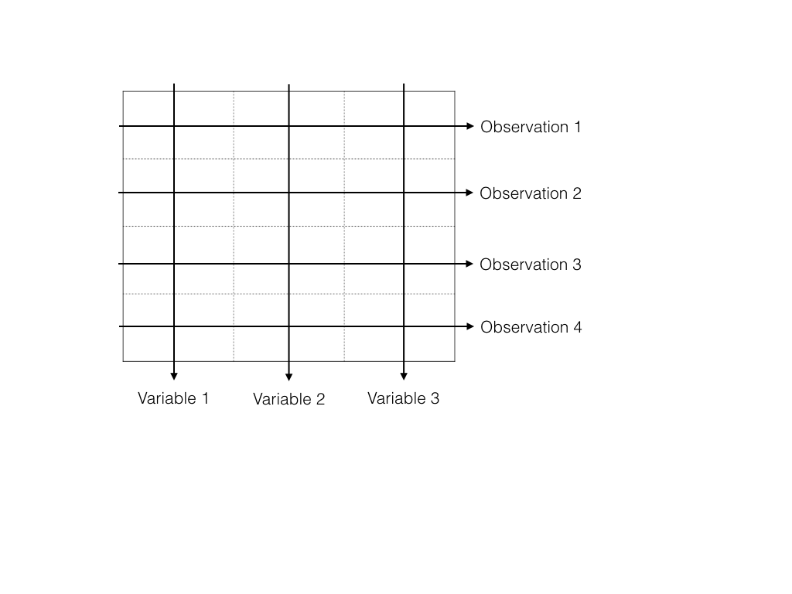
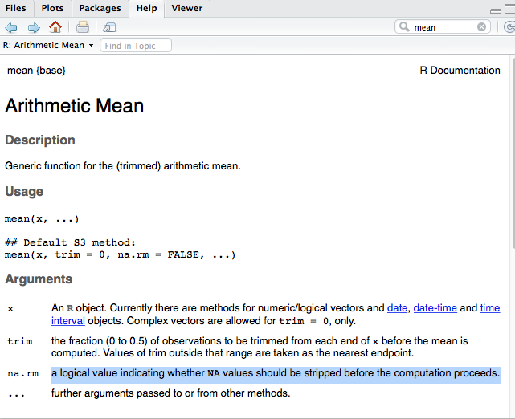

```{r setup, include=FALSE}
knitr::opts_chunk$set(echo = TRUE)
library(pacman)
pacman::p_load(ggplot2)
```

## Simple Data

We begin with data that is constructed within the R system
itself, without reference to any external resources.

The simplest type of data that we can process and describe is a column
of numbers.

```{r}
mpg <- c(21.0, 21.0, 22.8, 21.4, 18.7,
         18.1, 14.3, 24.4, 22.8, 19.2,
         17.8, 16.4, 17.3, 15.2, 10.4,
         10.4, 14.7, 32.4, 30.4, 33.9,
         21.5, 15.5, 15.2, 13.3, 19.2,
         27.3, 26.0, 30.4, 15.8, 19.7,
         15.0, 21.4)
```

The R construct `c(1, 2, 3)` is a simple way of constructing a vector
or column of the numbers 1, 2, 3 and the `<-` stands for assigning a
value to a variable named `mpg` in this case. (You can think of `mpg`
as the name for the column of numbers and use the name `mpg` wherever
you wish to use the column of numbers.)

##

Once such data is in R, we can manipulate it.

- What kind of structure is `mpg`? The function `str(mpg)` will tell us
about `mpg`.

```{r}
str(mpg)
```

## Mean of a list

The mean of a list of numbers is their sum divided by the length of the list.
Suppose our list is $[X_1,\dots,X_n]$, then the mean is
$$
\bar{X} = \frac{1}{n} \sum_{i=1}^n X_i.
$$

```{r}
c(mean(mpg), sum(mpg) / length(mpg))
```
## Standard deviation of a list

The standard deviation of a list is defined as the square-root of the sum of the squared
deviations around the mean, divided by **`n-1`** where `n=length(X)`. For our list
$[X_1,\dots,X_n]$, the deviations around the mean is the list
$[X_1-\bar{X}, \dots,X_n-\bar{X}]$.

The `n-1` is used
so that `sd(mpg)` is an **unbiased** estimate of a particular **population** parameter.
(At this point, you might scratch your head about the difference between
data and a population...or what "unbiased" means. More later.)

When `n` is large
there is little difference between using `n` and `n-1`. Some software divides by
`n` while `R` divides by `n-1`. If we divided
by `n` instead of `n-1` then we could define the standard deviation
as the square-root of the mean of the squared deviations around the mean.

We see then, that the standard deviation is
$$
SD([X_1,\dots,X_n]) = \sqrt{\frac{1}{n-1} \sum_{i=1}^n(X_i - \bar{X})^2 }.
$$
```{r}
c(sd(mpg), sqrt(sum((mpg - mean(mpg))^2) / (length(mpg)-1)))
```

## Assignment

- Assign the mean and standard deviation of `mpg` to quantities
`meanMPG` and `sdMPG` respectively

```{r}
meanMPG <- mean(mpg)
sdMPG <- sd(mpg)
```

The `<-` is R's **assignment operator**. Note that `=` may also be used
for assignment, and you may see both used in this class. Note also that the use of
`=` is more common in other languages. (There is a
good reason why developers prefer `<-` but we don't want to clutter
our discussion at this point.)

- Compute a summary of the data in `mpg`, assign it to `summaryMPG`
and print it.

```{r}
summaryMPG <- summary(mpg)
print(summaryMPG)
```

## The structure of an R object

- What kind of structure is `summaryMPG`?

```{r}
str(summaryMPG)
```
The quantity `summaryMPG` is more than just a vector of numbers: it
contains both values and some names like 

- `Min.`, 
- `1st Qu.`, 
- `Median`
    
etc. We'll discuss such more complicated structures as we encounter
them.

## Functions and where they come from (packages)

In the code above, we've also used **functions** in R
without explicitly saying so. 

- *Example*: the construct `str(mpg)`
invokes a function named `str` on the object
`mpg`. 

- Similarly, `mean`, `sd`, `summary` and others are functions
too provided by the basic R system.

Functions are the workhorses for everything that happens in R. The functions available to
you are a mix of

- those provided by the R system itself ("base" R functions)
- Those provided in **packages** created by others that you load as needed, which are usually designed to **augment the functionality** of base R 

Packages are available
in a repository known as CRAN. (This topic will be
discussed in the first lab!) 

In this course, we will explicitly state
what packages are needed when.

## Packages designed to replace parts of base R

- As R has become popular, some developers have created
packages that have improved upon functions that originally came with R

- Usually this is because the original implementations had quirks/drawbacks. 

- These
replacement functions often have names very similar to the originals
to make it easy to remember. 

- In practical work, one often installs a
number of such packages to overcome some limitations in the base
implementations. We'll introduce them as needed.

## Simple Data Relationships

The individual entries in columns of numbers like those in `mpg` are often referred to as
**observations**: measurements of some attribute on an
**observational unit**, also called in **experimental unit** or **subject**. 

Here, they happen to be the fuel efficiency
measurements in miles per gallon for 32 car models.

The measured attributes (like mpg) are referred to as **variables**. We will use the term variable and
attribute interchangeably.

Often **multiple variables** are measured on a subject, for example, the weight (in tons) of
each of the 32 car models. That would yield another column
of 32 numbers.


```{r}
wt <- c(2.62, 2.875, 2.32, 3.215, 3.44, 3.46, 3.57, 3.19,
        3.15, 3.44, 3.44, 4.07, 3.73, 3.78, 5.25, 5.424,
        5.345, 2.2, 1.615, 1.835, 2.465, 3.52, 3.435,
        3.84, 3.845, 1.935, 2.14, 1.513, 3.17, 2.77,
        3.57, 2.78)
```

So `wt` is a second column of numbers, **one corresponding to each entry in** 
`mpg`. We could measure more variables such as displacement, horsepower, transmission type,
etc., with the values for each being arranged into further
**parallel** columns of numbers.

## Information "stored" in the ordering

Obviously, the individual measurements are **related**, in that they are measurements taken on a single **subject**

- Each entry in `mpg` is the fuel economy of a single car model, and each entry in `wt` is the weight of a single car model
- We have **implicitly** put the numbers in the same order, so that the first entry of `mpg` and the first entry of `wt` are a **pair** of measurements of (mph,weight) for a single car model

So it would make sense to **keep them all together** so that the correspondence is
preserved, and we don't have to worry about accidentally changing the order of one of the vectors. 

## Basic object for holding data: tables

A natural way to do this is to zip together the parallel
measurements into one structure, for example, a spreadsheet-like
structure. Then 

- the rows would correspond to each observational unit
(also called _cases_) and columns would correspond to the variables
being measured such as `mpg`, `wt`, `transmission_type` etc. 

- Along each row, the variables are measured on the same observational unit
and therefore generally dependent.

<div align="center">

</div>

## `data.frame`

R provides a structure encapsulating this idea called the **data.frame**. A data frame for the `mpg` and `wt` would be:


```{r}
carData <- data.frame(mpg, wt)
```

Of course, the data frame has additional information than just the
pure columns of numbers; for example, the names of the columns, `mpg`
and `wt` are also included. Just as before, we can interrogate the
structure.

```{r}
str(carData)
```

When more than one attribute is measured on observational units, the
resulting data is **multivariate** data. Contrast with the **univariate**
data in the variable `mpg` alone. 

So data frames are natural
structures for multivariate data. (univariate
data is just multivariate data consisting of a single variable and so
nothing stops you from using a data frame for just one variable!)

##

We say that the data frame `carData` consists of two variables
`mpg` and `wt`. (This is a second use of the term _variable_, now in a data
frame context.)

Most data in the real world is multivariate and rectangular
shaped data is commonly used. But not all data is rectangular as we
will see later.

Computing summaries of variables in a data frame is just as simple.


```{r}
summary(carData$mpg)
```

This should yield the same result as `summary(mpg)` above. 

The `$`
construct is one way of selecting the variable of interest. So
`carData$wt` now refers to the `wt` variable in the `carData` data
frame. (And would be, in general, different from `anotherCarData$wt`
were there one!)

## Summary of a data frame

```{r}
summary(carData)
```

**Note**: other packages provide functions to compute the summaries
of all variables in a data frame, for example the function `describe`
from the package `Hmisc`. 

We'll use the syntax `Hmisc::describe` to
unambiguously refer to function `describe` in package `Hmisc`, with
the expectation that you can always install package `Hmisc` using the
standard menus in RStudio.

## Simple Data Types: factor

To continue our example with the car data, let us also include data on
the transmission type.


```{r}
transType <- c("manual", "manual", "manual", "automatic", "automatic",
               "automatic", "automatic", "automatic", "automatic",
               "automatic", "automatic", "automatic", "automatic", "automatic",
               "automatic", "automatic", "automatic", "manual", "manual",
               "manual", "automatic", "automatic", "automatic", "automatic",
               "automatic", "manual", "manual", "manual", "manual", "manual",
               "manual", "manual")
```
This variable is different from the `mpg` and `wt` we saw earlier: it
consists of character strings, not numbers. It is a **categorical variable** 
taking only two values: `automatic` and `manual`.

One could recode the `automatic` or `manual` as 0 and 1, but that
could cause confusion if you forget which type you map to which value.
As we are about to see, by default `R` handles this variable as
a **factor** anyway

## `data.frame` with mixed types

Of course it is easy to create a data frame with the transmission
type included.

```{r}
carData <- data.frame(mpg, wt, transType)
str(carData)
```

Notice how the structure now indicates that `transType` 
is a `Factor` with two levels (categories) which is R's  
nomenclature for categorical variables.

__Aside__: It is sometimes not desirable to have R make silent
assumptions about data (assuming above that `transType` is a factor,
for example). While facilities to prevent such silent **coercions** exist,
one has to remember to tell R every time. 

Coercion can become a problem with large datasets as the
conversion to factors often involves **significant computation** that might
be totally unnecessary. Therefore, new `data.frame`-like objects are
provided in recent packages like `tibble` by Hadley
Wickham or `data.table` by Matt Dowle. We discuss `tibble`s later.

## Matrices

Another object that shares this spreadsheet structure is a [_matrix_](https://en.wikipedia.org/wiki/Matrix_(mathematics)). 

Internally, `R` will often convert `data.frame`s to matrices, 
as most linear algebra computations are carried out using matrices.
We will not dwell on these computations in this course. 

One of the key differences between a `data.frame` and a `matrix`
is that within a `matrix`, all entries are of the **same type**. 
In a `data.frame`, different columns can have different types.

The concept of `matrix` is ubiquitous in scientific computing,
as many computational operations are expressed in terms of linear algebra and
matrices.

The concept of `data.frame` is fairly specific to statistics
or data science. As mentioned above, rows of 
a `data.frame` often represent different _subjects_ or _cases_
in a data set, while columns represent different
_features_ or _measurements_ on each case.

Roughly speaking, `data.frames` are good for storing,  
visualizing, and "munging" data; when you actually **compute**
something (like do a regression), a matrix is often involved

## Matrices and mixed types

```{r}
head(as.matrix(carData))
```

because there was a `character` column, all columns have been
converted to `character`. 

This is of no real use for computations.

## Matrices: `data.matrix`

```{r}
head(data.matrix(carData))
```

The function `data.matrix` tries to convert each variable to `numeric`. 

Factors
are coerced to their internal representation (in this case `1` or `2`).

If we were going to convert the two-level factor to a numeric, it might be
better to use `0` and `1` instead of `1` and `2`

## Matrices vs `data.frame`

- In `R`, `matrix` can have column names, though this is not true in 
many computing environments. 

- For data science, being able to identify columns with 
human interpretable names is very important.

- Integer indexing of matrices even differs by
computing environment (`[,1]` is the first column in `R`,
while `[:,0]` is the first column in `python`'s `numpy` library).

- Indexing errors can be important! Part of [Duke cancer
scandal](http://www.forbes.com/sites/fayeflam/2015/01/22/investigator-offers-lessons-from-precision-medicines-cancer-scandal/#4c2d010c1360) involved index errors. (However, there were many worse errors.)

## Internal copying of data

We saw that `data.frame` decided `transType` was a `Factor`. 

```{r}
str(carData$transType)
```

Is this the same data as what we had originally called `transType`?
```{r}
str(transType)
```

## Data frame and copies

What about `wt`?

```{r}
wt[1:5] = 0
str(wt)
```

Compare to what is in our data frame.
```{r}
str(carData$wt)
```

Generally, `R` (and other computing environments) may make copies of your data internally.

This is related to whether the environment passes arguments to functions **by value** or **by reference**
(`R` passes by value)

It is (sometimes) important to understand these copies to ensure your code is working properly.

## Restore `wt`

Let's make sure `wt` has the correct values in case
we want this vector later.

```{r}
wt = carData$wt
```

We just re-wrote the values in `wt` to equal those in `carData$wt` 

## `Factor` 

We saw that `data.frame` decided `transType` was a `Factor`. 

```{r}
carData$transType
```

We can also perform this transformation manually
```{r}
factor(transType)
```

## `Factor`

We saw that in constructing `carData`, `R` decided to set the `$transType`
attribute to be `factor(transType)` instead of the original storage type (character). 

It does this
as a convenience to us, though sometimes it may not be so convenient.

`Factor`s are used to concisely form models for our data, for example
when doing regression modeling

## `Factor`

Using a `Factor` makes it easy to group data. 

```{r}
ggplot(carData,aes(x=transType,y=mpg)) + geom_boxplot() + 
  theme(text=element_text(size = 24))
```

## Missing Values

We now add yet another measurement to our car data, the time to travel
1/4 mile from rest (0 velocity).

```{r}
qsec <- c(16.46, 17.02, 18.61, 19.44, 17.02, NA,
          NA, 20, 22.9, 18.3, 18.9, 17.4, 17.6,
          18, 17.98, 17.82, 17.42, 19.47, 18.52,
          19.9, 20.01, 16.87, 17.3, 15.41, 17.05,
          18.9, 16.7, 16.9, 14.5, 15.5, 14.6, 18.6)
```

- This variable is not unlike `mpg` or `wt`... 

- **But** it has some new values like `NA` interspersed betwen the numbers. 

- The symbol `NA` is used to
denote a **missing value**.  So `qsec` was **not measured** for car models 6 and 7.

## Missings: a fact of "real" data

Missing values are a feature of **real data** and in R they are given special
status and denoted as `NA`.

Including this data in our data frame is the same as for any other variable

```{r}
carData <- data.frame(mpg, wt, transType, qsec)
str(carData)
```

## Missing values

A distinguishing feature of a good statistical computing environment
is the ability to handle both data relationships and missing
values. 

Does `mean` work with missing values?

```{r}
mean(carData$qsec)
```

In R, numerical
computations with `NA` values will usually result in `NA` unless
one specifies how they are to be handled. 

A common choice is to
exclude missing values from the computation and many R functions make
that easy to do by specifying `na.rm = TRUE`. Such details are usually
part of the **help system** 

In RStudio, looking up help on
the function `mean` will show this:

<div align="center">

</div>

## Missing values

Now call `mean` again, telling it to remove `NA` values.

```{r}
mean(carData$qsec, na.rm = TRUE)
```

What about the `summary` function?

```{r}
summary(carData$qsec)
```
It seems to know what to do with missing values!

## Aside: NA and NaN

In `R`, the value `NA` is different from [`NaN`](https://en.wikipedia.org/wiki/NaN), 
which is an international standard meant to represent __Not a Number__, whereas `NA` is meant to represent __Not Available__ in `R`.

```{r}
vector_with_negative_values = c(-3,-2,3,4)
log(vector_with_negative_values)
```

Internally, `R` will by default treat `NaN` as `NA` so a value of `NA` may
not strictly mean that any data is __missing__.

```{r}
c(mean(log(vector_with_negative_values), na.rm=TRUE), mean(log(c(3,4))))
```

## Remarks on Data Frames

The data frame implementation in R has some default behaviors that are
useful for those who are very familiar with R, but troublesome in
general. The behaviors become especially troublesome when dealing with
data from an external source, which is almost always the case. Among
such behaviors are: 

- silently changing variable names in headers to conform to R syntax

- default conversion of character variables to
factors. 

There is computation behind these
behaviors that become significant when dealing with large
datasets. Although R does provide defaults to control the behaviors,
it would be preferable for defaults to be appropriate for modern data.

Hadley Wickham has developed a new package called `tibble` that
provides a data frame structure called (surprise!) `tibble` to addess
these issues. A `tibble` is also a data frame and so it may be
generally used wherever a data frame is called for.  We will explain
`tibble`s further as we proceed and use them where they seem
appropriate.

Tibbles are part of the ["tidyverse"](http://tidyverse.org/), which
includes various packages that replace parts of base R. We will
use several of these packages in the course for tasks at which they 
excel relative to base R functionality. For example, a few slides
ago I made a plot using `ggplot2`

## Summary

- We saw how simple data can be represented in columns, aka vectors
- We saw how to keep data relationships together in a data frame, which
  is a natural structure for storing multivariate/tabular data, the most
  common form of data.
- We briefly discussed the difference between `data.frame` and matrices.
- We saw how missing values pose no problem; they're denoted as `NA`
  in R. Functions in R can handle missing values although sometimes
  the user has to specify whether to ignore them or not.

