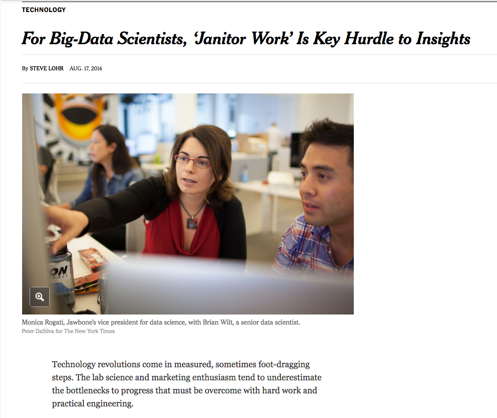
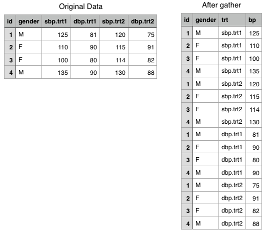

```{r setup, include=FALSE}
knitr::opts_chunk$set(echo = TRUE)
library(pacman)
pacman::p_load(tidyverse,nycflights13)
```


## NYT Article



## Key concept: Using R like a database

- A key to understanding what we'll do today is knowing just a little about relational **databases**

- Databases are a structure for storing tabular data

- The basic ideas are:

    1. The database consists of multiple **tables** each of which stores some data related to a particular topic/entity/etc
    2. Each table should have a variable that **uniquely identifies** every row/observation in the table. In database parlance this is called a **primary key**
    3. Non-duplication: if a variable's value can be completely determined by the value of another variable in the table, and has fewer unique values than the table has rows, then that variable should be stored in a second table with a smaller number of rows.
    
Recall the Bay Area Bike Share data from lab 1
```{r}
station <- read_csv(file='data/babs/201508_station_data.csv')
trip <- read_csv(file='data/babs/201508_trip_data.csv')
# eliminate spaces
nm <- names(trip); nm.no.whitespace <- gsub(" ","",nm)
names(trip) <- nm.no.whitespace
```

Let's remind ourselves what the trip data look like
```{r}
head(trip)
```

First, notice that there is a variable called `TripID`. I expect this is the unique identifier variable; the "primary key". Let's verify

```{r}
length(unique(trip$TripID))
nrow(trip)
```

The number of unique values of `TripID` is equal to the number of rows, so it is indeed a primary key.

There is a variable `StartStation` and another variable `StartTerminal`. Do these convey different information? Let's find out.

```{r}
trip %>% group_by(StartStation) %>% summarise(N.unique.terminal=n_distinct(StartTerminal)) %>% summarise(min.uniq=min(N.unique.terminal),max.uniq=max(N.unique.terminal))
```

There is exactly one value of `StartTerminal` for every value of `StartStation`, so it appears that `StartTerminal` is just a numeric code for `StartStation`. Therefore, this table is **not** in proper database format, since `StartTerminal` is duplicating the information in `StartStation`. Let's look at station, and see if `StartTerminal` is in there.

```{r}
head(station)
```

Well, not **explicitly**, but my strong suspicion is that `station_id` is the same as `StartTerminal` in `trip`, only with a different variable name. Let's assume I'm right. In that case, we can drop `StartStation` (and also `EndStation`) from `trip`. Let's do the same check for `EndStation` we did for `StartStation`

```{r}
trip %>% group_by(EndStation) %>% summarise(N.unique.terminal=n_distinct(EndTerminal)) %>% summarise(min.uniq=min(N.unique.terminal),max.uniq=max(N.unique.terminal))
```

Let's now drop `StartStation` and `EndStation`. What will this accomplish? It should use less memory, for one, which becomes a major issue when we work with big data. It will also save us computation time when we operate on the tibble.

```{r}
size.before <- object.size(trip)
trip <- trip %>% select(-StartStation,-EndStation)
size.after <- object.size(trip)
cat("decreased memory usage by: ",as.numeric((size.before-size.after)/size.before)*100," percent","\n")
```

That saved us a bit of space in memory. For data this size, it's not a big deal, but if the data were huge this could help a lot.

## Joining

- It's efficient to keep our data in multiple tables, but sometimes to do analysis, we need to **combine** data from several tables

- In databases, we do this by performing **join** queries using SQL (Structured Query Language)

- SQL is a natural language for doing these operations, and it has been around for decades, so many people know it. In fact, the recent shift to cloud storage resulted in a lot of products designed to allow analysts to write SQL code to access data in distributed storage, so that they didn't have to learn the new languages that are "native" to distributed architectures like scala

- `dplyr` contains a set of functions for joining data tables that have names nearly identical to the corresponding SQL statements

## Types of joins

- There are several types of joins:
    - Inner join: take two tables and merge them on a set of variables (the merge variables), keeping **only the observations** for which the merge variables exactly match in the two tables
    - Outer join: there are three flavors of the outer join
        1. Left outer join (aka left join): merge the tables on the merge variables, but keep all of the data from the first table, and only the observations from the second table for which the merge variables match exactly
        2. Right outer join (aka right join): merge the tables on the merge variables, but keep all of the data from the second table, and only the observations from the first table for which the merge variables match exactly
        3. Full outer join (aka "full join"): merge the tables on the merge variables, keeping all of the observations from both tables, even if they don't have a match on the merge variables in the other table
        
The best way to understand this is to do examples. In cases like the BABS data, where everything is very clean, the most common task is to perform an **inner join**. 

For example, suppose we want to know whether the number of bike docks at each station is roughly proportional to the number of trips originating at/ending at that station. If it isn't that would probably indicate an inefficient use of resources: some stations have too many/few docks. To do this, we'll first create a tibble containing the total number of trips originating at and ending at each station.

```{r}
trip.totals.start <- trip %>% group_by(StartTerminal) %>% summarise(N.trips=n()) %>% rename(station_id=StartTerminal)
trip.totals.end <- trip %>% group_by(EndTerminal) %>% summarise(N.trips=n()) %>% rename(station_id=EndTerminal)
trip.totals.start <- trip.totals.start %>% mutate(Terminus="start")
trip.totals.end <- trip.totals.end %>% mutate(Terminus="end")
trip.totals <- rbind(trip.totals.start,trip.totals.end)
head(trip.totals)
```

So this tibble has the info we wanted. Now let's **join** to the station tibble, which has the information on the number of bike docks at each station. In this case, we're doing an **inner join**, so we'll throw out anything that doesn't match. Since we expect there to be one row in `station` for every unique value of `station_id` in `trip.totals`, this should **not result in anything being thrown out by the join**. The easiest way to check that a join worked as expected is to **check that the number of rows in the resulting table is what you expected** and to look at a sample of the resulting table and **see that it matches the format you expect**

```{r}
cat("rows before: ", nrow(trip.totals), "\n")
trip.totals <- trip.totals %>% inner_join(station,by="station_id")
cat("rows after: ", nrow(trip.totals), "\n")
head(trip.totals)
```

Notice that we now have a lot more variables in our data...however, the dimensions did not change. Now we can answer our question about resource usage with a visualization

```{r}
ggplot(trip.totals,aes(x=dockcount,y=N.trips)) + geom_point() + facet_grid(~Terminus)
```

There appears to be only weak dependence between the number of docks and the number of trips starting and ending at each station. This suggests that efficiency of resource usage merits some further investigation.

There are many types of joins that are supported by dplyr, and we have just scratched the surface. For more info, check out the [vignette](https://cran.r-project.org/web/packages/dplyr/vignettes/two-table.html). We also may use some other join types in homework during the quarter.

## Reshaping data

- Another key operation is **reshaping** data. This is often critical for getting data ready to input into a function, which may expect data in a particular format

- The most common case in which I want to do this in my own workflow is taking output of models and getting it ready for `ggplot`. We will discuss `ggplot` graphics at length in week 4

- The basic reshaping operations are **gathering** and **spreading**, provided by `gather()` and `spread()` in `tidyr`

- We give a basic example here

Consider the `trip.totals` tibble that we just made. For simplicity, let's just select out the varialbes `N.trips`, `station_id`, and `Terminus`

```{r}
trip.totals <- trip.totals %>% select(station_id,N.trips,Terminus)
```

Recall its format
```{r}
head(trip.totals)
```

The data have one entry of `N.trips` for each combination of `Terminus` and `station_id`. It might be more convenient for some purposes to have two `N.trips` columns: one for the number of trips starting at that station, and another for the number of trips ending at that station. We can accomplish this by **spreading** the data

```{r}
trip.totals.spread <- spread(trip.totals,key=Terminus,value=N.trips)
head(trip.totals.spread)
```

This format is nice if we want to compare the number of trips that originate at each station to the number that end there. Again, this has implications for the efficiency of the system. We could make a graphic such as

```{r}
ggplot(trip.totals.spread, aes(x=start,y=end)) + geom_point()
```

There is apparently a strong relationship between the number of trips that start and end at each station. Note that while it was easy to make this plot with the spread data, it would be harder to make the plot that we previously made of the number of trips compared to the number of docks, faceting by start vs end. Over time, you'll develop a better sense of what the ideal format is for each plot type you'd like to make.


## Some slightly more advanced `dplyr`

A good data set to illustrate more functionality of `dplyr` is the US Bureau of
Transportation Statistics dataset of all 336776 flights that departed
from New York City in 2013. It is provided as a package
`nycflights13`.

The examples in this section are directly from the `dplyr` package
vignette.

```{r}
library(nycflights13)
dim(flights)
head(flights)
```

The functions in `dplyr` work on data frames and are geared to
specific tasks.

## Subset, or select rows

Select of a data set according to some criterion: the `filter` and
`slice` verbs.

To select all flights on January 1st:

```{r}
filter(flights, month == 1, day == 1)
```

In plain R, the equivalents are (note the use of the single
ampersand!):

```{r, eval = FALSE}
flights[flights$month == 1 & flights$day == 1, ]
```
or

```{r, eval = FALSE}
subset(flights, month == 1 & day == 1)
```

## 
To select all flights in January or February:

```{r, eval = FALSE}
filter(flights, month == 1 | month == 2)
```

To select specified rows, use `slice`:

```{r}
slice(flights, 1:6)
```
which is equivalent to the R version:

```{r}
head(flights)
```

The difference, of course, is that `slice` can get you arbitrary rows,
not just the head or tail.

### Reorder the rows

The order of the rows in the data set can be sorted according to one
or more variables or expressions you construct using `arrange`;

```{r}
arrange(flights, year, month, day)
```
will order the `flights` dataset first by `year`, and within `year` by
`month` and within `month` by `day`.

Use `desc()` to order a column in descending order:

```{r}
arrange(flights, desc(arr_delay))
```

## Select columns

Often only a few variables in a data frame are of concern for your
work. The verb `select` allows you to pick them and ignore others.

```{r}
# Select columns by name
select(flights, year, month, day)
# Select all columns between year and day (inclusive)
select(flights, year:day)
# Select all columns except those from year to day (inclusive)
select(flights, -(year:day))
```

There are a number of helper functions you can use within `select()`,
like `starts_with()`, `ends_with()`, `matches()` and
`contains()`. These let you quickly match larger blocks of variables
that meet some criterion. See `?select` for more details.

##

You can rename variables with `select()` by using named arguments:

```{r}
select(flights, tail_num = tailnum)
```

If instead you want to rename variables in a column (rather than
select some and drop others), use `rename`:

```{r}
dplyr::rename(flights, tail_num = tailnum)
```

## Extract distinct (unique) rows

Use `distinct()`to find unique values in a table:

```{r}
distinct(flights, tailnum)
distinct(flights, origin, dest)
```

Note how `distinct` only returns the variables specified!

## Add new columns

Besides selecting sets of existing columns, it's often useful to add
new (derived) columns that are functions of existing columns.  Enter `mutate`:

```{r}
mutate(flights,
  gain = arr_delay - dep_delay,
  speed = distance / air_time * 60)
```

## 

In `mutate` you can refer to columns that you've just created (useful
in complicated multi-step computations):

```{r}
mutate(flights,
  gain = arr_delay - dep_delay,
  gain_per_hour = gain / (air_time / 60)
)
```

## 

If you only want to keep the new variables (and drop the others) use
`transmute()`:

```{r}
transmute(flights,
  gain = arr_delay - dep_delay,
  gain_per_hour = gain / (air_time / 60)
)
```

## Summarise values

Summarizing reduces a data frame to a single row:

```{r}
summarize(flights,
  delay = mean(dep_delay, na.rm = TRUE))
```

## Randomly sample rows

You can use `sample_n()` and `sample_frac()` to take a random sample
of rows: use `sample_n()` for a fixed number and `sample_frac()` for a
fixed fraction.

```{r}
sample_n(flights, 10)
sample_frac(flights, 0.01)
```

Use `replace = TRUE` to perform a bootstrap sample. If needed, you can
weight the sample with the `weight` argument.

## Commonalities

You may have noticed that the syntax and function of all these verbs
are very similar:

* The first argument is a data frame.

* The subsequent arguments describe what to do with the data
  frame. Notice that you can refer to columns in the data frame
  directly without using `$`.

* The result is a new data frame

Together these properties make it easy to chain together multiple
simple steps, using pipes, to achieve a complex result.

## Grouped operations

The above verbs are useful on their own, but they become really
powerful when you apply them to groups of observations within a
dataset. In dplyr, you do this by with the `group_by()` function. It
breaks down a dataset into specified groups of rows. When you then
apply the verbs above on the resulting object they'll be automatically
applied "by group". Most importantly, all this is achieved by using
the same exact syntax you'd use with an ungrouped object.

Grouping affects the verbs as follows:

* grouped `select()` is the same as ungrouped `select()`, except that
  grouping variables are always retained.

* grouped `arrange()` orders first by the grouping variables

* `mutate()` and `filter()` are most useful in conjunction with window
  functions (like `rank()`, or `min(x) == x`). They are described in detail in
  `vignette("window-functions")`.

* `sample_n()` and `sample_frac()` sample the specified number/fraction of
  rows in each group.

* `slice()` extracts rows within each group.

* `summarise()` is powerful and easy to understand, as described in
  more detail below.

## Example from `dplyr` vignette

In the following example, we split the complete dataset into
individual planes and then summarise each plane by counting the number
of flights (`count = n()`) and computing the average distance (`dist =
mean(Distance, na.rm = TRUE)`) and arrival delay (`delay =
mean(ArrDelay, na.rm = TRUE)`). We then use ggplot2 to display the
output.

```{r, warning = FALSE, message = FALSE, fig.width = 6}
by_tailnum <- group_by(flights, tailnum)
delay <- summarise(by_tailnum,
  count = n(),
  dist = mean(distance, na.rm = TRUE),
  delay = mean(arr_delay, na.rm = TRUE))
delay <- filter(delay, count > 20, dist < 2000)

# Interestingly, the average delay is only slightly related to the
# average distance flown by a plane.
ggplot(delay, aes(dist, delay)) +
  geom_point(aes(size = count), alpha = 1/2) +
  geom_smooth() +
  scale_size_area()
```

## 

You use `summarise()` with __aggregate functions__, which take a
vector of values and return a single number. There are many useful
examples of such functions in base R like `min()`, `max()`, `mean()`,
`sum()`, `sd()`, `median()`, and `IQR()`. dplyr provides a handful of
others:

* `n()`: the number of observations in the current group

* `n_distinct(x)`:the number of unique values in `x`.

* `first(x)`, `last(x)` and `nth(x, n)` - these work
  similarly to `x[1]`, `x[length(x)]`, and `x[n]` but give you more control
  over the result if the value is missing.

For example, we could use these to find the number of planes and the
number of flights that go to each possible destination:

```{r}
destinations <- group_by(flights, dest)
summarise(destinations,
  planes = n_distinct(tailnum),
  flights = n()
)
```

## Group by multiple variables

When you group by multiple variables, each summary peels off one level
of the grouping. That makes it easy to progressively roll-up a
dataset:

```{r}
daily <- group_by(flights, year, month, day)
(per_day   <- summarise(daily, flights = n()))
(per_month <- summarise(per_day, flights = sum(flights)))
(per_year  <- summarise(per_month, flights = sum(flights)))
```

However you need to be careful when progressively rolling up summaries
like this: it's ok for sums and counts, but you need to think about
weighting for means and variances (it's not possible to do this
exactly for medians).

## Tidy Data

Tidy data is a standard way of mapping the meaning of a dataset to
its structure. A dataset is messy or tidy depending on how rows,
columns and tables are matched up with observations, variables and
types. In tidy data:

- Each variable forms a column
- Each observation forms a row
- Each type of observational unit forms a table cell.

Tidy data makes it easy to do analyses although there are applications
where data may be stored in preferred formats (not necessarily tidy by
the definition above) for efficiency reasons. The reason for a lot of
data wrangling and cleaning is really to create tidy data sets because
measured variables become clear and the analysis easy and
straightforward.

##

Consider the data frame.

```{r}
library(tidyr)

d <- data.frame(
    id = 1:4,
    gender = c("M", "F", "F", "M"),
    sbp.trt1 = c(125, 110, 100, 135),
    dbp.trt1 = c(81, 90, 80, 90),
    sbp.trt2 = c(120, 115, 114, 130),
    dbp.trt2 = c(75, 91, 82, 88)
)
d
```

##

Although five variables are measured for a patient: `id`, `gender`,
`sbp`, `dbp`, `treatment` (1 or 2), not all of these in a column by
themselves. For example the treatment that the patient got is along
columns. If we go by the strict definition, this would not be tidy
data.

Notice also how complicated it is to compute a simple thing such as
the average systolic pressure for all patients: we'd have to sum up
the two columns and divide by 8. This is quite unnatural to do since
typically one expects to apply the function `mean` to compute the
average. There is no easy way to do so with this data frame.

The natural format for this data is one where have a column for the
treatment (`trt`), a column for the type of blood pressure measurement
(`sbp` or `dbp`) and a column for the blood pressure value (`bp`). If
we have that format, then we can bring the power of `dplyr` and pipes
discussed above to compute all kinds of summaries very easily.

The package `tidyr` provides some functions to reshaping the data into
a form you want.  The operative word here is _reshape_!


## Step 1

The `tidyr::gather` function will take columns in a multiple columns
and collapses into key-value pairs. It takes care to duplicate all
other columns in the data set. This function is useful when we have
have columns that are not variables. (That is certainly the case for us
since the columns contain treatment information: `trt1` and `trt2`.)


```{r}
d %>%
    gather(key = trt, value = bp, sbp.trt1, sbp.trt2, dbp.trt1, dbp.trt2)
```
The above invocation asks `gather` to take the four blood pressure
columns and convert them into key-value pairs. The key column will be
named `trt` and the value column will be given the name `bp`.

## 

We can see this clearly by looking at the original data and after it
has been gathered, side-by-side.



Notice how `gather` duplicated the `id` and `gender` columns to keep
the data consistent. The order in which the values appear is dictated
by the order of the arguments specified in the `gather` invocation
above.


## Step 2

So we now have a column that has isolated the treatment. However,
there is a problem. It has also combined the measurement `sbp`, `dbp`
into the treatment column. So we need to separate it out.

Enter the `tidyr::separate` function which will separate parts of the

```{r}
d %>%
    gather(key = trt, value = bp, sbp.trt1, sbp.trt2, dbp.trt1, dbp.trt2) %>%
    separate(col = trt, into = c("bpType", "trt"))
```

## 

Nice, except how did `separate` know to separate `sbp.trt1` into `sbp`
and `trt1`? In other words, how did it know what to use as a
separator?

By default, `separate` uses all non-alphanumeric characters as
separators and period is one of them. In case your data set has
some other separater, that can be specified using the `sep` argument
to `separate`.

At this point, as you can verify, the data is in a tidy form. So let
us save it after making sure we `rename` the `sbp` column

```{r}
tidyD <- d %>%
    gather(key = trt, value = bp, sbp.trt1, sbp.trt2, dbp.trt1, dbp.trt2) %>%
    separate(col = trt, into = c("bpType", "trt"))
```

## Summaries

The tidiness makes it very easy to compute summaries etc.

1. Mean systolic blood pressure for all patients

```{r}
library(dplyr)
tidyD %>%
    filter(bpType == "sbp") %>%
    select(bp) %>%
    summarize(meanSBP = mean(bp))
```

2. Mean systolic blood pressure by treatment

```{r}
tidyD %>%
    group_by(trt) %>%
    filter(bpType == "sbp") %>%
    select(bp) %>%
    summarize(meanSBP = mean(bp))
```

3. Mean blood pressure by treatment, by gender, by type

```{r}
tidyD %>%
    group_by(trt, gender, bpType) %>%
    select(bp) %>%
    summarize(meanSBP = mean(bp))
```


So the functions in `tidyr` make it easy to produce such long skinny
_tidy_ data that make summarizing operations easier.

## Summary

We saw how data transformation may be needed for analysis. 

- Some key transformations are analogous to database operations

- To do these properly, important to understand database design principles

- The series of transformations of a data set in order to produce an
analyzable version can be nicely visualized as a **pipleline**

- The package `dplyr` provides some nice verbs to aid in the
transformations and analysis

- Tidy data makes it easy to analyze data, especially using `dplyr`
  verbs.  The package `tidyr` provides several functions to make this
  possible. A really nice large example using
  [WHO lung data](http://r4ds.had.co.nz/tidy-data.html#case-study) is
  discussed in Wickham and Gorlemund's books _R for Data Science_. We
  urge you to read it.

By combining all these tools, one can tackle many of the data-related
tasks and produce data that can be analyzed.


