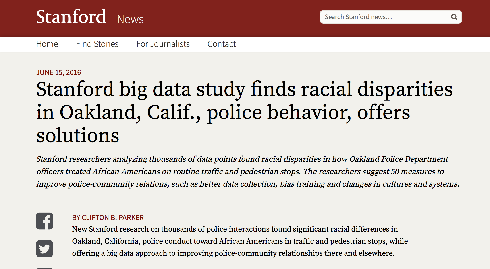

```{r setup, include=FALSE}
source('https://stats101.stanford.edu/profile.R')
knitr::opts_chunk$set(echo = FALSE)
```

## Sexy jobs

"I keep saying the sexy job in the next ten years
will be statisticians. People think I'm joking, but
who would've guessed that computer engineers
would've been the sexy job of the 1990s"

"The ability to take data, to be able to understand
it, to process it, to extract value from it, to
visualize it, to communicate it's going to be a
at the professional level but even at the
educational level for elementary school kids, for high school kids, for college kids. Because now we
really do have essentially free and ubiquitous data."

- Hal Varian, Google's Chief Economist


## Google trends


## Keeping things in perspective


## Data Science 101

- Not the recipe for your future start-up
- Literacy for citizenship
- Data
    * What is it?
    * Where can we find it?
    * How can we explore it?
  
- Science
    * What does it mean to learn from data?
    * How do we know when we are right or wrong?

## There is a lot of data

<div align="center">

</div>

## Some examples of Big Data

- **Genetics data**: it is easy to assess genetic variation at millions of locations in the genome, and to sequence the entire DNA of a subject; we measure expression levels of 20,000 genes in different tissues
- **Physics experiments**: the data generated in one year is 30 petabytes (petabyte of average MP3-encoded songs would require 2000 years to play)
- **Passively gathered data** 
    * Products we buy
    * Topics that engage us
    * Our levels of physical activity
    * Who we talk to
    

## Some sources of Data

- [Stats for change](http://stats-for-change.github.io/data.html)
- [Data.gov](https://www.data.gov)
- [GEO](https://www.ncbi.nlm.nih.gov/geo/)
- [dbGap](https://dbgap.ncbi.nlm.nih.gov)
- [CERN](http://opendata.cern.ch/?ln=en)
- Private data 

## Data can do a lot: sports

<div align="center">

</div>

## Data can do a lot: sports

<div align="center">

</div>


Starting around 2001, the Oakland A's picked
players that scouts thought were  no good
but data said otherwise.

## Data can do a lot: politics

<div align="center">

</div>

## Data can do a lot: politics

<div align="center">

</div>

## Data can do a lot: recommendations

- NETFLIX: US based streaming and DVD rental-by-mail company

- >10M customers, 10K titles, 1.9M DVDs per day

<div align="center">

</div>

## Netflix challenge

- October 2006: Netflix offers $1M for an improved recommender algorithm.

- Training data:
     * 100M ratings
     * 480K users
     * 17,770 movies
     * 6 years of data: 2000-2005

- Test data:
     * Last few ratings of each user (2.8M)
     * Evaluation via RMSE: root mean squared error
     * Netflix Cinematch RMSE: 0.9514

- Competition:
     * $1M grand prize for 10% improvement
     * If 10% not met, $50K annual "Progress Prize" for best improvement

## Netflix data: training

<div align="center">

</div>


## Netflix data: test


<div align="center">

</div>


## Netflix data: latent factor model


<div align="center">

</div>


## Netflix challenge

<div align="center">

</div>


In Sept 2009 a team led by Chris Volinsky from AT&T Statistics Research 
was announced as winner!


## Data can do a lot: discover bias


<div align="center">

</div>

## Data can do a lot: medicine

<div align="center">

</div>


## Data can do a lot: language processing

[Google translate](https://translate.google.com)

## Is data all we need?

<div align="center">

</div>

## Is data all we need?

<div align="center">

</div>


## Is data all we need?

<div align="center">

</div>


## Is data all we need?

<div align="center">

</div>


## Is data all we need?

[Google translate](https://translate.google.com)

## 

<table>
<tr>
<td>
<div align="center">

</div>
</td>
<td>
<div align="center">

</div>
</td>
</tr>
</table>

## Learn how to use data

- To know what one is talking about

- **To explore**: identify patterns 

- **To predict**: make informed guesses 

- **To make inference**: quantify what you know
   
## Data Science 101, resources

- A team of instructors, TA, and many more faculty that contribute to the course development


- Web-page: http://web.stanford.edu/class/stats101/


- [CANVAS](https://canvas.stanford.edu/courses/64451) site

## Data Science 101

- Weekly homework (60% of grade)

- In class final

- Bring your laptops on Tuesday and Thursdays

- Install R and Rstudio

- R mark-downs for lectures and labs available on [CANVAS](https://canvas.stanford.edu/courses/64451/files)

