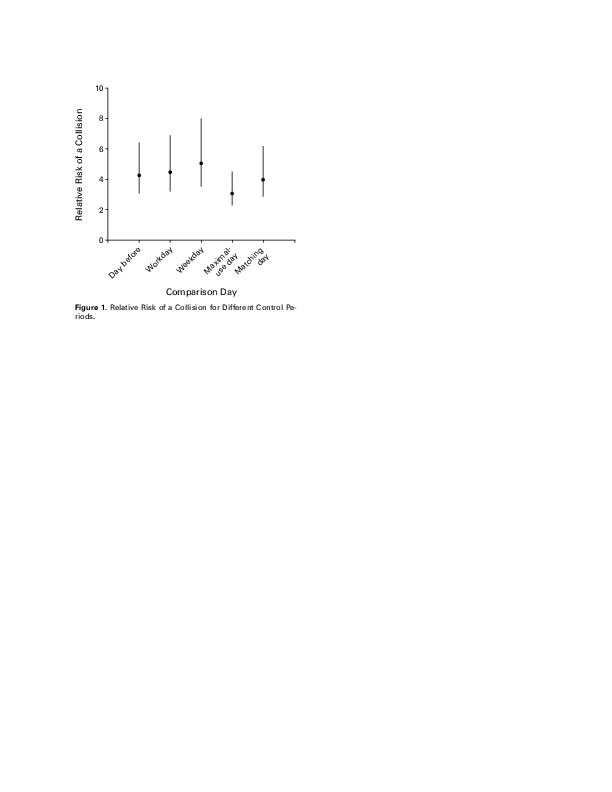

```{r setup, include=FALSE}
source('https://stats101.stanford.edu/profile.R')
knitr::opts_chunk$set(echo = FALSE)
```

## Administrative Items

- Please use the staff e-mail list: **stats101-spr17-staff@lists.stanford.edu**

- Exam will take place in the regularly scheduled slot

- If you need accomodations, please forward us the OAE letter as soon as possible 

- Office hours and locations are on the web

## Overview

- The abundance of data is new, but the usefulness of data analysis is not

- Looking at past experience, highlights what makes for a "good" or "bad" data analysis

- We have new questions and need more tools, but there is no need to re-invent the wheel.

## John Snow (1813--1858)
  
<div align="center">

</div>
  
  Anesthesiologist, epidemiologist
  
  
## Cholera (WHO)

- Acute diarrhoeal disease that can kill within hours if left untreated.

- Each year there are 1.3 to 4.0  million estimated cases of cholera, and 21,000 to 143,000 deaths worldwide due to cholera.

- Most of those infected will have no or mild symptoms, and can be successfully treated with oral rehydration solution.

- Severe cases will need rapid treatment with intravenous fluids and antibiotics.

- Provision of safe water and sanitation is critical to control the transmission of cholera and other waterborne diseases.


## Cholera 

<div align="center">

</div>


(Filippo Pacini in 1854 and Robert Koch, 30 years later)


## On the mode of communication of cholera

- Title of a [book](https://books.google.com/books/about/On_the_Mode_of_Communication_of_Cholera.html?id=-N0_AAAAcAAJ) published by J. Snow in 1855

- The first cases of cholera in England were reported in 1831 (previously known in India)

- Popular belief of the time that cholera was caused by breathing vapors or a “miasma in the atmosphere”.

- We now know that the bacteria are transmitted between humans through the fecal-oral route.

- Snow had been interested in transmission of cholera 

## On the mode of communication of cholera


- Outline of the history of cholera
- Cases proving its communication from person to person 
- Cholera not communicated by means of effluvia 
- The pathology of cholera indicates the manner in which it is communicated
- Cholera is propagated by the morbid poison entering the
alimentary canal
- Evidence of this mode of communication in the crowded habitations of the poor
- Instances of the communication of cholera through medium of polluted water
    - in Horsleydown
    - at Albion Terrace
    - Wandsworth Road 
    - at Ilford and near Bath 
    - at Newburn on the Tyne 


## Outbreak in 1854

<div align="center">

</div>


## Outbreak in 1854

<div align="center">

</div>


## Outbreak in 1854
```{r}
#library(ggplot2)
#snow1<-read_csv("./data/snow.csv",col_types = #cols(Date = col_date(format = "%Y-%m-%d")))
#qqplot(snow1$Date,snow1$Case,ylab="Number of fatal attacks",xlab="Date")
snow1<-read.csv("./data/snow.csv")
snow1$Date<-as.Date(snow1$Date)
plot(snow1$Date,snow1$Case,ylab="Number of fatal attacks",xlab="Date")
abline(v=as.Date("1854-09-07"))
```

## Snow's investigation

- "I suspected some contamination of the water of the much-frequented street-pump in Broad Street"

- "I requested permission, therefore, to take a list, at the General Register Office, of the deaths from cholera, registered during the week ending 2nd September, in the sub-districts of Golden Square, Berwick Street, and St.Ann's, Soho, which was kindly granted."

- 83 deaths in the last days of the week: only 10 in houses not near the pump
    - 5 did drink wather from the Broad Street pump
    - 3 childreen that went to school near Broad Street
    - 2 not connected
    
##

<div align="center">

</div>

## A modern version of the figure

<div align="center">
<a href="https://fusiontables.google.com/DataSource?docid=147wlDisDp6NnpNxHQpbnjAQ-iW4dR2MAmFdQxYc#map:id=3"></a>
</div>


## As a result of the investigation

"I had an interview with the Board of Guardians of St. James's parish, on the evening of Thursday, 7th September,and represented the above circumstances to them. In consequence of what I said, **the handle of the pump was removed on the following day**."

## Further facts: the brewery

"There is a Brewery in Broad Street, near to the pump, and on perceiving that no brewer's men were registered as having died of cholera, I called on Mr. Huggins, the proprietor. He informed me that there were above seventy workmen employed in the brewery, and that none of them had suffered from cholera--at least in a severe form--only two having been indisposed, and that not seriously, at the time the disease prevailed. **The men are allowed a certain quantity of malt liquor, and Mr. Huggins believes they do not drink water at all**; and he is quite certain that the workmen never obtained water from the pump in the street. There is a deep well in the brewery, in addition to the New River water."


## Further facts: the workhouse


"The Workhouse in Poland Street is more than three fourths surrounded by houses in which deaths from cholera occurred, yet out of five hundred and thirtyfive inmates only five died of cholera, the other deaths which took place being those of persons admitted after they were attacked. The workhouse **has a pump-well on the premises**, in addition to the supply from the Grand Junction Water Works, and the inmates never sent to Broad Street for water."

## Further facts: the west end widow

"I was informed by this lady's son that she had not been in the neighbourhood of Broad Street for many months. A cart went from Broad Street to West End every day, and **it was the custom to take out a large bottle of the water from the pump in Broad Street, as she preferred it**. The water was taken on Thursday, 31st August, and she drank of it in the evening, and also on Friday. She was seized with cholera on the evening of the latter day, and died on Saturday, as the above quotation from the register shows. A niece, who was on a visit to this lady, also drank of the water; she returned to her residence, in a high and healthy part of Islington, was attacked with cholera, and died also."

## Water supplies in London

- Looking at epidemic in 1832 and 1849, Snow notices that areas of London served by different companies have different mortality rates

- A glance at the table shows that in every district to which the supply of the Southwark and Vauxhall, or the Lambeth Water Company extends, the cholera was more fatal than in any other district whatever.

- These companies take their water from the Thames, which might be contaminiated by sewage

## An "experiment" opportunity

London was without cholera from the latter part of 1849 to August 1853.

- During this interval an important change had taken place in the water supply of several of
the south districts of London. The Lambeth Company removed their water works, in 1852, from opposite Hungerford Market to Thames Ditton; thus obtaining a supply of water quite free from the sewage of London

- Lambeth and Southwark & Vauxhall Companies serve some of the same area

##

<div align="center">

</div>


## Two comparable groups 

"In the sub-districts  being supplied by both Companies, the **mixing of the supply is of the most intimate kind**. The pipes of each Company go down all the streets, and into nearly all the courts and alleys. A few houses are supplied by one Company and a few by the other, according to the decision of the owner or occupier at that time when the Water Companies were in active competition. In many cases a single house has a supply different from that on either side. Each Company supplies both rich and poor, both large houses and small; there is no difference either in the condition or occupation of the persons receiving the water of the different Companies."

## A grand experiment

"The experiment, too, was on the grandest scale. No fewer than **three hundred thousand people** of both sexes, of every age and occupation, and of every rank and station, from gentle folks down to the very poor, **were divided into two groups without their choice, and, in most cases, with out their knowledge**; one group being supplied with water containing the sewage of London, and, amongst it, what ever might have come from the cholera patients, the other group having water quite free from such impurity."

## 


The following is the proportion of deaths to 10,000 houses, during the first seven weeks of the epidemic, ending in August 26, 1854

<div align="center">

</div>


## What makes Snow's work so powerful


- It **documents**  the sources and characteristics of the data
- It makes appropriate **controlled comparisons**
- It gets to mechanisms of **cause and effect**
- It uses information from **many different sources**
- It expresses the differences **quantitatively** 
- It inspect and evaluates **alternative explanations** 

## Cholera in Haiti

<div align="center">

</div>

 

## Haiti Cholera

- The outbreak began in mid October 2010 in the rural Center Department of Haiti, about 100 kilometres  north of the capital, Port-au-Prince, killing 4672 people by March 2011. 

- The outbreak occurred ten months after a powerful earthquake which devastated the nation's capital and southern towns on 12 January 2010. 

- The disease was not present in the country until United Nations peacekeepers arrived from Nepal, where an outbreak was underway.

- To date, 10,000 have died by Cholera in Haiti


## A more contemporary example

- 1997 study on the use  of cell phones and car collisions, one of  the first of its kind 

<div align="center">
<a href="http://www.nejm.org/doi/full/10.1056/NEJM199702133360701"></a>
</div>


## Background

- Motor vehicle collisions are a leading cause of death in North America.
- Popularity of cellular phones has  increased dramatically-
number of subscribers exceeded the birth rate in the U.S in 1995.
- In 1997, cell phones were not  widely used and many were fixed (in car) phones.
- Phone calls are a distraction: is there a link with collisions?
    - Cell phones increase driver's "state-of-mind"
    - No  epidemic of collisions.
    - There are many other distractions when driving

## Some previous work

- Case-control study of drivers in 1979: cell phone owners vs
non-owners
    - Marginally lower  rate of collisions in owners.
    - But there are confounding factors: people who buy a cell phone
may differ from others in important ways.

-  Randomized trial using a driving simulator (1995):
    - Worse reaction time using cell phone (2.2ms vs 1.6ms).
    - But may not represent real driving experience.


<div align="center">

</div>


## 1997 Study design

- 5890 drivers approached in collision reporting centers in Toronto,
who were involved in collisions causing significant property damage
but no personal injury between July 1, 1994, and August 31, 1995.

-  1064 had cell phones, and 742  consented to be in our study.
699 provided accurate telephone numbers that could be linked 
to detailed billing records.

- Some basic information (age, sex ...)  was obtained by questionnaire

- Using questionnaire, police reports, and 911 calls, we 
carefully deduced the actual time of collision and their phone usage in the previous week.

## 1997 Study: case-crossover design

- **self matching case-control design**: each person
acts as her own control.


- Contrast a time period on the day of the collision with a comparable period on a day preceding the collision

- Case–crossover analysis would identify an increase in risk if there were more telephone calls immediately before the collision than would be expected solely as a result of chance

## Hazard and Control Windows


## Relative risk

Ratio of

- the probability of having a collision when using a cellular telephone at any time during a 10-minute interval 

- the probability of having a collision when not using a cellular telephone at any time during a 10-minute interval.


## Results

<div align="center">

</div>

## Results

<div align="center">

</div>


## Complication

There was not information  about the person actually being in the car  during the
comparison window.   

-  Can't have a collision if not in the car
- 79% of phones could have been taken out of the car
- ``Driving intermittancy'' problem
- Downward adjustment of the relative risk estimate 


## Other findings

- ``Dose response''- effect not significant
for calls made more than 15 minutes before the event.
- No difference in incoming vs outgoing, hand-held vs hands-free,
male vs female.
- Effect appeared to be stronger on highway vs city streets.
-  39% of people made at least one emergency call after the collision


## The aftermath

- Lots of TV, radio, newspaper press. 

- Difficult to convey ideas of probability and risk to press
and general public. 

- Eg. relative risk of 4 is about equal to that for driving
at the legal limit of alcohol. Authors quoted as saying "Using cell phones in the car is as bad as driving drunk".  But the exposure shorter and hence
cumulative risk less.

- There are now many laws limiting the use of cell phones while driving.


## Main recommendations

- Avoid unnecessary calls.
- Keep conversations brief.
- Suspend dialogue during hazards.

In 1997:

**Our study may serve as a warning: if cell phones become standard
equipment in cars, collision rates may increase**


But smart phones and  texting were coming!


