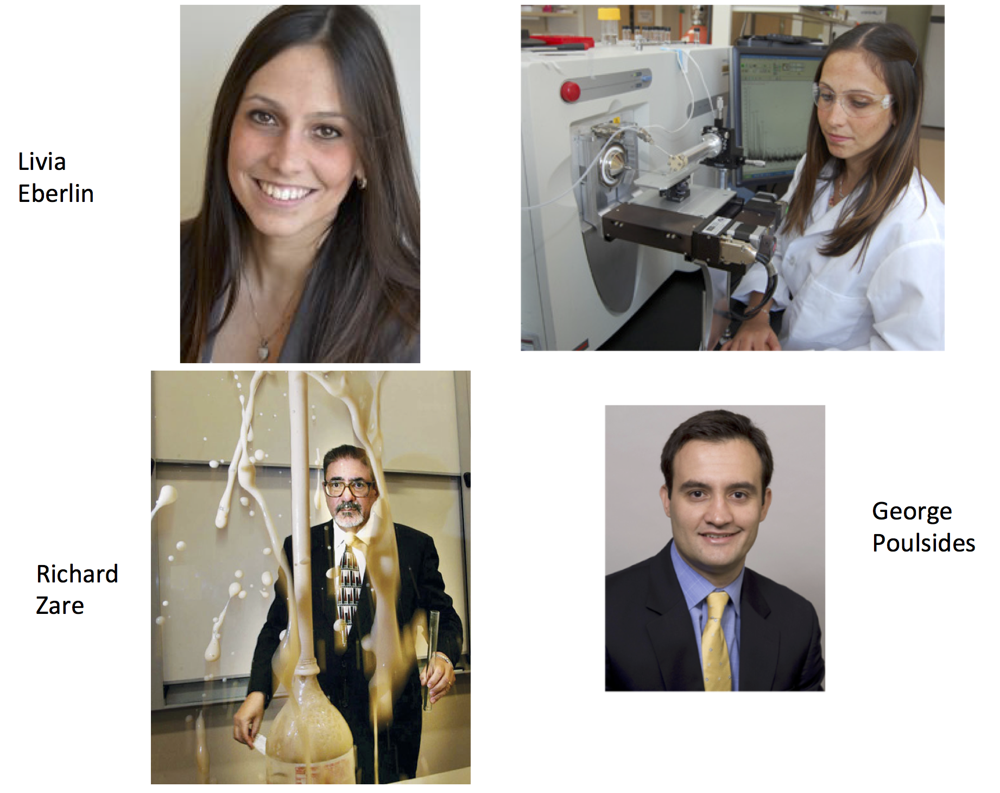
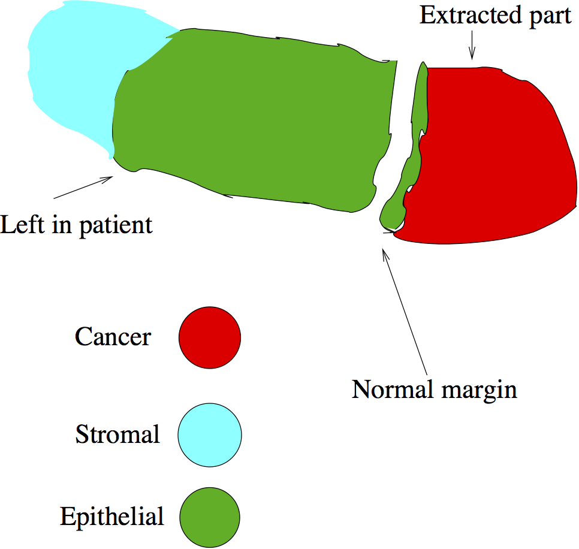
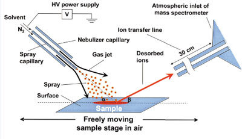
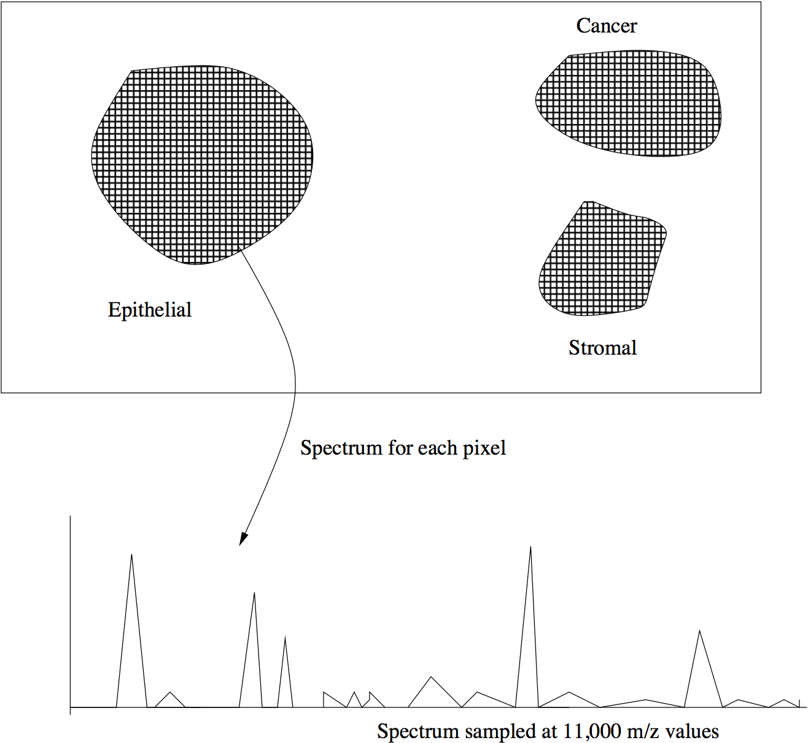
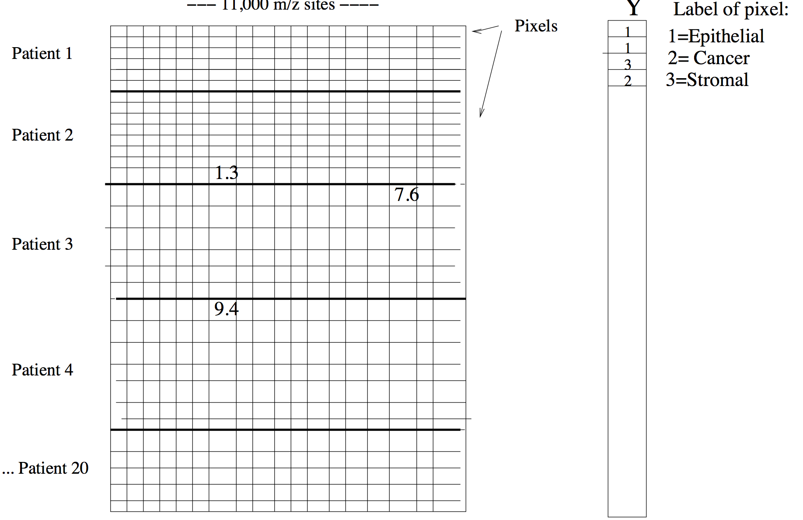
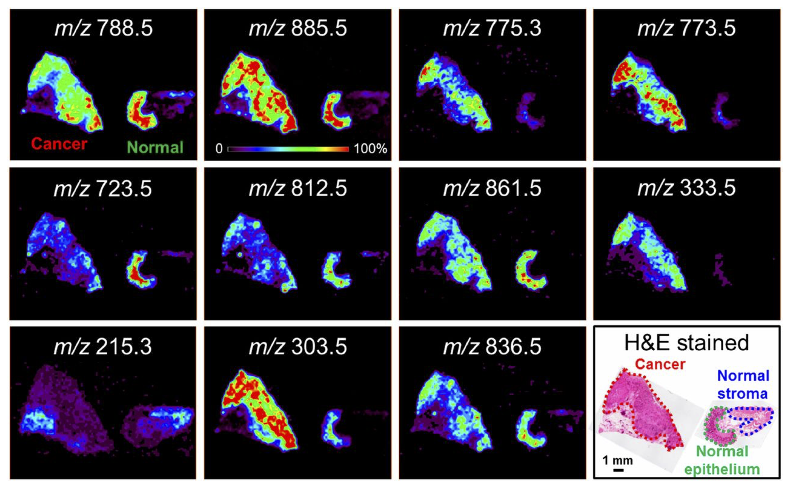
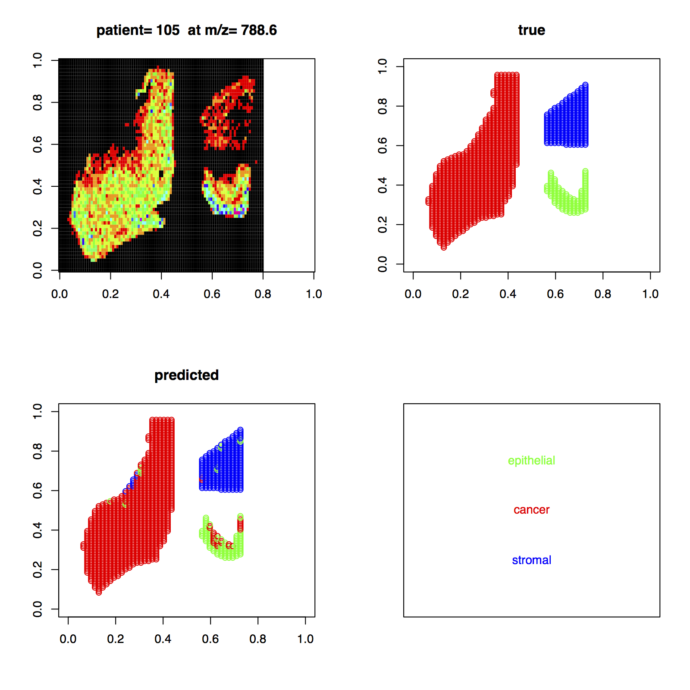
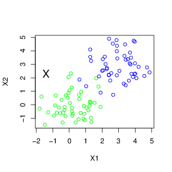
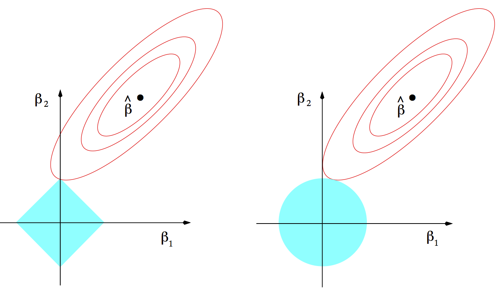

```{r setup, include=FALSE}
source('https://stats101.stanford.edu/profile.R')
knitr::opts_chunk$set(echo = FALSE)
library(pacman)
pacman::p_load(rpart,rpart.plot)
#library(rpart)
#library(rpart.plot)
```

## A Cancer detection problem

- I am currently working in a cancer diagnosis project with
co-workers at Stanford; 
 Livia Eberlin (PI) ---PostDoc (Chemistry);   Richard Zare (Chemistry)  and George Poulsides (Surgery)
- Reference: [Eberlin et al  (2014)](http://www.pnas.org/content/111/7/2436.abstract)
- They have collected samples of
tissue from   a number of  patients undergoing surgery
for  stomach cancer.

### Collaborators

<div align="center">

</div>

## Margin

<div align="center">

</div>

## Technology to the rescue!

### DESI (Desorption electrospray ionization)

- An  electrically charged *mist* is directed at the  sample.
- Surface  ions are freed and enter the mass spectrometer.

<div align="center">

</div>

## The data for one patient

<div align="center">

</div>

## Details

- 20 patients, each contributing a sample of epithelial, stromal and  cancer
tissue.
- Labels determined after 2 weeks of testing in pathology lab.
- At each pixel in the image, the intensity of metabolites is measured by 
DESI.
- Peaks in the spectrum  representing different metabolites.
- The spectrum has been finely sampled,
with the intensity measured at about 11,000 $m/z$ sites across the spectrum, for each of about 8000 pixels.


## The overall data

<div align="center">

</div>


## The data for one patient

<div align="center">

</div>


## What we need to tackle this problem

-  A statistical classifier  (algorithm) that sorts through the large number of features,
and finds the most informative ones: 
note that  we are doing pixel-wise classification.

-how would you approach this classification problem?

## Some ideas


-k-nearest neighbors 

```{r}
set.seed(3)
x=matrix(rnorm(100),nrow=50,ncol=2)
x[1:25,]=x[1:25,]+3
plot(x[,1],x[,2],xlab="x1",ylab='x2',type="n")
points(x[,1],x[,2],col=c(rep(2,25),rep(3,25)))
text(0,2,label='X')
```

##Linear decision boundaries

How would you define this boundary?

```{r}
set.seed(3)
x=matrix(rnorm(100),nrow=50,ncol=2)
x[1:25,]=x[1:25,]+3
plot(x[,1],x[,2],xlab="x1",ylab='x2',type="n")
points(x[,1],x[,2],col=c(rep(2,25),rep(3,25)))
abline(4,-1,lty=2)
```


## Decision trees and random forests

0=epithelial,  1=cancer,  2=cancer


```{r}
set.seed(3)
x=matrix(rnorm(100*5),ncol=5)
y=as.factor(sample(c(0,1,2),size=100,replace=T))
x[y==1,1:3]=x[y==1,1:3]+2
d=data.frame(x=x,y=y)
a=rpart(y~x,data=d)
rpart.plot(a)
```

## First construct new features from raw features- unsupervised learning

-Fourier or wavelet transforms

-linear combinations of features, or polynomual transformations, or both

Then we feed these features into one of the above classifiers

-neural networks and deep learning construct features using nonlinear transformations at different resolutions, and then use them for classification


## Our approach

We use a method called the <font class="emphred">Lasso</font>.  
Details are beyond the scope of this course, and are given
in ``Advanced material" later in this section.

- a key property of the lasso- it automatically discards features that are not informative,
and uses only the ones that are useful for discrimination.

## How would you evaluate the performance of a classifier?

- suppose that we apply a classifier like nearest neighbors or the lasso to our training data.

Should we just report the error rate on the same data?

- and what error measure would we use? Percentage of misclassified pixels?

- If we are just interested in cancer vs normal, is in worthwhile trying to discriminate between the 3 classes- Stromal, Epithelial (both normal), and Cancer?


## Classifier Results

<font class="emphred">Cross-validation</font> minimized at 129 peaks; overall error rate= 4.2%

<table>
<tr><td></td>
<td></td><td colspan="4"><div align="center"><font class="emphblue">Predicted</font></div></td></tr>
<tr><td></td><td></td><td>Epi</td><td>Canc</td><td>Strom</td><td>Prop correct</td></tr>
<tr><td></td><td>Epi </td><td>  3277.00 </td><td> 80.00 </td><td> 145.00 </td><td> 0.94 </td></tr>
<tr><td><font class="emphblue">True</font></td><td>Canc </td><td> 73.00 </td><td> 5106.00 </td><td> 13.00 </td><td> 0.98 </td></tr>
<tr><td></td><td>Strom  </td><td> 79.00 </td><td> 86.00 </td><td> 2409.00 </td><td> 0.94 </td></tr>
</table>

<font class="emphred">Test set</font> overall error rate =5.7%

<table>
<tr><td></td>
<td></td><td colspan="4"><div align="center"><font class="emphblue">Predicted</font></div></td></tr>
<tr><td></td><td></td><td>Epi</td><td>Canc</td><td>Strom</td><td>Prop correct</td></tr>
<td></td><td>Epi </td><td>  1606.00 </td><td> 149.00 </td><td> 19.00 </td><td> 0.91 </td></tr>
<td><font class="emphblue">True</font></td><td>Canc </td><td> 23.00 </td><td> 1622.00 </td><td> 5.00 </td><td> 0.98 </td></tr>
<td></td><td>Strom  </td><td> 67.00 </td><td> 5.00 </td><td> 1222.00 </td><td> 0.94 </td></tr>
</table>


## Results

<div align="center">

</div>

## How can we turn the pixel-wise predictions into a prediction for each patient sample?

## A challenge


- <font class="emphblue">Abstentions</font>: sometimes a classifier should not make a prediction; instead it should say  <font class="emphblue">"I don't know"</font>
- For example, when the query feature vector is far away from the training set features.
- This problem  happened in some tests  of our system 
- The classifier might  be extrapolating dangerously, but still be very confident in its prediction, 


<div align="center">

</div>

## Future work

-applications to pancreatic, skin, prostate cancer...

-could one customize the classifier to each new patient?

-currently our system samples the spectrum at equally spaced grid points- this occur at peaks,
valleys or shoulders. How can we instead form features that are peak heights, for better interpretability?

## More questions:

-If you were a cancer patient, would you want this statistical learning system
to replace the pathologist? If not, how do you think it would be best used?


## MORE ADVANCED MATERIAL

## The Lasso


- Regression problem: 
We  observe $n$ feature-response pairs $(x_i,~y_i)$, where $x_i$ is a $p$-vector
and $y_i$ is real-valued.
- Let $x_i=(x_{i1}, x_{i2},\ldots x_{ip})$

- Consider a **linear regression model**:
$$y_i=\beta_0+\sum_j x_{ij}\beta_j +\epsilon_i$$
where $\epsilon_i$ is an error term with mean zero.
$\beta_j$ is the weight given feature $j$

- <font class="emphblue">Later:</font>  $y_i$ will take one of  
3 values (epithelial, stromal, cancer) and $x_{ij}$ will be the height of the spectrum for
patient $i$, at  $m/z$ site $j$.

- <font class="emphblue">Least squares fitting</font> is defined by

$$
\DeclareMathOperator{\minimize}{minimize}
    \minimize_{\beta_0,\beta}\frac{1}{2}
\sum_i (y_i-\beta_0-\sum_j x_{ij}\beta_j)^2
$$


## The Lasso--- continued

  The <font class="emphred">Lasso</font> is an estimator defined by the following
  optimization problem:

$$
    \minimize_{\beta_0,\beta}\frac{1}{2}
\sum_i (y_i-\beta_0-\sum_j x_{ij}\beta_j)^2 \qquad\text{subject to}\quad \sum|\beta_j|\le s
$$

- Penalty $\implies$ sparsity (feature selection)
- Convex problem (good for computation and theory)
- <font class="emphblue">Ridge regression</font> uses penalty $\sum_j \beta_j^2\le s$
and does not yield sparsity


## Why does  the lasso give a sparse solution?


<div align="center">

</div>
 Lasso: $\sum_j|\beta_j|\le s$  Ridge: $\sum_j \beta_j^2\le s$


## Back to our problem

- K=3 classes (epithelial,  stromal, cancer): multinomial model
$$\log \frac{Pr(Y_i=k|x)}{\sum_k Pr(Y_i=k|x)}=\beta_{0k}+\sum_{j} x_{ij} \beta_{jk}, \;k=1,2,\ldots K$$
Here $x_{ij}$ is height of spectrum for sample $i$ at $j$-th $m/z$ position
- We replace the least squares objective function by the multinomial log-likelihood 
- Add lasso penalty $\sum|\beta_j|\leq s$; optimize, using cross-validation
to estimate best value for budget $s$.
- Yields a pixel classifier, and also reveals which $m/z$ sites  are informative.

## Fast computation is essential

- Our lab has written a open-source R language package called <font class="emphblue">glmnet</font> for fitting
lasso models.  Written in <font class="emphred">FORTRAN</font>!!!!!
- It is **very fast**: can solve the current problem in a few minutes on a PC. Some builtin parallelization too.
- Not *off-the shelf*: Many clever computational tricks were used to achieve the  impressive speed.
- Lots of features- Gaussian, Logistic, Poisson, Survival models; elastic net; grouping; parameter constraints.

Available in R and Matlab. 


<table border-width="0px">
<tr>
<td> Jerry Friedman</td>
<td> Trevor Hastie</td>
</tr>
</table>


## Other approaches

- <font class="emphred">Support vector machines</font>: classification error was a little higher than lasso; doesn't give a sparse solution easily
- <font class="emphred">Deep learning</font> (with help from a student of Geoff Hinton): reported that it didn't work any better than  lasso;  thought that non-linearities were likely unimportant for this problem, 
and sparsity was more important.


