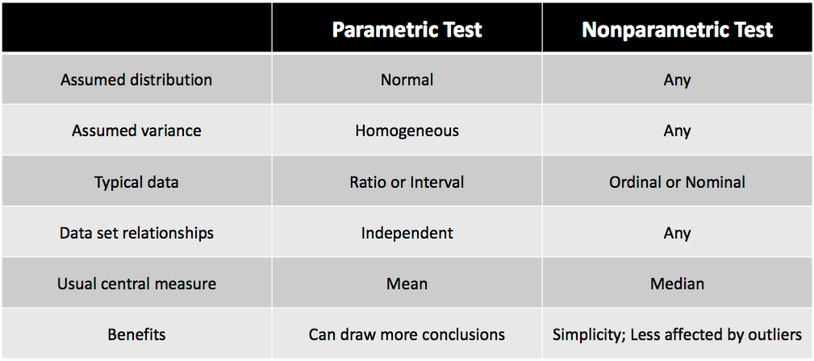

```{r setup, include=FALSE}
#source('http://datascience101.stanford.edu/profile.R')
knitr::opts_chunk$set(echo = TRUE)
```

## Where do rankings come in?

- Google
- Universities rankings (we will show a real example later in the week)
- Presidential candidates
- Sports teams

## Why do we use rankings?
- when the focus is about the order but not the magnitude
- when we only care about the overall relative performance

## Rankings as a useful transformation for long tailed data

"Long-tailed" means that the histogram extends more to the right then left

Examples:

- Income
- Size of universities
- Population of countries
- Search counts: a few key words are commonly searched for

## Remember Pearson correlation? 

Suppose we have $n$ pairs of data $(x_1,y_1),\cdots, (x_n,y_n)$, then the Pearson correlation is calculated as

\[
r(x,y) =\frac{\sum_{i=1}^n (x_i-\bar{x})(y_i-\bar{y})}{\sqrt{\sum_{i=1}^n (x_i-\bar{x})^2}\sqrt{\sum_{i=1}^n (y_i-\bar{y})^2}},
\]

where $\bar{x}=\frac{1}{n}\sum_{i=1}^n x_i$ and $\bar{y}=\frac{1}{n} \sum_{i=1}^n y_i$ represent the sample means of observations $x$ and $y$ respectively.

## Correlation is not a robust measure

Let us generate independent samples of $(x_i,y_i)$ with $i=1,\cdots, 100$. They look like
```{r}
x = rnorm(100)
y = rnorm(100)
plot(x,y,cex=1)
```

Calculate the sample Pearson correlation
```{r}
cor(x,y)
```

## Effects of outliers: add one point

```{r}
xnew = x
xnew[101] = 100
ynew = y
ynew[101] = 100
plot(xnew,ynew,col= c(rep(1,100),2),cex=1)
```

How does the correlation change?
```{r}
cor(xnew,ynew)
```

## Effects of outliers: what about this one?

```{r}
xnew1 = x
xnew1[101] = 100
ynew1 = y
ynew1[101] = -100
plot(xnew1,ynew1,col= c(rep(1,100),2),cex=1)
```

How does the correlation change?
```{r}
cor(xnew1,ynew1)
```

## Results for adding one point

```{r}
cor(x,y)
cor(xnew,ynew)
cor(xnew1,ynew1)
```

+ Pearson correlation is not robust to outliers

## What if we do rank transformation first?

```{r}
xrank = rank(x)
yrank = rank(y)
print(xrank[1:3])
print(yrank[1:3])
cor(xrank,yrank)
```

## Effects of outliers after rank transformation.

```{r}
xranknew = rank(xnew)
yranknew = rank(ynew)
print(xranknew[c(1:3,101)])
print(yranknew[c(1:3,101)])
cor(xranknew,yranknew)
```

## Effects of outliers after rank transformation.

```{r}
xranknew1 = rank(xnew1)
yranknew1 = rank(ynew1)
print(xranknew1[c(1:3,101)])
print(yranknew1[c(1:3,101)])
cor(xranknew1,yranknew1)
```

## Results for adding one point, under rank transformation

```{r}
cor(xrank,yrank)
cor(xranknew,yranknew)
cor(xranknew1,yranknew1)
```

+ Pearson correlation after rank transformation is more robust: this is called "Spearman correlation"


## Spearman correlation: a more robust measure
Remember we have $n$ pairs of data $(x_1,y_1),\cdots, (x_n,y_n)$. We first convert them to ranks $(\text{rk }x_1, \text{rk }y_1), \cdots, (\text{rk }x_n, \text{rk }y_n)$. Then the Spearman correlation coefficient is defined as:

\[
r_s (x,y) = r(\text{rk }x, \text{rk }y),
\]
where $r(.,.)$ represents the Pearson correlation.

```{r}
cor(xrank,yrank,method="spearman")
cor(xranknew,yranknew,method="spearman")
cor(xranknew1,yranknew1,method="spearman")
```

## Remarks about Spearman correlation
- The sign indicates the direction of association between $x$ and $y$.
- If $y$ tends to increase when $x$ increases, the Spearman correlation coefficient is positive.
- A Spearman correlation of 0 indicates that there is no tendency for $y$ to either increase or decrease when $x$ increases.
- The Spearman correlation increases in magnitude as $x$ and $y$  become closer to being perfect monotone functions of each other.
- It can be applied when one or two variables are ordinal

Questions:

-why not always use the Spearman correlation? Is there any downside?

-is it possible for the Spearman and Pearson correlations to be close to zero,  but the
x and y variables are highly dependent?

## Spearman correlation coefficient: nonparametric statistic

A perfect monotone increasing relationship implies that for any two pairs of data values $(x_i, y_i)$ and $(x_j,y_j)$, $x_i − x_j$ and $y_i − y_j$ always have the same sign. Comparing to Pearson correlation, to get $r(x,y)=1$, we require $x$ and $y$ to be related by a linear function.

Spearman correlation is considered nonparametric since

- a perfect Spearman correlation results when $x$ and $y$ are related by any monotonic function. While with Pearson correlation, it only gives a perfect value when $x$ and $y$ are related by a linear function.
- the Spearman correlation's exact sampling distribution can be obtained without requiring knowledge of the joint probability distribution of $x$ and $y$.

-but in practice can use permutations to carry out a test using either Spearman or Pearson
(how do you do this?)


## Monotonic relationship

We generate 100 independent points $x_1, \cdots, x_{100}$ from normal distribution and let $y_i = \exp(5x_i)$, $z_i = 5 x_i$. We calculate the Pearson correlation and Spearman correlation respectively.

```{r}
x = rnorm(100)
y = exp(5*x)
z = 5*x
```
```{r}
cor(x,y)
cor(x,y,method="spearman")
```

```{r}
cor(x,z)
cor(x,z,method="spearman")
```

## Another rank-based correlation measure: Kendall's tau

Again, with our data $(x_1,y_1),(x_2,y_2),\cdots, (x_n,y_n)$, we define the terms "concordant" and "discordant" as following: any pair of observations $(x_i,y_i)$ and $(x_j,y_j)$, where $i\neq j$

- are said to be concordant if the ranks for both elements agree: i.e., if both $x_i>x_j$ and $y_i >y_j$ or if both $x_i < x_j$ and $y_i < y_j$.
- are said to be discordant, if $x_i>x_j$ and $y_i < y_j$ or if $x_i<x_j$ and $y_i>y_j$

\[
\tau = \frac{(\text{number of concordant pairs})- (\text{number of discordant pairs})}{n(n-1)/2}
\]

## Kendall's tau

```{r}
cor(xrank,yrank,method="kendall")
cor(xranknew,yranknew,method="kendall")
cor(xranknew1,yranknew1,method="kendall")
```

## Comparisons between Kendall's tau and Spearman Rho
In hypothesis testing, correlation analyses usually are used to test for associations.  The null hypothesis is that there is no association between the variables under study.  

- Kendall’s Tau: usually smaller values than Spearman’s rho correlation. Calculations based on concordant and discordant pairs. Insensitive to error. P-values are more accurate with smaller sample sizes.

- Spearman’s rho: usually have larger values than Kendall’s Tau.  Calculations based on deviations.  Much more sensitive to error and discrepancies in data.


## Differences between parametric and nonparametric tests



## Other transformations

- logarithm
- logit
 


 

