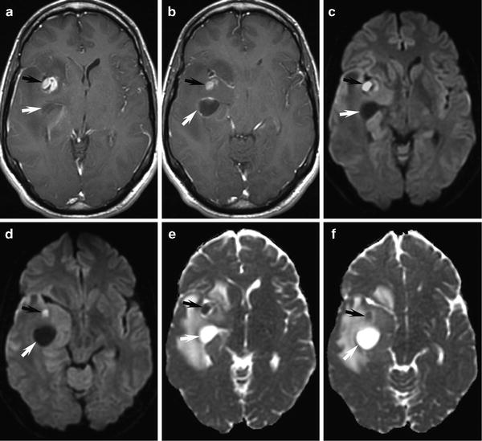
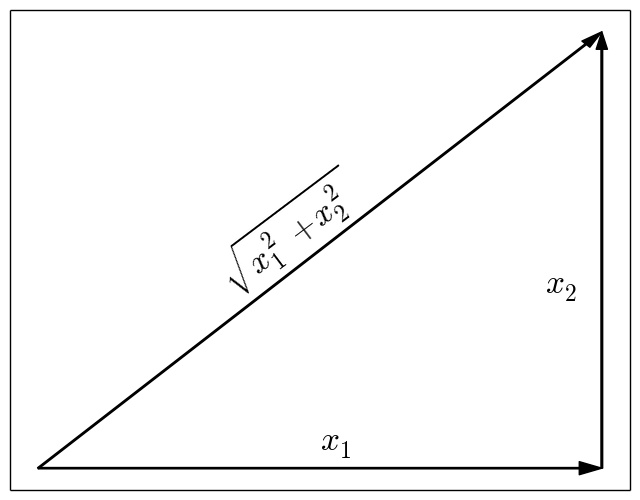
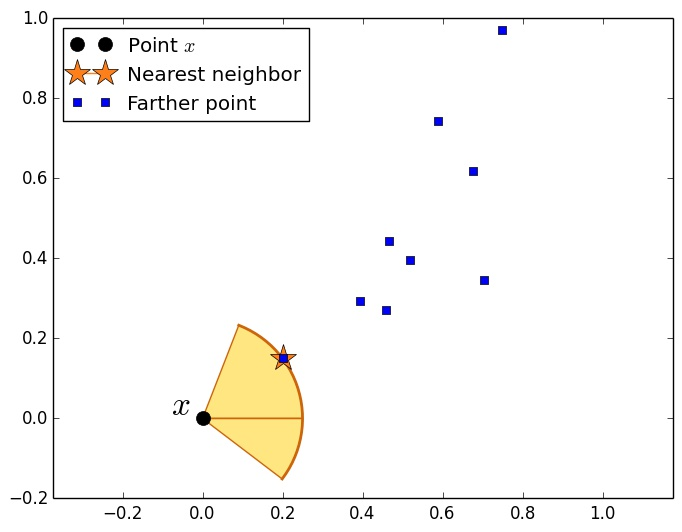
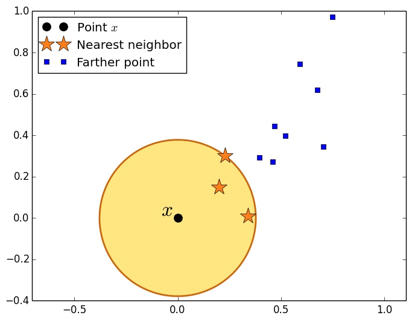

```{r setup, include=FALSE}
#source('http://datascience101.stanford.edu/profile.R')
knitr::opts_chunk$set(echo = FALSE,
                      root.dir="./")
```

```{r funcdefs, echo=FALSE}
ones <- function(nr, nc = 1) {
    return(matrix(1, nrow = nr, ncol = nc));
}
zeros <- function(nr, nc = 1) {
    return(matrix(0, nrow = nr, ncol = nc));
}

## DATA PROCESSING

constructData <- function(pc = 4, nc = 9) {
  ziptrain <- as.matrix(read.csv(file="~/Data/ZIP/zip.train",head=FALSE, sep=" "));
  ziptest <- as.matrix(read.csv(file="~/Data/ZIP/zip.test",head=FALSE,sep=" "));
  Xtrain = ziptrain[, c(2:257)];
  Xtest = ziptest[, c(2:257)];
  ytrain = as.vector(ziptrain[, 1]);
  ytest = as.vector(ziptest[, 1]);

  trainfileX = paste(pc, nc, "_train_images.csv", sep="");
  testfileX = paste(pc, nc, "_test_images.csv", sep="");
  trainfileY = paste(pc, nc, "_train_labels.csv", sep="");
  testfileY = paste(pc, nc, "_test_labels.csv", sep="");
  train_inds = (ytrain == pc | ytrain == nc);
  test_inds = (ytest == pc | ytest == nc);
  ytrain = ytrain[train_inds];
  ytrain[ytrain == nc] = -1;
  ytrain[ytrain == pc] = 1;
  ytest = ytest[test_inds];
  ytest[ytest == nc] = -1;
  ytest[ytest == pc] = 1;
  Xtrain = Xtrain[train_inds,];
  Xtest = Xtest[test_inds,];
  ntrain = nrow(Xtrain);
  dim = ncol(Xtrain);
  ## Add a tiny bit of noise to the training data, as it is low rank otherwise.
  Xtrain = Xtrain + matrix(rnorm(dim * ntrain, sd=.01), nrow=ntrain, ncol=dim);
  Xtrain = pmax(pmin(Xtrain, 1), -1);

  write.table(Xtrain, file = trainfileX, row.names=FALSE, col.names=FALSE);
  write.table(Xtest, file = testfileX, row.names=FALSE, col.names=FALSE);
  write.table(ytrain, file = trainfileY, row.names=FALSE, col.names=FALSE);
  write.table(ytest, file = testfileY, row.names=FALSE, col.names=FALSE);
}

loadZips <- function(pc = 4, nc = 9, base = "~/ds101/sandbox/jcd/") {
  X.trainfile = paste(base, pc, nc, "_train_images.csv", sep="");
  X.testfile = paste(base, pc, nc, "_test_images.csv", sep="");
  y.trainfile = paste(base, pc, nc, "_train_labels.csv", sep="");
  y.testfile = paste(base, pc, nc, "_test_labels.csv", sep="");
  Xtrain = as.matrix(read.table(X.trainfile));
  ytrain = as.vector(as.matrix(read.table(y.trainfile)));
  Xtest = as.matrix(read.table(X.testfile));
  ytest = as.vector(as.matrix(read.table(y.testfile)));
  return(list(Xtrain = Xtrain, ytrain = ytrain, Xtest = Xtest, ytest = ytest));
}

displayImage <- function(x = zeros(16, 16),
                         label = -1) {
    x = matrix(x, nrow = 16, byrow=TRUE);
    image(t(x[16:1,]), col=gray(0:256 / 256), asp = 1,
            main = paste("True label ", label), xaxt="n", yaxt="n");
}
```

## Learning Goals

- What is a classification problem?
- Defining a model
- Fitting a model
- Validating your model (does it work?)

## Outline

- Examples and motivation
- Binary classification with linear predictions
	+ Example: Zip Code prediction
	+ A good enough prediction model
- Binary classification by nearest neighbors
    + One-nearest neighbor	
	+ $k$-nearest neighbor

Recall our learning goals: to formulate a model, fit it, and then evaluate it

## The binary classification problem

- Data is in $(x, y)$ pairs, where $x$ is *independent* variable (or feature, or covariate vector) and
$y$ is *target* to be predicted
- Goal in classification problems: find a good prediction function
${\rm Predict}$ so that
\[
	{\rm Predict}(x)   \approx    y
\]
for most data pairs $(x, y)$ in the future

## Example: web advertising

Google/Bing are deciding whether to show you an advertisement or not

- Some covariates $x$:
    + What you actually searched for
    + What the advertisement is selling
	+ How much money Google will make if you click on the ad
- Target $y$: whether you click on the ad or not!

<div align = "center">

</div>

## Example two: Glioblastoma classification in image

<div align="center">

</div>

Tumor classification from MRI (Magnetic Resonance Imaging). Given 2D images of
lateral brain slices, can we identify tumors? Goal is to classify each pixel (voxel) as tumorous

- Covariates $x$: for each pixel, 
    + Grayscale color of neighboring brain regions
    + Sometimes different "slices of brain"
- Target $y$: whether position in the brain is tumor


## Binary classification

- Target variable $y$ is either $\{0, 1\}$-valued or $\{-1, +1\}$-valued.
	+ Call an example *positive* if its label $y = 1$ and *negative* otherwise
	+ Example: label $y$ is whether a patient is sick or not
	+ Focus on the $\{-1, 1\}$ case
- Independent variable (vector) $x \in \mathbb{R}^p$
- Making predictions given $x$ is a bit different
\[
	\hat{y} = \beta_0 + \sum_{j = 1}^p \beta_j x_j
\]
    + But usually we just take the sign of the above, i.e.
	  \[
	  {\rm Predict}(x) = \begin{cases} 1 & \mbox{if}~ \hat{y} > 0 \\
	  -1 & \mbox{if} ~ \hat{y} \le 0 \end{cases}.
	  \]
      + Sometimes we are more *confident* in answer if $|\hat{y}| \gg 0$

## Example: Digit Recognition

- Data vectors $x$ are in $[-1, 1]^{256}$
    + Each coordinate $j$ corresponds to grayscale level of pixel $j$ (of 256)
    + We predict digit (either 4 or 9) from pixels
```{r echo=TRUE}
D = loadZips(4, 9, "data/");
Xtest = D$Xtest;
ytest = D$ytest;
Xtrain = D$Xtrain;
ytrain = D$ytrain;
numeric.train.labels = ytrain;
numeric.train.labels[ytrain == 1] = 4;
numeric.train.labels[ytrain == -1] = 9;
par(mfrow = c(1, 2))
displayImage(Xtrain[1,], numeric.train.labels[1]);
displayImage(Xtrain[11,], numeric.train.labels[11]);
```
```{r echo=FALSE}
numeric.test.labels = ytest;
numeric.test.labels[ytest == 1] = 4;
numeric.test.labels[ytest == -1] = 9;
```


## Using linear regression for classification

- Target variable $y \in \{-1, 1\}$
- Goal: fit <font class="emphred">prediction model</font>
\[
	\hat{y} = \beta_0 + \sum_{j = 1}^p \beta_j x_j = \beta_0 + \beta \cdot x
	\]
	(prediction is sign of $\hat{y}$)
- Idea: minimize sum of squared errors for pairs $(x_i, y_i)$ with $y_i \in \{-1, 1\}$
\[
\mathop{\rm minimize}_{\beta_0 \in \mathbb{R}, \beta \in \mathbb{R}^p}
~~~~ \sum_{i = 1}^n (y_i - \hat{y}_i)^2
	= \sum_{i = 1}^n (y_i - \beta_0 - \beta \cdot x_i)^2
	\]

- Remember our friend George Box

> All models are wrong; some are useful

(this one is *really* wrong! But it is useful)

## Fitting a classifier with squared error

- In linear regression case, used `lm`, and we can do this again
- Tell R to regress the vector of $y$ against the matrix of $X$ via `y ~ X`:
```{r echo=TRUE}
linreg.fit <- lm(formula = ytrain ~ Xtrain)
```

- Checking if we did OK at least: see how we make predictions on our data
```{r echo=TRUE}
linreg.fit <- lm(formula = ytrain ~ Xtrain)
train.pred = linreg.fit$fitted.values;
num.mistakes = sum(sign(train.pred) != ytrain);
cat(paste("Number of mistakes on fitted data: ",
          num.mistakes, "out of",
          length(ytrain), "\n"));
```

## Evaluating a classifier

- But if we are actually making predictions, we should <font
  class="emphred">make predictions</font>
- Simplest way to evaluate a classifier (more later): validation!
	+ That is why we usually keep a test set of data we do not fit
- When performing classification, separate data into
    +	<font class = "emphred">training set</font> and a
	+ <font class="emphred">test</font>
	or <font class="emphred">validation</font> set
- Use the validation set to check if your fitted model and predictions are good:
test data pairs
\[
(x_i^{\rm test}, y_i^{\rm test}) ~~ \mbox{for} ~ i = 1, \ldots, n_{\rm test}
\]
For each test pair $(x, y)$, compare sign of prediction
\[
\hat{y} = \beta_0 + \beta \cdot x
\]
to true $y$

## Evaluating a classifier on held-out data

- We stored some validation/test data in `Xtest` and `ytest`
- Pull out parameters of our model and make some predictions
\[
\hat{y} = \beta_0 + \beta \cdot x
\]
To get coefficients $\beta_0$ and $\beta$, use `$coefficients` (the first entry is
the intercept $\beta_0$)
```{r echo=TRUE}
beta.0 = linreg.fit$coefficients[1]
beta = linreg.fit$coefficients[2:length(linreg.fit$coefficients)];
```
To make predictions, use the $n_{\rm test} \times p$ matrix of test
examples, `Xtest`
```{r echo=TRUE}
test.pred = Xtest %*% beta + beta.0;  # Get the test predictions
```
Find mistakes:
```{r echo=TRUE}
mistakes = which(sign(test.pred) != ytest);
cat(paste("Number of mistakes on held out data: ", length(mistakes),
          " of ", length(ytest), " (",
          round(100*length(mistakes) / length(ytest), digits=1),
          "% error rate)\n", sep = ""));
```

## Visualizing the mistakes

- Take a look at some of the mistaken examples
```{r echo=TRUE}
par(mfrow = c(1, 2));
## Show some of the mistaken images
displayImage(Xtest[mistakes[5], ], numeric.test.labels[mistakes[5]]);
displayImage(Xtest[mistakes[9], ], numeric.test.labels[mistakes[9]]);
```

## Summary for linear prediction rules

- Make predictions by taking sign of
\[
\hat{y} = \beta_0 + \sum_{j = 1}^p \beta_j x_j = \beta_0 + \beta \cdot x
\]
- Must <font class="emphred">validate</font> (check on test data)
- Many other classification schemes possible with linear models
    + Logistic regression
    + Probit regression

## Nearest neighbor classification

Another way to perform classification: do what your friends do

- The *norm* $\|x\|$ is the length of the vector $x$
- In one dimension, the norm is just absolute value, $\|x\| = |x|$
- In two dimensions,
\[
x = \left[\begin{matrix} x_1 \\ x_2 \end{matrix} \right],
	~~~~
	\|x\| = \sqrt{x_1^2 + x_2^2}
\]
<div align="center">

</div>
- In higher dimensions (i.e.\ with $p$ parameters)
\[
x = \left[\begin{matrix} x_1 \\ x_2 \\ \vdots \\ x_p \end{matrix} \right]
\in \mathbb{R}^p,
~~~
\|x\| = \sqrt{x_1^2 + x_2^2 + \cdots + x_p^2}
\]

## How to carry out nearest neighbor classification

- Have *training pairs* $x_i, y_i$, where $y_i$ are classification labels
	+ Can have any type of classification label
	+ Could have $y_i \in \{-1, 1\}$, or $y_i \in \{1, \ldots, L\}$ where $L$
    is number of labels
- Given a new example $x$, to make a prediction
	1. Find the training example $x_i$ <font class="emphred">closest</font> to
    $x$, i.e.
	\[
		\|x_i - x\| \le \|x_j - x\| ~ \mbox{for all} ~ j = 1, \ldots, n
	\]
	2. Set $\hat{y} = y_i$ (the label of example $i$)
<div align="center">

</div>

## Nearest neighbor classification in R

Method `knn` ($k$-nearest neighbor) in the library `class` (classification)

- Usage:
```{r echo=TRUE}
## Set train to be training data, test to be test data, cl is
## classification labels, and k to be the number of neighbors
library(class);
test.predictions = knn(train = Xtrain, test = Xtest, cl = ytrain, k = 1);
```
- Note that the method `knn` assumes it is given a test dataset already
- Computing the error rate of our nearest-neighbor classifier
```{r echo=TRUE}
num.errors = sum(ytest != test.predictions)
cat(paste("Number of mistakes on held out data: ", num.errors,
          " of ", length(ytest), " (",
          round(100*num.errors / length(ytest), digits=1),
          "% error rate)\n", sep = ""));
```

## Nearest neighbor classification in R: mistakes

To find all entries of a vector satisfying a condition, use `which`. We use this to find the
first mistaken example
```{r echo=TRUE}
mistakes = which(test.predictions != ytest);
x = Xtest[mistakes[1], ];
distances.squared = rowSums((Xtrain - ones(nrow(Xtrain), 1) %*% x)^2);
closest.ind = which.min(distances.squared);
nearest.x = Xtrain[closest.ind, ];
```

And now we display the mistaken example $x$ (left) and its nearest neighbor (right)
```{r echo=TRUE}
par(mfrow = c(1, 2));
displayImage(x, label = numeric.test.labels[mistakes[1]]);
displayImage(nearest.x, label = numeric.train.labels[closest.ind]);
```

## k-nearest neighbor classification

<div align="center">

</div>

- Can also average over multiple neighbors
- Have *training pairs* $x_i, y_i$, where $y_i$ are classification labels
- Given a new vector of covariates $x$, to make a prediction
	1. Find the $k$ training examples in the dataset, call them
	$x_{(1)}, \ldots, x_{(k)}$ <font class="emphred">closest</font> to $x$
	2. Take a majority vote of their labels $y_{(1)}, \ldots, y_{(k)}$
	3. Set
	\[
	\hat{y} = {\rm Vote}(y_{(1)}, \ldots, y_{(k)})
	\]
	breaking ties arbitrarily

## k-nearest neighbor classification in R

- In r, use `knn` with the value `k`
```{r echo = TRUE}
test.predictions = knn(train = Xtrain, test = Xtest, cl = ytrain, k = 2);
num.errors = sum(ytest != test.predictions)
cat(paste("Fraction of mistakes for 2 neighbors: ",
          round(num.errors / length(test.predictions), digits = 3), "\n"));
test.predictions = knn(train = Xtrain, test = Xtest, cl = ytrain, k = 3);
num.errors = sum(ytest != test.predictions)
cat(paste("Fraction of mistakes for 3 neighbors: ",
          round(num.errors / length(test.predictions), digits = 3), "\n"));
test.predictions = knn(train = Xtrain, test = Xtest, cl = ytrain, k = 4);
num.errors = sum(ytest != test.predictions)
cat(paste("Fraction of mistakes for 4 neighbors: ",
          round(num.errors / length(test.predictions), digits = 3), "\n"));
```

## Check out the errors we make

Find the three images closest to the second of our mistakes
```{r echo=TRUE}
test.predictions = knn(train = Xtrain, test = Xtest, cl = ytrain, k = 3);
mistakes = which(test.predictions != ytest);
x = Xtest[mistakes[2], ];
distances.squared = rowSums((Xtrain - ones(nrow(Xtrain), 1) %*% x)^2);
distance.ranks = rank(distances.squared);
near.inds = which(distance.ranks <= 3);
```
The test image is in the upper left, nearest neighbors are the remaining three
```{r echo=FALSE}
par(mfrow = c(2, 2));
displayImage(x, numeric.test.labels[mistakes[2]]);
displayImage(Xtrain[near.inds[1], ], numeric.train.labels[near.inds[1]]);
displayImage(Xtrain[near.inds[2], ], numeric.train.labels[near.inds[2]]);
displayImage(Xtrain[near.inds[3], ], numeric.train.labels[near.inds[3]]);
```
