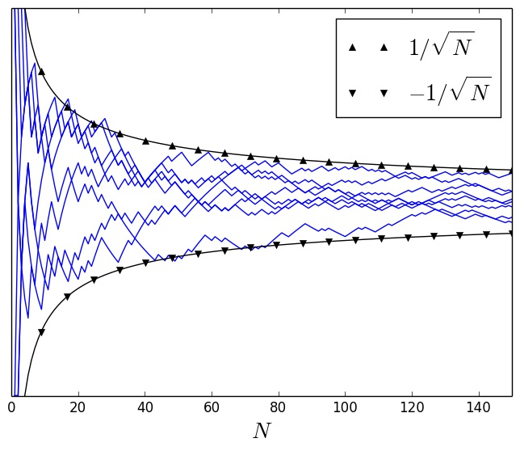
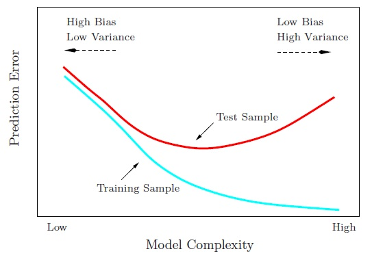

```{r setup, include=FALSE}
source('https://stats101.stanford.edu/profile.R')
knitr::opts_chunk$set(echo = FALSE)
```
```{r funcdefs, echo=FALSE}
ones <- function(nr, nc = 1) {
    return(matrix(1, nrow = nr, ncol = nc));
}
zeros <- function(nr, nc = 1) {
    return(matrix(0, nrow = nr, ncol = nc));
}

## DATA PROCESSING

constructData <- function(pc = 4, nc = 9) {
  ziptrain <- as.matrix(read.csv(file="~/Data/ZIP/zip.train",head=FALSE, sep=" "));
  ziptest <- as.matrix(read.csv(file="~/Data/ZIP/zip.test",head=FALSE,sep=" "));
  Xtrain = ziptrain[, c(2:257)];
  Xtest = ziptest[, c(2:257)];
  ytrain = as.vector(ziptrain[, 1]);
  ytest = as.vector(ziptest[, 1]);

  trainfileX = paste(pc, nc, "_train_images.csv", sep="");
  testfileX = paste(pc, nc, "_test_images.csv", sep="");
  trainfileY = paste(pc, nc, "_train_labels.csv", sep="");
  testfileY = paste(pc, nc, "_test_labels.csv", sep="");
  train_inds = (ytrain == pc | ytrain == nc);
  test_inds = (ytest == pc | ytest == nc);
  ytrain = ytrain[train_inds];
  ytrain[ytrain == nc] = -1;
  ytrain[ytrain == pc] = 1;
  ytest = ytest[test_inds];
  ytest[ytest == nc] = -1;
  ytest[ytest == pc] = 1;
  Xtrain = Xtrain[train_inds,];
  Xtest = Xtest[test_inds,];
  ntrain = nrow(Xtrain);
  dim = ncol(Xtrain);
  ## Add a tiny bit of noise to the training data, as it is low rank otherwise.
  Xtrain = Xtrain + matrix(rnorm(dim * ntrain, sd=.01), nrow=ntrain, ncol=dim);
  Xtrain = pmax(pmin(Xtrain, 1), -1);

  write.table(Xtrain, file = trainfileX, row.names=FALSE, col.names=FALSE);
  write.table(Xtest, file = testfileX, row.names=FALSE, col.names=FALSE);
  write.table(ytrain, file = trainfileY, row.names=FALSE, col.names=FALSE);
  write.table(ytest, file = testfileY, row.names=FALSE, col.names=FALSE);
}

loadZips <- function(pc = 4, nc = 9, base = "~/ds101/sandbox/jcd/") {
  X.trainfile = paste(base, pc, nc, "_train_images.csv", sep="");
  X.testfile = paste(base, pc, nc, "_test_images.csv", sep="");
  y.trainfile = paste(base, pc, nc, "_train_labels.csv", sep="");
  y.testfile = paste(base, pc, nc, "_test_labels.csv", sep="");
  Xtrain = as.matrix(read.table(X.trainfile));
  ytrain = as.vector(as.matrix(read.table(y.trainfile)));
  Xtest = as.matrix(read.table(X.testfile));
  ytest = as.vector(as.matrix(read.table(y.testfile)));
  return(list(Xtrain = Xtrain, ytrain = ytrain, Xtest = Xtest, ytest = ytest));
}

displayImage <- function(x = zeros(16, 16),
                         label = -1) {
    x = matrix(x, nrow = 16, byrow=TRUE);
    image(t(x[16:1,]), col=gray(0:256 / 256), asp = 1,
            main = paste("True label ", label), xaxt="n", yaxt="n");
}

D = loadZips(4, 9, "data/");
Xtest = D$Xtest;
ytest = D$ytest;
Xtrain = D$Xtrain;
ytrain = D$ytrain;
numeric.train.labels = ytrain;
numeric.train.labels[ytrain == 1] = 4;
numeric.train.labels[ytrain == -1] = 9;
numeric.test.labels = ytest;
numeric.test.labels[ytest == 1] = 4;
numeric.test.labels[ytest == -1] = 9;
```


## Outline

- Validation
    + Why is it important
    + How should we do it?
- Model checking
    + Checking whether your model is a good fit to the data
    + What to do if it is not?

## Using a very powerful model

Let us do a small experiment predicting handwritten digits again (4 versus 9),
where $x$ is pixels in image, $y \in \{-1, 1\}$

- Idea: why use just the pixel values? Why not squares or other powers of pixel values?
- Use a more powerful prediction model with **vectors** $\beta^{(1)}$,
  $\beta^{(2)}$, and $\beta^{(3)}$, which weight *powers* of pixel intensity :

\[
\hat{y} = \beta_0 + \sum_{j = 1}^p \beta_j^{(1)} x_j
+ \underbrace{\sum_{j = 1}^p \beta_j^{(2)} x_j^2}_{\mbox{quadratic terms}}
+ \underbrace{\sum_{j = 1}^p \beta_j^{(3)} x_j^3}_{\mbox{cubic terms}}
\]

```{r echo=TRUE}
Xtrain.powers = cbind(Xtrain, Xtrain * Xtrain, Xtrain * Xtrain * Xtrain);
Xtest.powers = cbind(Xtest, Xtest * Xtest, Xtest * Xtest * Xtest);
super.linreg = lm(ytrain ~ Xtrain.powers);
```

- What is your hypothesis about how this model will do on
    + Error on the <font class="emphred">training</font> data?
    + Error on the <font class="emphred">testing</font> data?

## Experiments with a powerful model on digit recognition

```{r echo=TRUE}
## Errors in training
cat(paste("Training data: ", sum(sign(super.linreg$fitted.values) != ytrain),
          " mistakes of ", length(ytrain), " data points\n", sep = ""));
```

Now, the moment of truth: how does our super classifier work?
```{r echo=TRUE}
beta.0 = super.linreg$coefficients[1];
beta = super.linreg$coefficients[2:length(super.linreg$coefficients)];
test.pred = Xtest.powers %*% beta + beta.0;
## Now, let's find a few example mistakes
mistakes = which(sign(test.pred) != ytest);
cat(paste("Test data: ", length(mistakes),
          " mistakes of ", length(ytest), " data points (",
          round(100 * length(mistakes) / length(ytest), digits = 1),
          "% error)\n", sep = ""));
```

## Experiments with a simple model on digit recognition

```{r echo=TRUE}
linreg = lm(ytrain ~ Xtrain);
## Errors in training
mistakes = which(sign(linreg$fitted.values) != ytrain);
cat(paste("Training data: ", length(mistakes),
          " mistakes of ", length(ytrain), " data points (",
          round(100 * length(mistakes) / length(ytrain), digits = 1),
          "% error)\n", sep = ""));
```

What about our old standby simple classifier?
```{r echo=TRUE}
beta.0 = linreg$coefficients[1];
beta = linreg$coefficients[2:length(linreg$coefficients)];
test.pred = Xtest %*% beta + beta.0;
## Now, let's find a few example mistakes
mistakes = which(sign(test.pred) != ytest);
cat(paste("Test data: ", length(mistakes),
          " mistakes of ", length(ytest), " data points (",
          round(100 * length(mistakes) / length(ytest), digits = 1),
          "% error)\n", sep = ""));
```

## Validation

<font class="emphblue">How</font> can we check how good our classifier is?

- The basic goal in prediction (machine learning) is to do well on *future data*
- Often, the best source of future data is to hold some data in the training
set out in a *test set* or *validation set*

- Why do we do this?
    + To avoid  <font class="emphred">overfitting</font> --- forcing our model to match 
    our training data too closely
    + <font class="emphred">To confirm </font> that we are making
	reasonable predictions

## A little theory (the classification case)

- Suppose we fit a model with parameters $\beta$ on a training set
- We keep out a *validation* (or *test*) set of size $N$, with pairs
  $x_i, y_i$, independent of the training data
- For a classification problem, with very high probability, the validation error rate
\[
	\widehat{\rm err} = \frac{1}{N} \sum_{i = 1}^N 1 \{ \hat{y}_i \neq y_i \}
\]
is an accurate measure of the true error rate of our classifier for all future data,
at least within $\sqrt{\widehat{\rm err}} / \sqrt{N} + 4 / N$

- Plot of validation error as a function of validation test size for several random validation sets

<div align="center">

</div>

## Revisiting validation of our models

For simple classifier:
```{r}
cat(paste("Test data: ", length(mistakes),
          " mistakes of ", length(ytest), " data points (",
          round(100 * length(mistakes) / length(ytest), digits = 1),
          "% error)\n", sep=""));
```
The true error rate (on future images) should be no more than
\[
\frac{\sqrt{.029}}{\sqrt{377}} + \frac{4}{377} = .019
\]
better or worse than 2.9% error.

For the fancier classifier:
```{r}
beta.0 = super.linreg$coefficients[1];
beta = super.linreg$coefficients[2:length(super.linreg$coefficients)];
test.pred = Xtest.powers %*% beta + beta.0;
## Now, let's find a few example mistakes
mistakes = which(sign(test.pred) != ytest);
cat(paste("Test data: ", length(mistakes),
          " mistakes of ", length(ytest), " data points (",
          round(100 * length(mistakes) / length(ytest), digits = 1),
          "% error)\n", sep = ""));
```
So the true error rate (on future images) is (likely) no more than
\[
	\frac{\sqrt{.077}}{\sqrt{N}} + \frac{4}{N} = .025
\]
better or worse than 7.7% error.

## What is going on?

- <font class="emphred">Overfitting</font>: we have overfit to our training data
- When we use a model that is *too powerful* for the amount of data we have, we fit
spurious junk

```{r echo=FALSE}
set.seed(2);
```
```{r echo=TRUE}
N = 10;  # Generate data that is nothing but random Normal noise
y = .25 * rnorm(N);
x = seq(0, 1, length.out=N);
```
```{r echo=FALSE}
plot(x, y, xlab = "x", pch = 20, ylim = c(-2, 2))
```

Fit the *noise* with a model of the form
\[
\hat{y} = \beta_0 + \beta_1 x + \beta_2 x^2 + \cdots + \beta_9 x^9
\]

## Fitting a model that predicts the data perfectly

```{r echo=TRUE}
X = cbind(x)
for (ii in 2:(N-1)) {
  X = cbind(X, x^ii);  # Construct data with all powers up to N - 1.
}
polynomial.linreg = lm(y ~ X);
```

```{r echo=FALSE}
plot(x, y, xlab = "x", pch = 20, ylim = c(-2, 2));
x.interp = seq(0, 1, length.out = 100);
X = cbind(x.interp);
for (ii in 2:(N - 1)) {
  X = cbind(X, x.interp^ii);
}
beta = polynomial.linreg$coefficients[2:N];
beta0 = polynomial.linreg$coefficients[1];
yhat = X %*% beta + beta0;
## polynomial.linreg$ceofficients[1];
lines(x.interp, yhat, col="blue", lwd=2)
```

## Generating a little more data

And yet, if we get a bit more data, it becomes clear we have *overfit*

```{r echo=TRUE}
y.additional = .25 * rnorm(100);
plot(x, y, xlab = "x", pch = 21, ylim = c(-2, 2), ylab = "y", col="blue", cex=2);
points(x, y, pch = 20);
points(x.interp, y.additional, pch = 20);
lines(c(0, 1), c(0, 0), col="red", lwd=2);
lines(x.interp, yhat, col="blue", lwd=2);
```

##Overfitting and the bias-variance tradeoff

<div align="center">

</div>


## Model checking

- Defining the model (according to George Box)

> All models are wrong; some models are useful...
> Just as the ability to devise simple but evocative models is the signature
> of the great scientist so overelaboration and overparameterization is
> often the mark of mediocrity

- What do we check for in a regression model?
	+ Are the assumptions reasonable?
	+ Have we chosen good features ($x$ variables)?

- We consider two diagnostics (also good for modeling)
    + Residual plots
    + Probability plots

## Model checking: residual plots

- Do we have good features?

We make predictions
\[
	\hat{y} = \beta_0 + \sum_{j = 1}^p \beta_j x_j
\]
Consider the errors (residuals) in each prediction
\[
	r = y - \hat{y} = y - \beta_0 - \sum_{j = 1}^p \beta_j x_j
\]
For each variable $j \in \{1, 2, \ldots, p\}$, we ask 

<div align="center">
<font class="emphred"> Is the assumption of linearity reasonable? </font>
</div>

## Model checking: what function should we use?

- Idea: holding all other variables constant (but at their best fits), what
is the right fit for variable $j$?
- Plot the prediction errors $y - \hat{y}$, removing predicted contribution of
  variable $x_j$, versus variable $x_j$
- That is, plot
\[
\underbrace{y - \hat{y}}_{\mbox{residual}} + \underbrace{\beta_j x_j}_{\mbox{remove
component for $j$}}
= y - \beta_0 - \sum_{k \neq j} \beta_k x_k
~~~~~~ \mbox{vs.} ~~~~~
x_j
\]

## Model checking example: finding the right functions

- Generate data from the model
\[
y = 2.1 \cdot x_1 + 3.5 \cdot x_2 - 1.9 \cdot x_3 + 2.0 \cdot x_4 + 1.5 \cdot x_1^2
	+ \varepsilon
\]
where $\varepsilon$ is normal mean 0, variance $1/4$
	
```{r echo=TRUE}
p = 4;
n = 100;
betas = c(2.1, 3.5, -1.9, 2.0, 1.5);
x.samples = rnorm(n * p);
X = matrix(x.samples, nrow = n, ncol = p);
X.with.quadratic = cbind(X, X[, 1]^2);
y = X.with.quadratic %*% betas + .5 * rnorm(n);
```

- We have generated $n = 100$ points from this distribution

## Model checking example: basic plots

- Plot $y$ against each coordinate of $x$
```{r echo=TRUE}
par(mfrow=c(2, 2));
plot(X[, 1], y, xlab = "x1", ylab = "y")
plot(X[, 2], y, xlab = "x2", ylab = "y")
plot(X[, 3], y, xlab = "x3", ylab = "y")
plot(X[, 4], y, xlab = "x4", ylab = "y")
```

## Model checking example: first diagnostic

- Plot $y$ against each coordinate of $x$
```{r echo=TRUE}
linreg = lm(formula = y ~ X);
betas = linreg$coefficients[2:(p+1)];
par(mfrow = c(2, 2));
plot(X[, 1], linreg$residuals + X[, 1] * betas[1], xlab = "x1",
     ylab = "residual 1")
plot(X[, 2], linreg$residuals + X[, 2] * betas[2], xlab = "x2",
     ylab = "residual 2")
plot(X[, 3], linreg$residuals + X[, 3] * betas[3], xlab = "x3",
     ylab = "residual 3")
plot(X[, 4], linreg$residuals + X[, 4] * betas[4], xlab = "x4",
     ylab = "residual 4")
```

## Model checking example: adding quadratic in

- Plot $y$ against each coordinate of $x$
```{r echo=TRUE}
X.with.quadratic = cbind(X, X[, 1]^2);
linreg = lm(formula = y ~ X.with.quadratic);
betas = linreg$coefficients[2:(p+1)];
par(mfrow = c(2, 2));
plot(X[, 1], linreg$residuals + X[, 1] * betas[1], xlab = "x1",
     ylab = "residual 1")
plot(X[, 2], linreg$residuals + X[, 2] * betas[2], xlab = "x2",
     ylab = "residual 2")
plot(X[, 3], linreg$residuals + X[, 3] * betas[3], xlab = "x3",
     ylab = "residual 3")
plot(X[, 4], linreg$residuals + X[, 4] * betas[4], xlab = "x4",
     ylab = "residual 4")
```

- Errors now look pretty linear!

## Model checking: do we have fidelity to the data?

<!-- I have a problem: this does not seem to let one actually do anything -->
- The QQ ("quantile-quantile") plot is a plot of *quantiles* of one
distribution against another
- Quantile of a distribution: for $\alpha \in [0, 1]$,
\[
q_\alpha = q : P(Y  \le q) = \alpha
\]
- The function `qqnorm` plots the quantiles of a distribution against those
for a normal
    + If things are normal, `qqnorm` should look linear

## Model checking: do we have fidelity to the data?

- Example 1: our simulation

```{r echo=TRUE}
qqnorm(linreg$residuals / sd(linreg$residuals));
lines(c(-2, 2), c(-2, 2), col="red", lwd=2);
```

## Model checking: does our model look good

- Example 2: Boston housing data set

```{r echo=TRUE}
library(MASS);
data(Boston);
boston = Boston;
## Remove the $500,000 sale price, as it is fake
boston = boston[boston$medv != 50, ];
fullregression = lm(formula = medv ~ ., data = boston)
qqnorm(fullregression$residuals / sd(fullregression$residuals))
lines(c(-3, 3), c(-3, 3), col = "red", lwd=2);
```


<!--- How about a bootstrap for a coefficient? Bootstrap interval? --->


