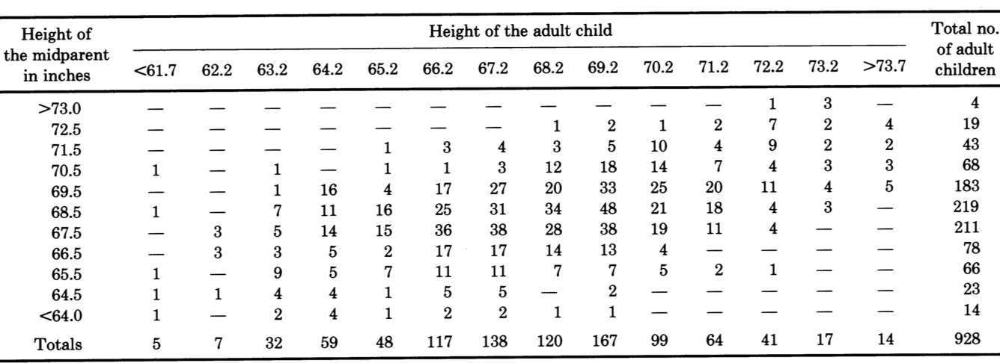
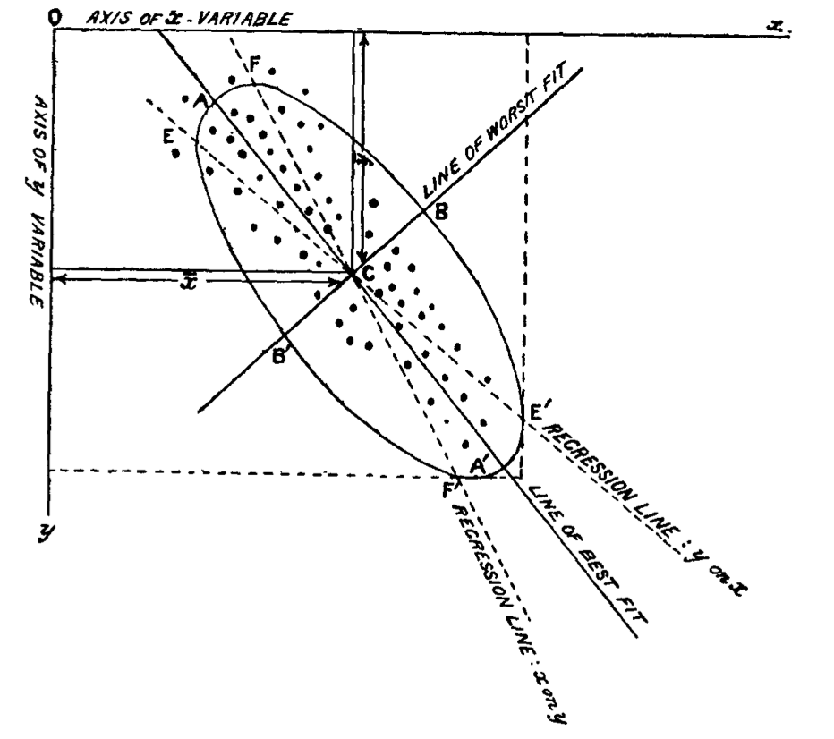

```{r setup,include=F}
#source('http://stats101.stanford.edu/profile.R')
knitr::opts_chunk$set(echo = TRUE)
knitr::opts_chunk$set(dev="pdf", fig.align="center",fig.width=4.5,fig.height=3.3,out.width ='.85\\linewidth')
library(ggplot2)

```


## PCA I: putting a line through the data

- Scatterplots with lines through the data are one of the most common plots we see

- When you studied regression, you did study one way of putting lines through the data. We are going to look at a different approach, which treats the different variables symmetrically.

- We will start with two dimensional datasets, but we are really interested in an tool that can be applied to summarize the relation between many variables.


## An historical dataset


- Galton in 1885 compiles a table with the height of 928 adult children, classified by height of "midparents"

- All female heights were re-scaled by multiplying by 1.08, and midparent heights were computed averaging the heights of father and rescaled mother.

- It is working with this dataset that Galton develops the concepts of regression and correlation

## Galton data


{ width=105% }


##  Galton data - available in R in the "psych" package 

```{r,include=FALSE}
library(UsingR)
data(galton) # galton data in UsingR package
```

```{r}
summary(galton)
```

## Galton data 

```{R, echo=FALSE,fig.height=6,fig.width=6,out.width='.99\\linewidth'}
par(mfrow=c(1,1))
attach(galton)
sunflowerplot(child,parent,xlab="Child Height", ylab="Mid-parent Height",main="Using `sunflowerplot'",seg.col="darkgray")
detach(galton)
```

## Means, conditional and non

To predict a child's height given a parent's height, look at the average height of children that have parents of the same height

```{r, echo=FALSE,fig.height=6,fig.width=6,out.width='.7\\linewidth'}
tabledata<-table(galton[,1],galton[,2])

#Let's look at what we get.
N<-sum(tabledata)
#Calculating marginal frequencies
Xfreq<-apply(tabledata,1,sum)/N
Yfreq<-apply(tabledata,2,sum)/N

Xval<-as.numeric(rownames(tabledata))
Yval<-as.numeric(colnames(tabledata))


# Calculating marginal means
Xmean<-sum(Xfreq*Xval)
Ymean<-sum(Yfreq*Yval)

# Calculating marginal variances
Xvar<-sum((Xval-Xmean)^2*Xfreq)
Yvar<-sum((Yval-Ymean)^2*Yfreq)


# Calculating conditional means (we are doing all of them at the same time, being careful at how R handles multiplication * of a vector by a matrix. You can try to do to them one at the time also

Xmean.given.Y<-apply(Xval*tabledata,2,sum)/(Yfreq*N)
Ymean.given.X<-apply(Yval*t(tabledata),2,sum)/(Xfreq*N)

# Just to make sure you know how to do these conditional averages one a the time, the following will give you the conditional average of X given that Y is equal to its second value
#sum(Xval*tabledata[,2])/sum(tabledata[,2])

# plotting the results, together with the original data

sunflowerplot(galton[,1],galton[,2],xlab="Child Height",ylab="Mid-Parent height",seg.col="gray")

# To see all these overlapping observations we use the function jitter, which adds a bit of noise.
points(Xmean.given.Y,Yval,col=2,pch=15)
lines(Xmean.given.Y,Yval,col=2,pch=15)
points(Xval,Ymean.given.X, col="blue",pch=17)
lines(Xval,Ymean.given.X,col="blue",pch=17)
abline(v=Ymean,col=2)
abline(h=Xmean,col="blue")

```

## Subtracting the means and using regression lines

```{R, echo=FALSE,fig.height=6,fig.width=6,out.width='.99\\linewidth'}
attach(galton)
child<-child-mean(child)
parent<-parent-mean(parent)
sunflowerplot(child,parent,xlab="Child Height", ylab="Mid-parent Height",main="Centered Galton's data",col="gray",xlim=c(-6.5,6.5),ylim=c(-6.5,6.5),seg.col="gray")
reg1 = lm(child~parent)
abline(0,1/0.6463,col="red")
reg2 = lm(parent~child)
abline(0,0.3256,col="blue")
detach(galton)
```

## Galton's display of the data 


{width=.95\\linewidth}


## Putting a line through the data

- We can recognize the regression line of mid-parents' heights on children's

- And the regression line of children's heights on parents'

- But there are two additional lines that appear, and they are marked as major and minor axis of the ellipse: what are these?

- To understand more about this, we start working with another dataset, which is "contemporary" to Galton's and on the same topic, but simpler in that it deals with men only, and it is not discretized

## Pearson's data

```{R, echo=FALSE,fig.height=6.2,fig.width=5.6,out.width='.99\\linewidth'}
data(father.son)
par(mfrow=c(1,1))
plot(father.son,main="Pearson's height data",xlab="Father",ylab="Son")
```

## Pearson's data

We subtract means from fathers' and sons' heights  and plot the linear regression lines 

```{r, echo=FALSE,fig.height=6.2,fig.width=5.6,out.width='.6\\linewidth'}
data(father.son)
attach(father.son)
father = fheight-mean(fheight)
N = length(father)
son = sheight-mean(sheight)
plot(father,son,main="",xlab="Father",ylab="Son",xlim=c(-10,10),ylim=c(-10,10))
reg1 = lm(son~father)
abline(reg1$coeff[1],reg1$coeff[2],col=2)
reg2 = lm(father~son)
abline(-reg2$coeff[1]/reg2$coeff[2],1/reg2$coeff[2],col=4)
```

## Minimal sum of squared errors

```{R, echo=FALSE,fig.height=8,fig.width=8,out.width='1.5\\linewidth'}

par(mfrow=c(2,2),mar=c(5,7,4,2))
plot(father,son,main="Reg. Line of Son on Father",xlab="Father",ylab="Son",xlim=c(-10,10),ylim=c(-10,10),cex.main=1.5,cex.lab=1.5)
mtext("Vertical Errors",side=2,line=5,cex=1.5)
reg1<-lm(son~father)
abline(0,0.5141,col=2)
N<-length(father)
for(i in 1:N)
  {lines(c(father[i],father[i]),c(son[i],0.5141*father[i]),col=2)}
plot(father,son,main="Reg. Line of Father on Son",xlab="Father",ylab="Son",xlim=c(-10,10),ylim=c(-10,10),cex.main=1.5,cex.lab=1.5)
reg2<-lm(father~son)
abline(0,1/0.4889,col=4)
N<-length(father)
for(i in 1:N)
  {lines(c(father[i],father[i]),c(son[i],father[i]/0.4889),col=2)}
abline(0,1/0.4889,col=4)


plot(father,son,main="Reg. Line of Son  on Father",xlab="Father",ylab="Son",xlim=c(-10,10),ylim=c(-10,10),cex.main=1.5,cex.lab=1.5)
abline(0,0.5141,col=2)
for(i in 1:N)
  {lines(c(father[i],son[i]/0.5141),c(son[i],son[i]),col=4)}
abline(0,0.5141,col=2)
mtext("Horizontal Errors",side=2,line=5,cex=1.5)

plot(father,son,main="Reg. Line of Father on Son",xlab="Father",ylab="Son",xlim=c(-10,10),ylim=c(-10,10),cex.main=1.5,cex.lab=1.5)
abline(0,1/0.4889,col=4)
for(i in 1:N)
  {lines(c(father[i],son[i]*0.4889),c(son[i],son[i]),col=4)}


```

## Distances of a point to a line

Euclidean distances: symmetric with respect to $x$ and $y$.  
```{R, echo=FALSE,fig.height=6.2,fig.width=5.6,out.width='.99\\linewidth'}
our.proj = function(x, y, a){(x+a*y)/(1+a^2)} # there is a builtin function called `proj`
subsample = sample(1:N,100, replace=F)
sfather = father[subsample]
sson = son[subsample]

# What type of distances of a point to a line we might consider?
par(mfrow=c(1,1))
plot(sfather,sson,xlab="Fathers' height", ylab="Son's height",main="Distances of points to a line")
abline(0,1)
for(i in 1:100)
  {lines(c(sfather[i],sson[i]),c(sson[i],sson[i]),col=4)}
for(i in 1:100)
  {lines(c(sfather[i],sfather[i]),c(sson[i],sfather[i]),col=2)}
 t = our.proj(sfather,sson,1)
for(i in 1:100)
{
lines(c(sfather[i],t[i]),c(sson[i],t[i]),col=3)
}
```

## Finding the line that minimizes SS of Euclidean distances

- One example where we create two variables

 $$x \sim {\cal N}(0,1)$$
$$ y= 2x + \epsilon, \;\;\; \epsilon \sim {\cal N}(0,1)$$

- We are going to evaluate the sum of squared euclidean distances between these data points and 8 lines, all with intercept 0 and slopes

$$ -.5,-1, -2, -4, 4, 2, 1, .5$$ 

## Finding the line that minimizes SS of Euclidean distances

```{R, echo=FALSE,fig.height=6,fig.width=8.5,out.width='.99\\linewidth'}
x = rnorm(30)
y = 2*x +rnorm(30)
dataset = cbind(x,y)
rm(x,y)
par(mfrow=c(2,4),mar=c(6,4,6,2))
slopeval = c(-.5,-1,-2,-4,4,2,1,.5)

for(j in 1:8) {
    slope = slopeval[j]
    t = our.proj(dataset[,1],dataset[,2],slope)
    err =  round(sum((dataset[,1]-t)^2+(dataset[,2]-slope*t)),2)
    plot(dataset[,1],dataset[,2],xlim=c(-5,5),ylim=c(-5,5),main=paste("Sum of SE =",as.character(err)),ylab="Variable 2",xlab="variable 1")
    slope = slopeval[j]
    mtext(paste("slope=",as.character(slope)),side=3,line=5)
    abline(0,slope)
    for(i in 1:30) {
        lines(c(dataset[i,1],t[i]),c(dataset[i,2],slope*t[i]),col=2)
    }
    points(t,slope*t,col=4,pch=20)
}
```

## Finding the line that minimizes SS of Euclidean distances

- So, in our example, the line with minimal SSEuclidean Errors was the one that reflected the "true" relation between the two variables.

- Note that so far, we have not actually figured out how to calculate this line (see later and next lecture). 

- In the following examples, however, I am going to use the rule that we will discover to 
(1) Compare to Galton's results (and looking back at Pearson's data)
(2) Understand some of the properties of this line

## Going back to Galton's data

```{R, echo=FALSE,message = FALSE, warnings = FALSE,fig.height=6,fig.width=6,out.width='.99\\linewidth'}
attach(galton)
child<-child-mean(child)
parent<-parent-mean(parent)
sunflowerplot(child,parent,xlab="Child Height", ylab="Mid-parent Height",main="Galton's data (centered)",col="gray",xlim=c(-6.5,6.5),ylim=c(-6.5,6.5),seg.col="gray")
reg1 = lm(child~parent)
abline(0,1/0.6463,col="red")
reg2 = lm(parent~child)
abline(0,0.3256,col="blue")
pca.xy = prcomp(cbind(child,parent),retx=TRUE)
rot = pca.xy$rotation
abline(0,rot[2,1]/rot[1,1],col="green")
detach(galton)
```


## Going back to Galton's data

{width=.95\\linewidth}


The line we found is called **Principal Component**

## Going back to Pearson's data

```{R, echo=FALSE,fig.height=6.2,fig.width=5.6,out.width='.99\\linewidth'}
plot(father,son,main="Pearson's height data (centered)",xlab="Father",ylab="Son",xlim=c(-10,10),ylim=c(-10,10))
reg1<-lm(son~father)
abline(0,0.5141,col=2)
reg2<-lm(father~son)
abline(0,1/0.4889,col=4)
pca.height<-prcomp(father.son, retx=TRUE)
rot <- pca.height$rotation
abline(0,rot[2,1]/rot[1,1],col=3)
```

##  Pearson's work


*[On lines and planes of closest fit to systems of points in space](http://www.tandfonline.com/doi/pdf/10.1080/14786440109462720)* (1901)




## An instructive example

$$z\sim {\cal N}(0,1)$$
$$x=z + \epsilon$$
$$ y= z+ \eta$$

- There is one underlying variable $z$ that contributes both to $x$ and to $y$.

- There is a noise component $\epsilon$ and $\eta$ both in $x$ and $y$

- Let $\sigma$ be the standard-deviaton of $\epsilon$ and $\eta$. We consider 8 values for $\sigma=(1,0.7,.6,.5,.4,.3,.2,.1)$

- We are going to generate 8 datasets following this rule, plot the data, and the two regression lines (red and blue) as well as the line that minimizes the sum of square euclidean distance from the points (green)

## An instructive example

```{R, echo=FALSE,fig.height=5,fig.width=8.5,out.width='1.05\\linewidth'}
par(mfrow=c(2,4))
SIGMA<-c(1,0.7,.6,.5,.4,.3,.2,.1)
for(i in 1:8)
{
    sigma<-SIGMA[i]
    z<-rnorm(100)
    y<-z+rnorm(100)*sigma
    x<-z+rnorm(100)*sigma
    y<-y-mean(y)
    x<-x-mean(x)
    pca.xy<-prcomp(cbind(x,y),retx=TRUE)
    rot <- pca.xy$rotation
    reg1<-lm(y~x)
    reg2<-lm(x~y)
    slopeOR<-rot[2,1]/rot[1,1]
    titleplot<-paste(paste(paste("Sigma =",sigma),", SlopeOR="),as.character(round(slopeOR,2)))
    plot(x,y,xlim=c(-3.5,3.5),ylim=c(-3.5,3.5),main=titleplot)
    abline(reg1$coeff[1],reg1$coeff[2],col=2)
    abline(-reg2$coeff[1]/reg2$coeff[2],1/reg2$coeff[2],col=4)    
    abline(0,rot[2,1]/rot[1,1],col=3)
}
```

## An instructive example

- The slopes of the regression lines change with the change in standard deviation, but the slope of the "Orthogonal Regression" line not so much 

- As the variance of $\epsilon$ and $\eta$ decreases, the difference between the two regression lines diminishes, and they both become closer to the green line

- Let's try again and see what happens if we do the same exercise as before, but this time

$$z\sim {\cal N}(0,1)$$
$$x=z + \epsilon$$
$$ y= z/2+ \eta$$


## An instructive example, II

```{R, echo=FALSE,fig.height=5,fig.width=8.5,out.width='1.05\\linewidth'}
par(mfrow=c(2,4))
for(i in 1:8)
{
    sigma = SIGMA[i]
    z = rnorm(100)
    y = z/2+rnorm(100)*sigma
    x = z+rnorm(100)*sigma
    y = y-mean(y)
    x = x-mean(x)
    pca.xy = prcomp(cbind(x,y),retx=TRUE)
    rot  =  pca.xy$rotation
    reg1 = lm(y~x)
    reg2 = lm(x~y)
    slopeOR = rot[2,1]/rot[1,1]
    titleplot = paste(paste(paste("Sigma =",sigma),", SlopeOR="),as.character(round(slopeOR,2)))
    plot(x,y,xlim=c(-3.5,3.5),ylim=c(-3.5,3.5),main=titleplot)
    abline(reg1$coeff[1],reg1$coeff[2],col=2)
    abline(-reg2$coeff[1]/reg2$coeff[2],1/reg2$coeff[2],col=4)    
    abline(0,rot[2,1]/rot[1,1],col=3)
}
```


## How do we calculate the line that minimizes SS of Euclidean distances?

- let's look back at our trial and error attempt and focus on the blue projections, rather then red distances

```{R, echo=FALSE,fig.height=5,fig.width=8.5,out.width='.99\\linewidth'}
x = rnorm(30)
y = 2*x +rnorm(30)
dataset = cbind(x,y)
rm(x,y)
par(mfrow=c(2,4))
slopeval = c(-.5,-1,-2,-4,4,2,1,.5)

for(j in 1:8) {
    slope = slopeval[j]
    t = our.proj(dataset[,1],dataset[,2],slope)
    err =  round(sum((dataset[,1]-t)^2+(dataset[,2]-slope*t)),2)
    plot(dataset[,1],dataset[,2],xlim=c(-5,5),ylim=c(-5,5),main=paste("Sum of SE =",as.character(err)),ylab="Variable 2",xlab="variable 1")
    slope = slopeval[j]
    abline(0,slope)
    for(i in 1:30) {
        lines(c(dataset[i,1],t[i]),c(dataset[i,2],slope*t[i]),col=2)
    }
    points(t,slope*t,col=4,pch=20)
}
```

## An application of Pythagoras' theorem

```{R, echo=FALSE,fig.height=6.2,fig.width=5.3,out.width='.99\\linewidth'}
par(mfrow=c(1,1))
plot(father,son,xlab="Fathers' height", ylab="Son's height",main="",col="gray")
i<-10
points(father[i],son[i],pch=20,col=2)
points(0,0,pch=20)
lines(c(father[i],0),c(son[i],0))
abline(0,1,col="mediumslateblue")
t<-our.proj(father,son,1)
lines(c(father[i],t[i]),c(son[i],t[i]),col="mediumslateblue",lty=2)
points(t[i],t[i],pch=20,col="mediumslateblue")
lines(c(t[i],0), c(t[i],0),col="mediumslateblue",lw=2)

abline(0,0.5,col="darkolivegreen4")
t<-our.proj(father,son,.5)
lines(c(father[i],t[i]),c(son[i],.5*t[i]),col="darkolivegreen4",lty=2)
points(t[i],.5*t[i],pch=20,col="darkolivegreen4")
lines(c(t[i],0), c(.5*t[i],0),col="darkolivegreen4",lw=2)

abline(0,2,col="darkorange3")
t<-our.proj(father,son,2)
lines(c(father[i],t[i]),c(son[i],2*t[i]),col="darkorange3",lty=2)
points(t[i],2*t[i],pch=20,col="darkorange3")
lines(c(t[i],0), c(2*t[i],0),col="darkorange3",lw=2)
```

## An application of Pythagoras' theorem

- The square of the distance of a point to a line going through the origin + the square of the distance of the projection of the point on this line to the origin = square of the distance of a point to the origin

-  Finding the line with minimal sum of squared euclidean distances from the points, is equivalent to finding the line on which the points projections have maximal variance

- This last goal is very interesting and we will explore it further next time
