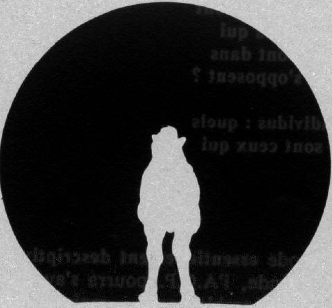

```{r setup,include=F}
#source('http://stats101.stanford.edu/profile.R')
knitr::opts_chunk$set(echo = TRUE)
knitr::opts_chunk$set(dev="pdf", fig.align="center",fig.width=4.5,fig.height=3.3,out.width ='.85\\linewidth')
library(ggplot2)
options(width=50)
```

## PCA II: finding a linear combination with maximal variance

- We are going to arrive at the idea behind principal components from a different perspective

- We are going to describe an explicit rule with which to solve this problem

- Note: understanding the rule requires some knowledge in linear algebra that not all of you might have. This is OK: you will not be required to understand the derivation for the purpose of this class, but
(1) If you do, you will enjoy the application of linear algebra
(2) If you do not, you will be motivated to learn more linear algebra

## The test/re-test problem

You and your friends want to compare the speeds of your pets

You want to have them run between two points and record arrival times, but it is somewhat difficult to convince cats, bunnies, hamsters, chickens, dogs etc to comply with the rules of track and field

So, keeping the total distance constant, you design a set of different close courses (in the grass, dirt, black-top...), with differnt incentivation devices (a loud noise at the start; you running ahead of your pet and prompting it to follow; the pet's food clearly visible at the end of the course; you pursuing the pet with a torch; you saying "ready set go," ...) and you record the pet times in each of them

When you look at the results, you see that the course/incentive combinations lead to variable spread of times for the animals and variable average times. How would you combine the results to get a good ranking of the speed of the pets?

## Aggregating the results of questions

You want to evaluate how much each of your friends likes to travel and decide to design a questionnaire

You want to use 20 questions, each of the type:   

- How much do you agree with the following statement?  [...]
 Indicate your answer with a number between 0 ("Strongly disagree") and 10 ("Strongly agree")

 In deciding on the statements, you try to pick 20 such that "Strong agreement" with the statement should indicate strong affinity to travel.

After, you convinced 50 of your friends to take the survey, realize that some of your questions are not very discriminatory. For example, everybody expressed agreement  between 8 and 10 with the statement "It is great to discover new things"


## A meaningful "average"

- When  we have many measurements of "the same underlying quantity", it is often useful to combine them in one "average" value

- Before we rush to take the arithmetic mean, however, there are few things worth considering.

- Each measurement might have an inherently different mean (animals run faster from a fire than from a laud noise), so that it is useful to subtract the mean from each measurement before combing them

- Measurements might have different variances

- When we summarize all the measurements in one "average" we are projecting multidimensional data onto one dimension: it is a good idea to choose a dimension that separates things well.

## Projections




## Good Projections


## Good Projections -- going back to last time

Blue points are one dimensional summary of black points

```{R, echo=FALSE,fig.height=6,fig.width=8.5,out.width='.99\\linewidth'}
our.proj = function(x, y, a){(x+a*y)/(1+a^2)}
x = rnorm(30)
y = 2*x +rnorm(30)
dataset = cbind(x,y)
rm(x,y)
par(mfrow=c(2,4),mar=c(6,4,6,2))
slopeval = c(-.5,-1,-2,-4,4,2,1,.5)

for(j in 1:8) {
    slope = slopeval[j]
    t = our.proj(dataset[,1],dataset[,2],slope)
    err =  round(sum((dataset[,1]-t)^2+(dataset[,2]-slope*t)),2)
    plot(dataset[,1],dataset[,2],xlim=c(-5,5),ylim=c(-5,5),main=paste("Sum of SE =",as.character(err)),ylab="Variable 2",xlab="variable 1")
    slope = slopeval[j]
    mtext(paste("slope=",as.character(slope)),side=3,line=5)
    abline(0,slope)
    for(i in 1:30) {
        lines(c(dataset[i,1],t[i]),c(dataset[i,2],slope*t[i]),col=2)
    }
    points(t,slope*t,col=4,pch=20)
}
```


## Looking at two variables and setting up the problem

- Let $X_1$ and $X_2$ be our initial variables, centered so that their mean is 0.
- We want to choose $w_1$ and $w_2$ so that 
$t_i=w_1 \cdot X_{1i}+w_2 \cdot X_{2i}$ has maximal variance $n^{-1}\sum_{i}t_i^2$

- We need to add a constraint to make the problem meaningful (otherwise the bigger $w_1$ or $w_2$  the bigger the variance)

- We choose the constraint $w_1^2+w_2^2 = 1$ 

Note that then we are not quite finding an "average" of the two variables ($w_1+w_2 \neq 1$); 

- Pythagoras' theorem tells us that the solution to this problem is the projection onto the line that minimizes the sum of squared euclidean distances from the points.

- We are going to solve the maximal variance problem

## Rephrasing the problem with matrix notation

Let $$w=\left[\begin{array}{c}w_1\\ w_2 \end{array}\right]
\;\;\;\; X=\left[\begin{array}{cc} X_{11} & X_{21}\\
X_{12} & X_{22}\\
X_{13} & X_{23}\\
\vdots & \vdots \\
X_{1n} & X_{2n}
\end{array}\right]$$

Then 

$$t=\left[\begin{array}{c} t_1\\t_2\\ \vdots \\ t_n\end{array}\right]= Xw$$


We can write the problem as follows
$$\max_{w: w'w=1}\frac{1}{n}\sum_i t_i^2=
\max_{w: w'w=1}w'(n^{-1}X'X) w.$$

## Maximal variance: an eigenvalue-eigenvector problem

Define the Lagrangian ${\cal L} = w'(n^{-1}X'X) w-\lambda(w'w-1)$.
 Differentiate with respect to $w$ (squint for a second and pretend 
it is a one dimensional object).

$$
\frac{\partial {\cal L}}{\partial w} =  2(n^{-1}X'X)w-2\lambda w=0
 \Longrightarrow (n^{-1} X'X) w =\lambda w
$$

 $\implies w$ is an eigenvector of $n^{-1}X'X$ and $\lambda$ an eigenvalue.

 Note that $$n^{-1}\sum_i t_i^2 = w'(n^{-1}X'X)w =w'\lambda w =\lambda w'w=\lambda.$$
 $\implies$ To get maximal variance we need to pick the eigenvector 
associated to the maximal eigenvalue. This is the major axis of Galton's ellipse and the **principal component**

The second eigenvector is the minor axis of Galton's ellipse!

## More than 2 variables

- Note that there is nothing special about 2 variables in the matrix notation framework.

- Let $$w=\left[\begin{array}{c}w_1\\ w_2 \\ \vdots \\ w_p \end{array}\right]
\;\;\;\; X=\left[\begin{array}{cccc} X_{11} & X_{21} & \cdots & X_{p1} \\
X_{12} & X_{22} & \cdots & X_{p2}\\
X_{13} & X_{23} & \cdots & X_{p3}\\
\vdots & \vdots & \vdots & \vdots \\
X_{1n} & X_{2n}& \cdots & X_{pn} 
\end{array}\right]\;\;\; t=Xw$$

We still have
$$\max_{w: w'w=1}\sum_i t_i^2=
\max_{w: w'w=1}w'X'X w.$$

- The solution is still given by eigenvalues and eigenvectors


## Calculating Principal Components in R: the decathlon dataset
Performances of 33 men's decathlon at the 1988 Olympic Games, as reported in the R package ade4.

```{r, include=FALSE}
deca = read.csv(file="data/Decathlon.csv")
```
```{r, echo=FALSE,fig.height=4,fig.width=8.5,out.width='.9\\linewidth'}
par(mfrow=c(2,5),bty="n",mar=c(1,4,2,2))
for(i in 1:10)
  {boxplot(deca[,i],main=names(deca)[i])}
```

## The decathlon dataset: scatter plot of performances
```{r, echo=FALSE,fig.height=8,fig.width=10,out.width='1.2\\linewidth'}
pairs(deca[,1:10],cex.labels = 1.2)
```

## The decathlon dataset: who does well
```{r,echo=FALSE,fig.height=4.5,fig.width=7.5,out.width='1.01\\linewidth'}
par(mfrow=c(2,5),bty="n",mar=c(5,2,4,2))
for(i in 1:10) {
    plot(deca$Score,deca[,i],main=names(deca)[i],xlab="Final Score",ylab="")
}
```

## Calculating principal components in R

```{r, include=FALSE}
deca.pc = prcomp(deca[,1:10],center=TRUE,scale=TRUE)

```

{width=105% }


- Note that by default the program looks at all eigenvalues and associated eigenvectors -- we will learn more about this next time.

## Eploring the principal component object: $\lambda$

Here are the **eigenvalues** -- rather their square root.

```{r, echo=TRUE}
deca.pc$sdev
```

$$\sum_i\lambda_i= trace (X'X) =\sum_i Var(X_i)$$

They inform us about the portion of variance explained

## Exploring the principal component object: $w$

**eigenvectors**: coefficients for the linear combination

{width=105%}

## Eploring the principal component object: $Xw$

The linear combinations of the original variables defined by the eigenvector are called Principal Components


## Coefficients of the events in the first principal component


```{r,fig.height=4,fig.width=6,out.width='.8\\linewidth'}
par(las=3)
barplot(deca.pc$rotation[,1],main=paste(" PCA",
    as.character(1)),xlab="",ylab="Coefficients",
    names.arg=names(deca)[1:10])

```

## The first principal component vs the Final Olympic Score
```{r, include=FALSE}
par(mfrow=c(1,1),las=1)
```
```{r,fig.height=5,fig.width=6,out.width='.8\\linewidth'}
plot(deca.pc$x[,1],deca$Score,main="",xlab="First 
     Principal Component", ylab="Olympic score")

```

## The first principal component of the decathlon dataset

- We grouped events correctly (those for which a small number is better and those for which a large number is better)

- It provided us with a method to summarize the results that is quite close to the official scoring system -- and we used no information on typical performance or difficulty of the event, just the results for these 33 subjects

- Summarizing variables by looking at the linear combination with maximal variants seems indeed to be doing something useful!
