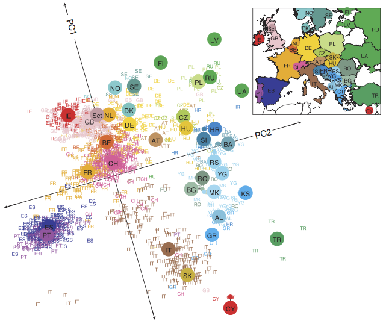

```{r setup,include=FALSE}
#source('http://stats101.stanford.edu/profile.R')
knitr::opts_chunk$set(echo = FALSE)
knitr::opts_chunk$set(dev="pdf", fig.align="center",fig.width=4.5,fig.height=3.3,out.width ='.85\\linewidth')
library(ggplot2)
library(readr)

```

## When the data has many variables

- We have seen that R automatically looks at all eigenvectors and eigenvalues and outputs many principal components.

- PC are ordered by the size of the relative eigenvalues.

- Each of them defines a linear combination of $X$ that is orthogonal to the others, and explain a portion of the total variance 

$$\sum_i\lambda_i= trace (X'X) =\sum_i Var(X_i)$$

- We have seen in the lab, that if a dataset has a true dimension that is lower than the number of variables, PCA is able to recover this.

- PCA analysis can be used to study the "dimension" of a dataset

## A "fake" 3D dataset
```{r,echo=TRUE}
x<-rnorm(100)
y<-rnorm(100)
z<-x*3+y*3
dataset<-cbind(x,y,z)
dataset.pc<-prcomp(dataset,center=TRUE)
summary(dataset.pc)
```

## How our data looks in 3D

```{r,echo=TRUE,warning=FALSE, message=FALSE,fig.height=5,fig.width=10,out.width='0.99\\linewidth'}
library(scatterplot3d)
par(mfrow=c(1,2))
sd3<-scatterplot3d(dataset,angle=25,box=FALSE,
                   pch=20,cex.lab=1.3)
sd3<-scatterplot3d(dataset,angle=120,box=FALSE,
                   pch=20,cex.lab=1.3)
```

## How our data looks in 3D

```{r,echo=FALSE,fig.height=5,fig.width=10,out.width='0.99\\linewidth'}
par(mfrow=c(1,2))
sd3<-scatterplot3d(dataset,angle=25,box=FALSE,pch=20,cex.lab=1.3)
my.lm <- lm(z ~ x + y)
sd3$plane3d(my.lm)

sd3<-scatterplot3d(dataset,angle=120,box=FALSE,pch=20,cex.lab=1.3)
my.lm <- lm(z ~ x + y)
sd3$plane3d(my.lm)
```

It sits on a plane!

## How the data looks in the PCA coordinate system

```{r,echo=FALSE,fig.height=5,fig.width=9,out.width='0.6\\linewidth'}
par(mfrow=c(1,2))
sd3<-scatterplot3d(cbind(dataset.pc$x[,1:2],abs(dataset.pc$x[,3])),angle=25,box=FALSE,pch=20,zlim=c(0,1),zlab="PC3",cex.symbols = 0.8)
```

## Another example

```{r,echo=TRUE}
x<-rnorm(100)
y<-rnorm(100)
z<-x^2+y^2
dataset<-cbind(x,y,z)
```

```{r,echo=FALSE,warning=FALSE, message=FALSE,fig.height=5,fig.width=10,out.width='0.99\\linewidth'}
library(scatterplot3d)

par(mfrow=c(1,2))
sd3<-scatterplot3d(dataset,angle=25,box=FALSE,pch=20,cex.lab=1.3)
dataset.pc<-prcomp(dataset,center=TRUE)
plot(dataset.pc)
```


## [http://mypersonality.org/](http://mypersonality.org/)

Thanks to M. Kosinski we have data on 10000 individuals who took the *[IPIP proxy for Costa and McCrae's NEO-PI-R domains (Five Factor Model)](http://ipip.ori.org/Goldberg_etal_2006_IPIP_JRP.pdf)*


Personality theory talks about 5 traits (OCEAN) 

**Openness** to experience describes a dimension of personality that distinguishes imaginative, creative people from down-to-earth, conventional people.

**Conscientiousness** concerns the way in which we control, regulate, and direct our impulses.

**Extraversion** is marked by pronounced engagement with the external world, versus being comfortable with your own company.

**Agreeableness** reflects individual differences in concern with cooperation and social harmony.

**Neuroticism** refers to the tendency to experience negative emotions.


## The questions

The data contains answers to the first *[20 questions](http://mypersonality.org/wiki/doku.php?id=ipip_questions)*

The questions presumably probe the different 5 dimensions as follows:

```{r,fig.height=4,fig.width=8.5,out.width='0.8\\linewidth'}
perso <- read_delim("./data/Personality", " ",escape_double = FALSE, col_types = cols(date = col_date(format = "%Y-%m-%d")),  trim_ws = TRUE)
choicecol<-c("gold","mediumseagreen","firebrick1","aliceblue","lightslateblue")
questioncol<-c(1,2,3,1,4,2,1,4,2,3,5,5,2,3,4,1,5,3,5,4)
par(mfrow=c(1,1))
barplot(rep(1,20),col= choicecol[questioncol], names.arg=1:20,ylim=c(0,6),yaxt="n")
legend(5,5,c("Openness", "Agreeableness","Extraversion","Conscientiousness",  "Neuroticism"),fill=choicecol,ncol=2)
```


You can take *[the test](http://discovermyprofile.com/miniIPIP/introduction.html)*


## A quick look at the demographics
```{r,fig.height=7,fig.width=8.5,out.width='0.8\\linewidth'}

par(mfcol=c(2,2))
hist(perso$age,xlab="Years",main="Age")
barplot(summary(as.factor(perso$gender)),names.arg=c("Male","Female"),main="Gender")
hist(perso$age[perso$gender==0],xlab="Years",main="Age of males")
hist(perso$age[perso$gender==1],xlab="Years",main="Age of females")
```

## Principal components of the Personality questions

```{r, fig.height=4,fig.width=5,out.width='0.8\\linewidth'}
perso.pc<-prcomp(perso[,3:22],center=TRUE)

plot((perso.pc$sdev)^2,type="l", main="Variances of the principal components",xlab="Principal components",ylab="Variances")
points(1:20,(perso.pc$sdev)^2,pch=20)
```


## Coefficients of questions and their association to OCEAN
```{r,fig.height=7,fig.width=8.5,out.width='0.9\\linewidth'}
choicecol<-c("gold","mediumseagreen","firebrick1","aliceblue","lightslateblue")
questioncol<-c(1,2,3,1,4,2,1,4,2,3,5,5,2,3,4,1,5,3,5,4)
par(mfrow=c(2,3))
for(i in 1:6)
{barplot(perso.pc$rotation[1:20,i],main=paste(" PCA ", as.character(i)),xlab="Questions",ylab="Coefficients",col=choicecol[questioncol])
}
```

## Projection of subjects onto the first 6 PCA
```{r,fig.height=7,fig.width=8.5,out.width='0.99\\linewidth',echo=FALSE}
pairs(perso.pc$x[1:1000,1:6],col=(as.numeric(perso$gender[1:1000])+1),pch=20,cex=.25)
```


## Looking at more then one PCA
- Because they allows to summarize data in a few dimensions, PCA are a very handy tool to visualize high dimensional data.

- How much time can you spend looking at the scatterplots of 10,000 variables? how meaningful would that be?

- It is often handy to look at the scatterplots of the first few principal components: this gives us an idea of the spread of the data, of the possible existence of clusters, or relationships

## [Novembre et al. (2008) Genes mirror geography within Europe, Nature](http://www.ncbi.nlm.nih.gov/pubmed/18758442)

- 1387 European individuals (number of observations)

- Genotypes at 197,146 Single Nucleotide Polymorphism (number of variables)

- A genotype is here coded as a quantitative variable with values 0,1, or 2 -- corresponding to the number of copies of the more rare allele that an individual has the SNP in question.

- Each subject in the sudy had all 4 grandparents coming from the same country within Europe


- Plotting each subject on the coordinates of the first 2 principal components, coloring each point by the country of origin.

##



## PCA for genetics data

- The first two principal components pretty much capture the 
spread of individuals across latitude and longitude

- Routinely used in genetics to account for global genetic variation that is correlated with the population of origin

- It is very useful to identify subjects with "outlier" genetic background (for example, askenazi jewish)

- It is tempting to use these genetic principal components to describe the population history, but one has to be somewhat [careful](http://www.ncbi.nlm.nih.gov/pubmed/18425127).


## Reification fallacy


- For any collection of variables, one can find the linear combination that 
has the maximal variance, aka the first principal component.
-  Recall that  in the artificial model we created for father and sons heights,
the principal component did a good job at reconstructing the common 
element $z$. If multivariate data is generated in a similar fashion, the 
first principal component will reconstruct the underlying unmeasured factor. 
- However, this is true only **if there is an underlying factor**.
- It is often tempting to believe that because we can calculate a first 
principal component, this must capture an underlying factor. But this 
is not the case.
- This is called **reification fallacy**. (from *res* latin for "thing", making something real)

## A book on this topics

*[S.J. Gould ``The mismeasure of man.''](https://books.google.com/books/about/The_Mismeasure_of_Man.html?id=WTtTiG4eda0C)*


