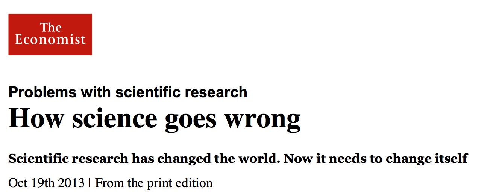
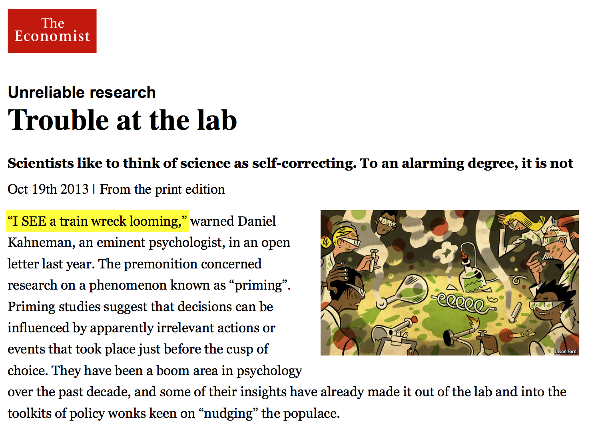
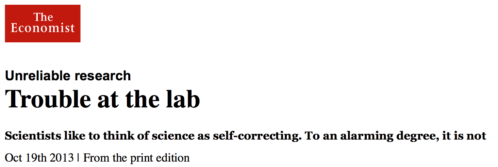
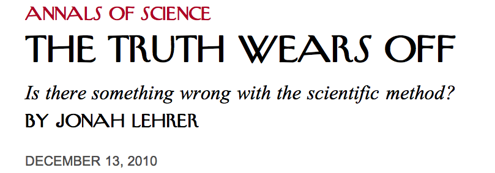
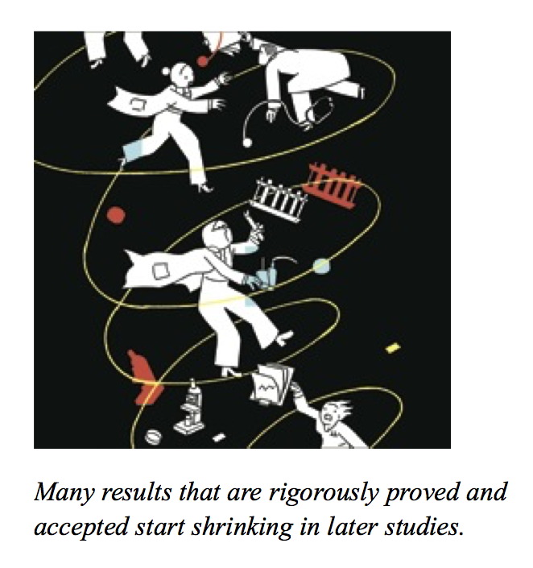
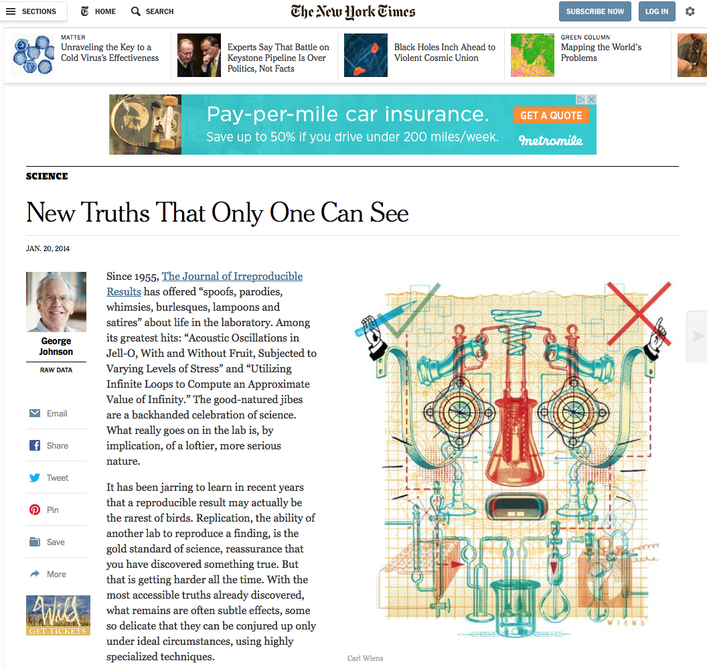
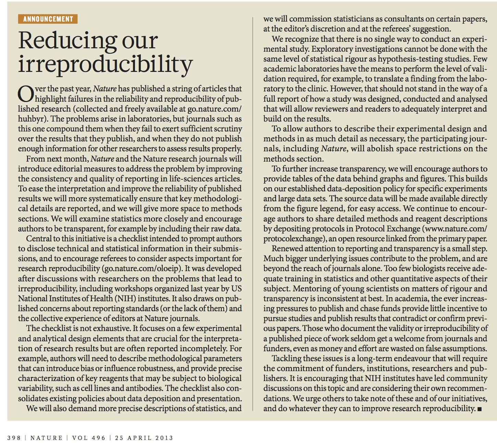
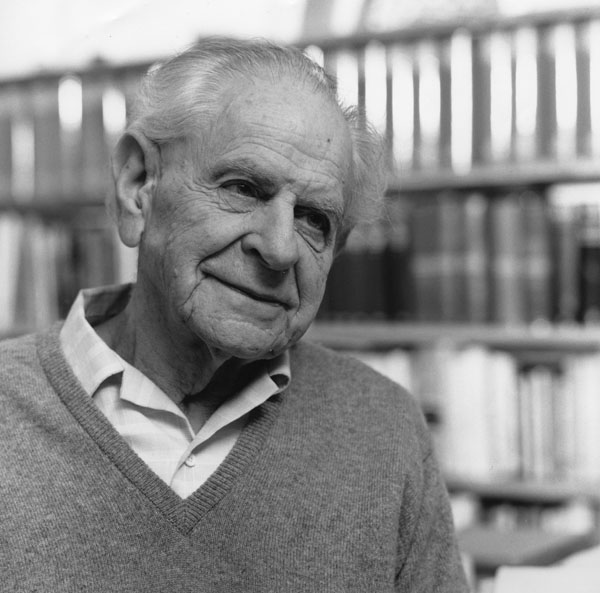
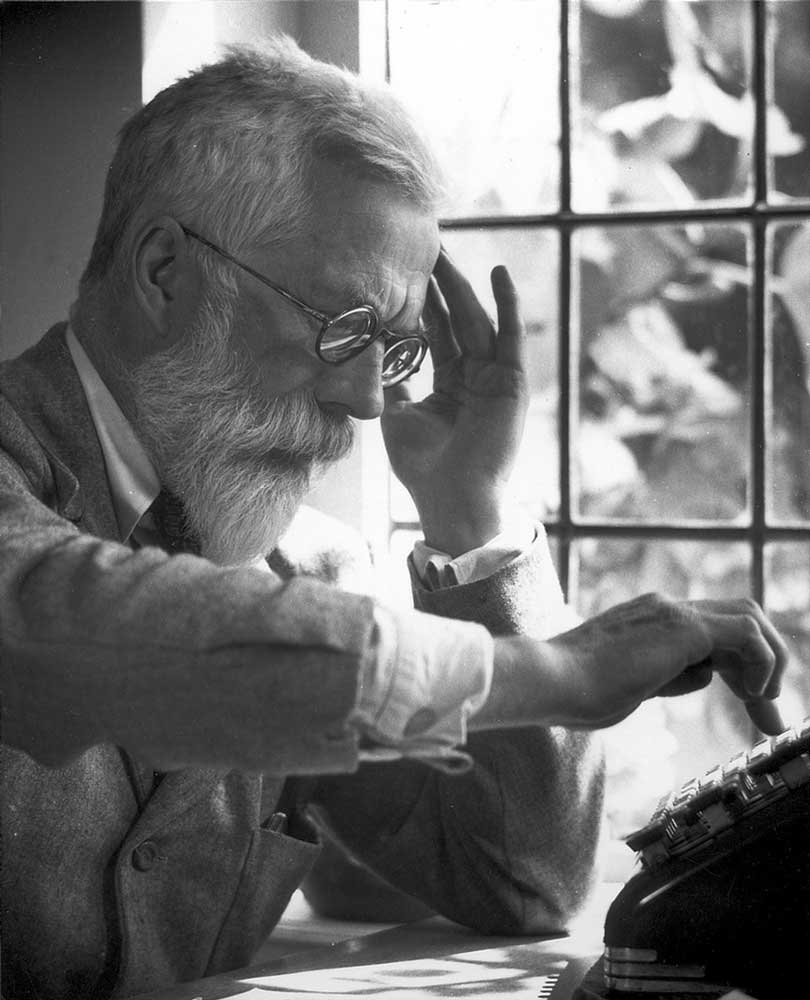
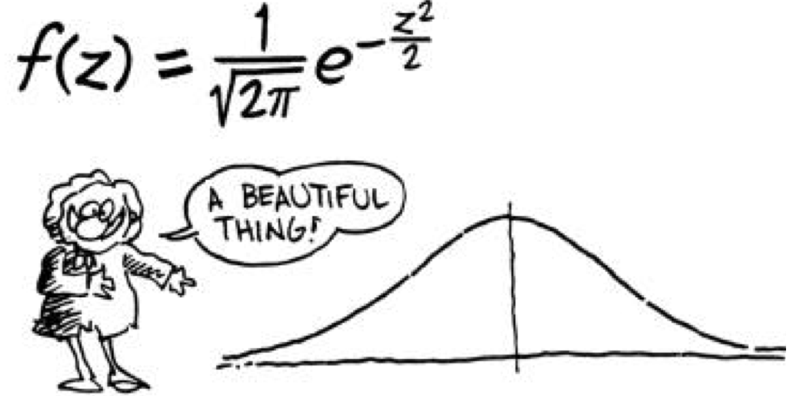

```{r setup,include=F}
#source('http://stats101.stanford.edu/profile.R')
knitr::opts_chunk$set(echo = TRUE)
knitr::opts_chunk$set(dev="pdf", fig.align="center",fig.width=4.5,fig.height=3.3,out.width ='.85\\linewidth')
library(ggplot2)

```


## Science and replicability in the big data era


## A crisis? *The Economist*, Oct. 2013



## A crisis? *The Economist*, Oct. 2013



## Snippets




- Systematic attempts to replicate widely cited priming
  experiments have failed

- Amgen could only replicate 6 of 53 studies they considered
  landmarks in basic cancer science

- HealthCare could only replicate about 25% of 67 seminal
  studies

- Early report (Kaplan, '08): 50% of Phase III FDA studies ended
in failure


## *The New Yorker*, Dec. 2010





## Possible explanations

- *Significance chasing / p-hacking*

- *Publication bias* (file drawer effect, Rosenthal '79)

- *Researcher's degrees of freedom* and *False positive psychology* [(Simmons et al., 2011)](http://pss.sagepub.com/content/22/11/1359.full)

- *Why most published research findings are false*
    [(Ioannidis, 2005)](https://www.ncbi.nlm.nih.gov/pmc/articles/PMC1182327/pdf/pmed.0020124.pdf)


## [*The New York Times*, Jan. 2014](http://www.nytimes.com/2014/01/21/science/new-truths-that-only-one-can-see.html)




## Personal and societal concern


**Great danger in seeing erosion of public confidence in science!**

- Scientific community is beginning to respond


## Reproducibility initiative

[validation.scienceexchange.com](http://validation.scienceexchange.com/)


 


## *Nature*'s 18-point checklist: April 25, 2013



## NAS President's address: April 27, 2015


## What Has Changed? Classical approach


### [The Logic of Scientific Discovery, 1934](https://en.wikipedia.org/wiki/The_Logic_of_Scientific_Discovery)



### Deductive methods of testing

- Formulate hypothesis

- Collect data to test predictions 

- Falsify or corroborate


## Operationalization

### [The Design of Experiments, 1935](https://en.wikipedia.org/wiki/The_Design_of_Experiments)



##  The Design of Experiments, 1935

### The lady tasting tea

*A lady declares that by tasting a cup of tea made with milk she can discriminate whether the milk or the tea infusion was first added to the cup. We will consider the problem of designing an experiment by means of which this assertion can be tested.*

 
### The null hypothesis

*Every experiment may be said to exist only in order to give the facts a chance of disproving the null hypothesis.*
 

### The *p*-value

*It is open to the experimenter to be more or less exacting in
respect to the smallness of the probability he would require before
he would be willing to admit that his observations have disproved the null.*

## *P*-values

 
 
## What Has Changed? Big data and a new scientific paradigm

### Collect data first $\Longrightarrow$ ask questions later

- Large data sets available prior to formulation of hypotheses

- Need to adjust inference to reflect the fact that hypotheses
generated by data snooping

## What does statistics have to offer?

- Account for *look everywhere* effect.

- Provide reliable answers given all hypotheses that
  have been explored.

## DS 101 and replicabilty

There are many reasons why studies may not replicate well.

Our focus is:

- Look-everywhere effect (multiple testing) 

- Selection bias (winner's curse)   

## Most discoveries may be false: Soric (1989)


```{r echo=FALSE, fig.height=5, fig.width=8}
par(mfrow=c(1,1))
image(matrix(0,50,20), axes=FALSE, col=c("#DDDDDDFF", "#4444DDFF"))
pu <- par("usr")
abline(v = seq(pu[1], pu[2], len=51), h = seq(pu[3], pu[4], len=21))
```


\color[HTML]{DDDDDD} 1000 hypotheses to test

## Most discoveries may be false: Soric (1989)


```{r echo=FALSE, fig.height=5, fig.width=8}
par(mfrow=c(1,1))
truth = matrix(0,50,20)
truth[41:50,11:20] = 1
truth_col = c("#DDDDAAFF", "#4444DDFF")
image(truth, axes=FALSE, col=truth_col)
pu <- par("usr")
abline(v = seq(pu[1], pu[2], len=51), h = seq(pu[3], pu[4], len=21))
```

\color[HTML]{DDDDAA}Nothing going on

\color[HTML]{4444DD} Something going on

## Most discoveries may be false: Soric (1989)


```{r echo=FALSE, fig.height=5, fig.width=8}
generate_outcome = function(typeI=0.05, typeII=0.2) {

   # Randomly selecting within "nothing" (and "something")
   result = matrix(rbinom(50*20, 1, typeI), 50, 20) 

   # Randomly selecting within "something"
   something = matrix(rbinom(100, 1, 1-typeII), 10, 10) + 2
   result[41:50,11:20] = something
   return(result)
}
typeI = 0.05
typeII = 0.20
outcome = generate_outcome(typeI=typeI, typeII=typeII)
discovery = (outcome==1) + (outcome==3)
discovery_col = c("#AAAAAAFF", "#DD4444FF")
image(discovery, axes=FALSE,col=discovery_col)
pu = par("usr")
abline(v = seq(pu[1], pu[2], len=51), h = seq(pu[3], pu[4], len=21))

```

For each question, 
we make a decision: P(false positive)=`r typeI`, P(false negative)=`r typeII`.

These are the decisions we made.
  
  - \color[HTML]{DD4444} Discovery, :)
  - \color[HTML]{AAAAAA} Not a discovery, :(


## Most discoveries may be false: Soric (1989)


```{r echo=FALSE, fig.height=5, fig.width=8}
outcome_col = c("#777777FF", "#DD4444FF", "#DDDD44FF", "#44DD44FF")
image(outcome, axes=FALSE,col=outcome_col)
pu = par("usr")
abline(v = seq(pu[1], pu[2], len=51), h = seq(pu[3], pu[4], len=21))
TD = sum(discovery) # total discoveries
TTD = sum(discovery[41:50,11:20]) # true discoveries
TFD = TD-TTD # False discoveries
FDP = TFD/TD # False discovery proportion
```

- We made \color[HTML]{44DD44} `r TTD` true discoveries
- \color{black} We made \color[HTML]{DD4444} `r TFD` false discoveries
- \color{black} Our *False Discovery Proportion* is `r TFD`/`r TD`=`r round(FDP,2)`.


## Most discoveries may be false: Soric (1989)


```{r echo=FALSE, fig.height=5, fig.width=8}
outcome_col = c("#777777FF", "#DD4444FF", "#DDDD44FF", "#44DD44FF")
image(outcome, axes=FALSE,col=outcome_col)
pu = par("usr")
abline(v = seq(pu[1], pu[2], len=51), h = seq(pu[3], pu[4], len=21))
TD = sum(discovery) # total discoveries
TTD = sum(discovery[41:50,11:20]) # true discoveries
TFD = TD-TTD # False discoveries
FDP = TFD/TD # False discovery proportion
```
</td><td>
<ul>
<li>**Is this a problem?**
<li>**Can we fix it?**
</ul>
</td>
</tr>
</table>


## A few more comments

- [Chocolate helps you lose weight](http://io9.gizmodo.com/i-fooled-millions-into-thinking-chocolate-helps-weight-1707251800)

- [John Oliver's critique of "popular" science](https://www.youtube.com/watch?v=0Rnq1NpHdmw)

