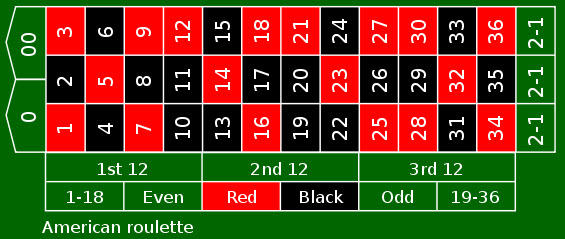

```{r setup,include=F}
#source('http://stats101.stanford.edu/profile.R')
knitr::opts_chunk$set(echo = TRUE)
knitr::opts_chunk$set(dev="pdf", fig.align="center",fig.width=4.5,fig.height=3.3,out.width ='.85\\linewidth')
library(ggplot2)

```

## [The population of Stanford undergraduate students](https://ucomm.stanford.edu/cds/pdf/stanford_cds_2016.pdf)


## The population of Stanford undergraduate students

```{r,echo=FALSE,include=FALSE}
library(readr)
Stanford <- read_delim("data/Stanford.txt", 
    "\t", escape_double = FALSE, trim_ws = TRUE)
Stanford<-Stanford[,c(1,3)]
names(Stanford)<-c("Race/Ethnicity","Number")
Stanford<-Stanford[-10,]
UGRace<-rep(Stanford$"Race/Ethnicity",Stanford$Number)
```
```{r,fig.height=4,fig.width=9,echo=FALSE,out.width='.99\\linewidth'}
par(mar=c(5,25,4,2))
barplot(sort(summary(as.factor(UGRace)))/length(UGRace),horiz = T,las=1)
```

## Learning from a sample

- Suppose we did not have this comprehensive dataset with exact information on the **population** of Stanford undergraduate students and we were interested in the proportion  students who are "Black or African American" (actual value = 0.064) and "Hispanic/Latino" (actual value= 0.16).

- We could try to estimate this starting from a **sample**

- How big should the sample be?

- What would be a good strategy to obtain it?

## Would sampling work?

We can try a thought experiment using our complete data and seeing what the result of a sampling experiment would be. 

```{r}
ssize<-50
observation<-sample(UGRace,ssize,replace=FALSE)
SamplePropB<-
  sum(observation==
"Black or African American, non-Hispanic")/ssize
SamplePropB
SamplePropH<-
  sum(observation=="Hispanic/Latino")/ssize
SamplePropH
```

## Repeating the thought experiment 100 times

Sampling proportions for 100 samples of size 50

```{r,echo=FALSE,include=FALSE}
ssize<-50
B<-100
SamplePropB<-NULL
SamplePropH<-NULL
for(i in 1:B)
{
observation<-sample(UGRace,ssize,replace=FALSE)
SamplePropB<-c(SamplePropB,
  sum(observation==
"Black or African American, non-Hispanic")/ssize)
SamplePropH<-c(SamplePropH,
  sum(observation=="Hispanic/Latino")/ssize)
}
```

```{r,fig.height=4.5,fig.width=7.5,out.width='.99\\linewidth',echo=F}
par(mfrow=c(1,2))
hist(SamplePropB,main="Black or African American",xlab="Sample Proportion",xlim=c(0,.3))
abline(v=0.064,col=2,lwd=2)
hist(SamplePropH,main="Hispanic/Latino",xlab="Sample Proportion",xlim=c(0,.4))
abline(v=0.16,col=2,lwd=2)
```

## Repeating the thought experiment 1000 times

Sampling proportions for 1000 samples of size 50


```{r,echo=FALSE,include=FALSE}
ssize<-50
B<-1000
SamplePropB<-NULL
SamplePropH<-NULL
for(i in 1:B)
{
observation<-sample(UGRace,ssize,replace=FALSE)
SamplePropB<-c(SamplePropB,
  sum(observation==
"Black or African American, non-Hispanic")/ssize)
SamplePropH<-c(SamplePropH,
  sum(observation=="Hispanic/Latino")/ssize)
}
```

```{r,fig.height=4.5,fig.width=7.5,out.width='.99\\linewidth',echo=F}
par(mfrow=c(1,2))
hist(SamplePropB,main="Black or African American",xlab="Sample Proportion",xlim=c(0,.3))
abline(v=0.064,col=2,lwd=2)
hist(SamplePropH,main="Hispanic/Latino",xlab="Sample Proportion",xlim=c(0,.4))
abline(v=0.16,col=2,lwd=2)
```


## Using a larger sample size

Sampling proportions for 1000 samples of size 100


```{r,echo=FALSE,include=FALSE}
ssize<-100
B<-1000
SamplePropB<-NULL
SamplePropH<-NULL
for(i in 1:B)
{
observation<-sample(UGRace,ssize,replace=FALSE)
SamplePropB<-c(SamplePropB,
  sum(observation==
"Black or African American, non-Hispanic")/ssize)
SamplePropH<-c(SamplePropH,
  sum(observation=="Hispanic/Latino")/ssize)
}
```

```{r,fig.height=4.5,fig.width=7.5,out.width='.99\\linewidth',echo=F}
par(mfrow=c(1,2))
hist(SamplePropB,main="Black or African American",xlab="Sample Proportion",xlim=c(0,.3))
abline(v=0.064,col=2,lwd=2)
hist(SamplePropH,main="Hispanic/Latino",xlab="Sample Proportion",xlim=c(0,.4))
abline(v=0.16,col=2,lwd=2)
```

## Things to note

- Each sample gives us potentially a different result: there is **sampling variability**

- We need to remember this sampling variability when **interpreting the sampling results**

- A larger sample size resulted in smaller variability


## Learning from  data 

- In our first few weeks, we've talked a lot about data:
     * how to import it.
     * how to summarize it.
     * how to visualize it.
     
- Sometimes the data is comprehensive: the census, for example, aims to record every person living in the US at a given point in time.

- Much of the data we work with does not contain information on all the members of  a group of interest, but only on a subset.

- We often want to **infer from the data something that goes beyond the specific units we have measured**.

- The experiments we have done tell us that this is possible, but not trivial.


## Examples we have seen

- The **Current Population Survey**---which we used for income data---does not include all the US households, but that sample of 125817 households aims to represent the entire US population.

- The 1056 individuals whose **genotypes** were at the basis of  the 2002 Science paper were not every subject in the 52 human populations under study, but just a sample

- In the study on **cell phone usage** when driving, the researchers did not treat the data as the "complete story:" they were not interested in the specific drivers included in the study, but they wanted to learn something more general, that would apply to any driver

## Sample and population

- In order to understand how we can learn from data something more general  the concepts of **Population** and **Sample** are useful

Ex | Population    | Sample
---|------------------------------------- | -------------------------------------------
1. | *Stanford undergraduates on Oct 15, 2016* | *A random sample of 50 students*
2. | US population   | Households in CPS survey
3. | *52 distinct human populations (defined historically, culturally,  and geographically)*        | *1052 individuals from these populations*
4. | Every potential driver | Drivers involved in collision in Toronto between 7/1/1994, and 8/31/1995.

 
## Abstract populations

- In the case of cell phone study, "all drivers" is a concept more than a real population: we could not measure all drivers even if we wanted

- Often, it is useful to think about the abstract populations that describe all possible outcomes

- We will see a few examples of these abstract populations, starting from games of chance

## Populations and sample summaries

- We typically do not expect to learn everything about a population from a sample.

- Rather we want to learn about the value of a population summary from the corresponding sample summary

Ex |Population summary | Sample summary
--|-------------------------------------|-------------------------------------
1.| *Proportion of "Black" among undergraduate at Stanford* | *Proportion of "Black" in the sample of 50*
2. | Income inequality in US population | Income inequality among survey participants
3.| *Genetic diversity of 52 human populations* | *Genetic diversity in the samples of each of these populations*
4.| Increased risk of collision when driving using cell phone | Increased risk of collision for the drivers in the study

## Roulette



- Each spin of the roulette wheel yields either a number from 0 to 36 or "00".

- Each number also has a color.

- Casino always wins on a "0" or "00".

- Some variability in what colors are, at least online.

## Let's make R play roulette

```{r}
values = c("00", 0:36)
play<-sample(values,1)
play
```

Suppose we want to bet on red. Let's make a function
that takes a possible value from `values` and tells us whether  our bet on red wins or not.

```{r}
red_values = c( 1,  3,  5,  7,  9,  12, 14, 16, 18,
               21, 23,  25, 27, 28, 30, 32, 34,  36)
red_bet = function(spin_value) {
    return(spin_value %in% red_values)
}
red_bet(play)
```

## Abstract population: all possible roulette games

- The **population of all the possible outcomes of a roulette game** is infinite and we cannot ever sample it completely

- Without thinking too hard, however, we know that the proportion of  "red" outcomes in this population is  18/38 (we call this the **probability of red**)

- Suppose that we ignored this: could we estimate it from a **sample**, using the **sample proportion of red outcomes**?


## Estimating the probability of red

Recall that the probability of red is 18/38 = 0.474

Let's play 5 times

```{r}
red_bet(sample(values, 5, replace=TRUE))
```

Let's calculate the proportion of times in which we win out of 50 games

```{r}
mean(red_bet(sample(values, 50, replace=TRUE)))
```

## Sampling variability of the proportion of red wins
Histograms of 1000 experiments each of 100 or 1000 spins
```{r,echo=F, include=F}
ssize1<-100
ssize2<-1000
B<-1000
x<-NULL
y<-NULL
for(i in 1:B)
{
x<-c(x,mean(red_bet(sample(values, ssize1, replace=TRUE))))
y<-c(y,mean(red_bet(sample(values, ssize2, replace=TRUE))))
}
```

```{r,fig.height=4.5,fig.width=7.5,out.width='.99\\linewidth',echo=F}
par(mfrow=c(1,2))
hist(x,main="100 spins",xlab="Proportion of red",xlim=c(0.28,0.62))
abline(v=18/38,col=2,lwd=2)
hist(y,main="1000 spins",xlab="Proportion of red",xlim=c(0.28,0.62))
abline(v=18/38,col=2,lwd=2)
```


## Take home messages

- Just as we sow from the experiment with Stanford undergraduate population, sample summaries do give us information on the value of the population summaries

- Each sample potentially has a different value: there is sample variability in our estimate of the population summary

- The larger the sample, the more accurate is our estimate based on the sample summary

## Another abstract population


## Another  abstract population


-  **Population: caucasian  males in an age group** one cannot record them all; there is no time limit; we are really referring to an abstract concept

- **Variables: stature and weight**

- **Populations summaries: 5,10,25,50,75,90,95 percentiles**

- How did the CDC established these values?

## A model for the height of US "white" adult males

```{r,echo=FALSE,fig.width=6,fig.height=4}
x<-seq(50,90)
d<-dnorm(x,mean=70,sd=4)
plot(x,d,type="l",main="Caucasian adult male height",xlab="Height in inches",ylab="Density")
```

## Where does this comes from?


## Normal distribution

We say that a variable $X$ has Normal distribution with mean $\mu$ and standard deviation $\sigma$
$$ X\sim {\cal N}(\mu,\sigma)$$
when the "histogram" of all its possible values in the abstract population can be described by the function

$$\text{density}(x)=  \frac{1}{\sqrt{2\pi}\sigma}e^{-\frac{(x-\mu)^2}{2\sigma^2}}$$

- The mean of $X$ is equal to $\mu$
- The variance of $X$ is equal to $\sigma^2$


## Generating observations from a Normal in R

```{r,fig.width=6,fig.height=4}
X<-rnorm(10000,mean=70,sd=4)
hist(X)
```

## A re-normalized histogram

In a density histogram, **areas** correspond to **proportions**

```{r,fig.width=6,fig.height=4,echo=F}
try<-hist(X,plot=FALSE)
hist(X,probability = TRUE)
polygon(c(try$breaks[7], try$breaks[8], try$breaks[8], try$breaks[7]),c(0, 0, try$density[7], try$density[7]),col='red')
mtext(paste(paste(paste("Proportion of values between",as.character(try$breaks[7])),"and"),as.character(try$breaks[8])),side=1,line=2,at=try$breaks[7],col=2)
```

## Relationship between probability histogram and density

```{r,fig.width=6,fig.height=4}
t<-seq(min(X),max(X),length.out=1000)
hist(X,probability=TRUE,ylim=c(0,0.1))
lines(t,dnorm(t,mean=70,sd=4),col=2,lwd=2)
```
## Normal distribution -- formal interpretation of density

We say that a variable $X$ has Normal distribution with mean $\mu$ and standard deviation $\sigma$
$$ X\sim {\cal N}(\mu,\sigma)$$

when the frequency with which $X$ takes values in an interval $[a,b]$ can be calculated in terms of the integral

$$\text{Freq}(X\in [a,b])=\int_{a}^b\frac{1}{\sqrt{2\pi}\sigma}e^{-\frac{(t-\mu)^2}{2\sigma^2}}dt$$

## Area under the density = proportion

```{r,fig.height=4,fig.width=5,echo=FALSE}
library(ggplot2)
ggplot()+geom_line(aes(x=t,y=dnorm(t,mean=70,sd=4)))+ geom_area(aes(x=t[300:400],y=dnorm(t,mean=70,sd=4)[300:400]),fill="red",alpha=0.5)+ggtitle("Normal distribution")+ylab("Density")+annotate("text",label=paste(paste(paste("Proportion of values between",as.character(round(t[300])),"and"),as.character(round(t[400])))), x = t[300], y =dnorm(t[400],mean=70,sd=4),color="red",size=3)
```
 

  

