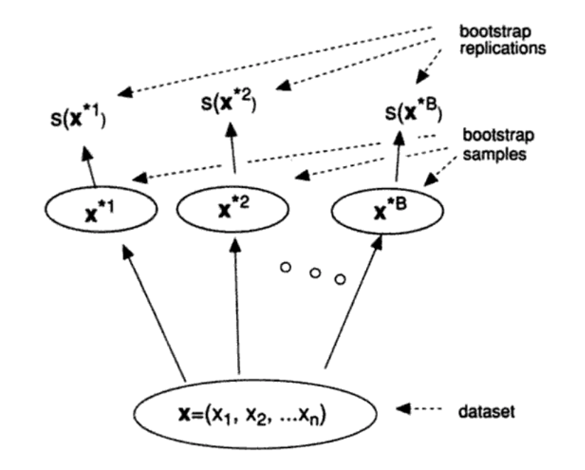

```{r setup,include=F}
#source('http://stats101.stanford.edu/profile.R')
knitr::opts_chunk$set(echo = TRUE)
knitr::opts_chunk$set(dev="pdf", fig.align="center",fig.width=4.5,fig.height=3.3,out.width ='.85\\linewidth')

```

## Sample variability so far

- We have learned that data is often a sample from a larger population

- Sometimes the larger population is defined by a concrete number of subjects, sometimes an abstraction

- We have discovered that there are many models for these abstract populations. When they include an infinite number of continuous possible values we use densities to describe the frequencies of the values (we will get back to this later)

- We have seen that using summaries of the sample we can estimate the value of these summaries in the population. 

- We noted that these estimates have some variability

## Stanford undergraduate population


```{r,echo=FALSE,include=FALSE}
library(readr)
Stanford <- read_delim("data/Stanford.txt", 
    "\t", escape_double = FALSE, trim_ws = TRUE)
Stanford<-Stanford[,c(1,3)]
names(Stanford)<-c("Race/Ethnicity","Number")
Stanford<-Stanford[-10,]
UGRace<-rep(Stanford$"Race/Ethnicity",Stanford$Number)
```


We know that the proportion of "Black or African american" is 0.064.

If we do the thought experiment of obtaining 10000 samples of size 50, and calculating the proportion of  "Black or African american" in each of them
```{r,echo=FALSE,include=FALSE}
ssize<-50
B<-10000
SamplePropB<-NULL
for(i in 1:B)
{
observation<-sample(UGRace,ssize,replace=FALSE)
SamplePropB<-c(SamplePropB,
  sum(observation==
"Black or African American, non-Hispanic")/ssize)
}
```


```{r,echo=F,fig.width=6,fig.height=4,out.width='.75\\linewidth'}
hist(SamplePropB,main="Histogram of 10000 estimates",xlab="Proportion of 'Black' in a sample of size 50",xlim=c(0,.3))
abline(v=0.064,col=2,lwd=2)

```
## How much we are off on average?

If we could average all the 10000 samples, we would be doing quite well
```{r}
mean(SamplePropB)
```

The "problem" is that we get to see only one sample. And samples have a sizeable variance
```{r}
sqrt(var(SamplePropB))
```

## Interpreting  the result from one sample

```{r}
ssize<-50
actualsample<-sample(UGRace,ssize,replace=F)
sum(actualsample==
"Black or African American, non-Hispanic")/ssize
```

- Our sample gives us an estimate of the proportion, but  our experiments show that we can be 0.0347 off.

- In reality, we have only one sample and we do not get to see the entire population. How can we get an idea of how wrong we could be?

## How to get a sense of the potential error from one sample?

- In reality, we would only have one sample of size 50.

- If we could repeat the random process many times, we would be fine.

- To repeat the random process, we need a population to sample from.

- **As a "best guess" for the population we can use the sample we actually observed**

- Repeated sampling with replacement for the population defined by the sample is an idea


## Pulling oneself up from one's bootstraps

```{r,fig.width=8,fig.height=4,out.width='.85\\linewidth'}
ssize<-50
actualsample<-sample(UGRace,ssize,replace=F)
B<-10000
bsampleprop<-NULL
for(i in 1:B)
{
  bootsample<-sample(actualsample,ssize,replace=T)
  bsampleprop<-c(bsampleprop,
                sum(bootsample==
"Black or African American, non-Hispanic")/ssize )
}
```

## Pulling oneself up from one's bootstraps

```{r,fig.width=8,fig.height=5,out.width='.95\\linewidth',echo=F}
par(mfrow=c(1,2))
hist(SamplePropB,main="10000 samples from population",xlab="Proportion of Black in sample")
hist(bsampleprop, main="10000 re-samples from sample", xlab="Proportion of Black in re-sample")
```

## Bootstrap



##


Population | Sample | Bootstrap samples
---------------|----------------------|----------------------------
We do not observe | We obtain **one** sample from the population | We can resample with replacement from the sample **as many times as we want**


Population Summary | Sample Summary |     Bootstrap Summaries 
---------------|----------------------|----------------------------
This is the **quantity we would like to know**, but we cannot observe | This is our **estimate** for the population summary | By calculating the standard deviation of the summaries of the different bootstrap samples we learn about the **error of our estimate**


## A toy example

Here is a small **population with its true mean**

```{r}
population<-c(3,3,3,5,5,5,7,7,7,9,9,9,10,10,10)
mean(population)
```

Here is our **sample with its sample mean**

```{r}
actualsample<-sample(population,5,replace=F)
actualsample
mean(actualsample)
```

## A toy example, bootstrap samples

Now we construct multiple bootstrap samples, sampling with replacement from 
```{r}
actualsample
```
```{r,include=F}
B<-10000
bsample<-matrix(NA,B,5)
bsamplemean<-NULL
for(i in 1:B)
{
  bootsample<-sample(actualsample,5,replace=T)
  bsample[i,]<-bootsample
  bsamplemean<-c(bsamplemean,
                mean(bootsample) )
}
boot<-cbind(bsample,bsamplemean)
rownames(boot)<-rep("boot sample",B)
colnames(boot)<-c("B.obs1","B.obs2","B.obs3","B.obs4","B.obs5","B.Mean")
```

```{r,echo=FALSE}
boot[1:10,]
```

## A toy example, evaluating variability
We can calculate the standard deviation of the bootstrap sample to estimate the standard error of the sample estimator

```{r}
sqrt(var(bsamplemean))
```

Or we can calculate a range of possible estimated value using quantiles
```{r}
quantile(bsamplemean,c(.05,.95))
```


## A toy example, checking that the bootstrap helped

```{r,echo=FALSE,include=FALSE}
ssize<-5
B<-10000
SampleMean<-NULL
for(i in 1:B)
{
observation<-sample(population,ssize,replace=FALSE)
SampleMean<-c(SampleMean,mean(observation))
}
```

Histograms of variability of sample estimate


```{r,fig.width=8,fig.height=5,out.width='.95\\linewidth',echo=FALSE}
par(mfrow=c(1,2))
hist(bsamplemean,main="Obtained with Bootstrap",xlab="Bootstrap samples means")
abline(v=mean(actualsample),lwd=3)
mtext("Sample mean",side=3,line=0,at=mean(actualsample))

hist(SampleMean, main="Thought experiment", xlab="Sample mean",border="darkorchid")
abline(v=mean(population),col="darkorchid",lwd=3)
mtext("Population mean",side=3,line=0,at=mean(population),col="darkorchid")
abline(v=mean(actualsample),lwd=3)
mtext("Sample mean",side=1,line=0,at=mean(actualsample))


```

## Bootstrap principle

- Introduced by Prof. Brad Efron in early 1980s.

- The bootstrap works here because we are able to replicate
the chance process of drawing (with replacement) from an unknown  *population* by
drawing with replacement from our observed sample.


- Works in the sense that it gives a pretty good estimate of the sampling variability.
*Even when we do not know the exact population generating our sample.*

- Also works in that *we did not have to use any complicated calculations* to get
this estimate.

## Does it always work?

- If our chance process were different, then drawing repeatedly from our observed sample
will not help us.

- **We have to believe that the resampling process we use is a reasonable approximation
to the way our data was generated.**

- We might call this **no free lunch principle**: we can use the computer
to do calculations for us about the sampling processes **only** when we know how
to tell the computer to mimic the sampling process.


## Let's try some other examples

- **Population (unknown)**: $X \sim {\cal N}(0,10)$
- **Summary of interest**: Median of $X$
- **Estimating strategy**: take a random sample of size 20 and calculate sample median
```{r}
observation<-rnorm(20,mean=0,sd=10)
median(observation)
```

We will compare what we learn about variability of our estimate with:
  
  1.  A thought experiment done assuming we know the population 
  
  2.  The bootstram  strategy applied to the observed sample

## Sampling variability and its reconstruction by the bootstrap

```{r,echo=FALSE}
samplemedian<-NULL
bootmedian<-NULL
for(i in 1:10000)
  {
  samplemedian<-c(samplemedian,median(rnorm(20,0,10)))
  bootmedian<-c(bootmedian,median(sample(observation,size=20,replace=TRUE)))
}
```


```{r,fig.width=8,fig.height=5,out.width='.95\\linewidth',echo=FALSE}
par(mfrow=c(1,2))
hist(samplemedian, main="Thought experiment", xlab="Sample median",border="darkorchid")
abline(v=0,col="darkorchid",lwd=3)
abline(v=median(observation),lwd=3)
mtext("Population median",side=3,line=0,at=0,col="darkorchid")
mtext("Sample median",side=1,line=0,at=median(observation))

hist(bootmedian,main="Bootstrap",xlab="Bootstrap samples medians")
abline(v=median(observation),lwd=3)
mtext("Sample median",side=3,line=0,at=median(observation))


```
