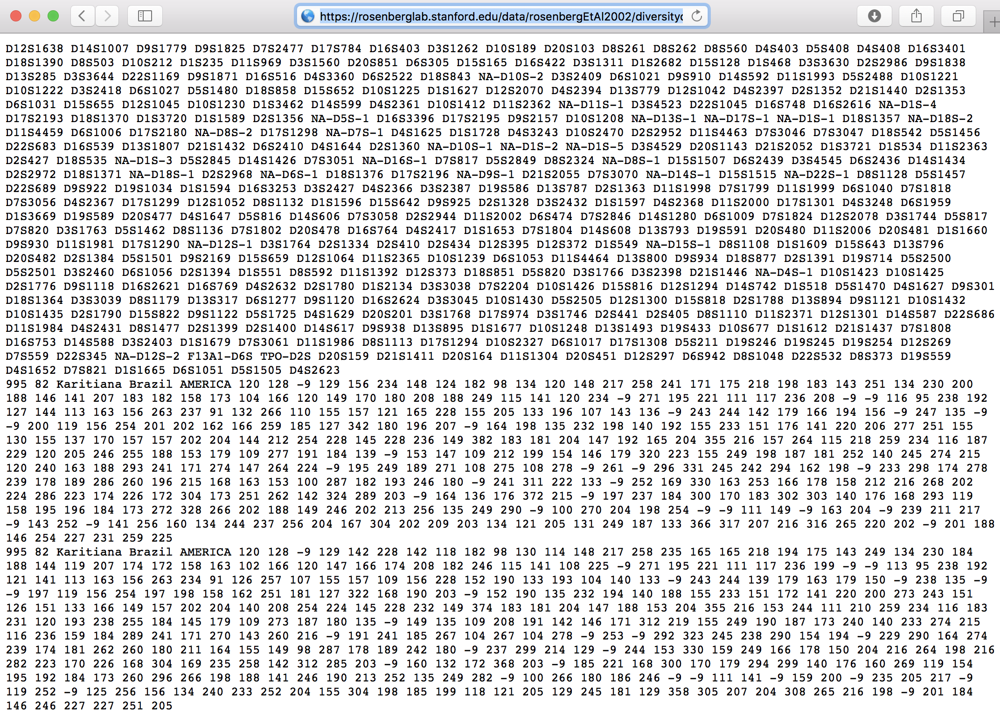

```{r setup, include=FALSE}
#source('http://datascience101.stanford.edu/profile.R')
knitr::opts_chunk$set(echo = TRUE)

```

## Goals of the module

- Data has many variables and many observations
- In order to understand what is going on, it is often useful to boil down this complexity to one or two numbers
- We will loose some complexity, but it helps us with a "gestalt" of the data and with comparisons

## Example questions

- How do we compare the rentability of different financial products, starting from their daily market yields across a time-frame?

- How do different nation compare in terms of their income distribution?

- How diverse is the genetic make-up of different populations?

## Interest rates for US tresury security, constant maturity 

[Federal Reserve Data](https://www.federalreserve.gov/datadownload/Choose.aspx?rel=H15)


## Income distribution in USA 2015
[Current Population Survey](https://www.census.gov/programs-surveys/cps/about.html), 
[Income Data](https://www.census.gov/data/tables/time-series/demo/income-poverty/cps-hinc/hinc-06.html)


## Genotypes of individuals from 52 human populations

[Human Genome Diversity Panel](https://rosenberglab.stanford.edu/diversity.html)



## Summaries & Indexes

- We will focus on *univariate* data: our analysis will be of one variable at the time

- When summarizing we may choose *different aspects*: center, spread, asymmetry

- We talk about an *index* when we can standardize an summary so that its range is between fixed values (ex. [0,1], [-1,1])

## Summaries of Center

- Imagine the data as a cloud and you have to decide where to place it

- Focus on quantitative variables

- From K-12 education: Mean, Mode, Median

- Some further options: weighted average, trimmed mean, etc..

- Let's re-think the objectives we have in mind when we calculate a summary of center and see if this gives us new ideas.

## Properties for an *average*

*average*: a number $\bar{x}$ that substitutes the entire data $x_1,x_2,\ldots, x_n$ for one variable

1. **Reflexivity:** if $x_1=x_2=x_3=\cdots = x_n$ $\longrightarrow \bar{x}=x_1$

2. **Internality:**
$\min_i x_i \leq \bar{x}\leq \max_i x_i$

3. **Monotonicity: **
if ($x_1, x_2,\ldots , x_n$) and ($y_1,y_2,\ldots, y_n$) are such that
$x_i\leq y_i\;\; \forall i \;\;\; \longrightarrow \;\;\; \bar{x}\leq \bar{y}$.

4. **Symmetry:** 
*average*($x_1, x_2,\ldots , x_n$) = *average*($x_{\pi(1)}, x_{\pi(2)},\ldots , x_{\pi(n)}$), with $\pi$ a permutation of the indexes

5. **Associativity:**
Let $\bar{x}_{kl}$=*average*($x_k,x_{k+1},\ldots, x_l$), then
*average*($x_1, x_2,\ldots, x_k,x_{k+1},\ldots,x_l,x_{l+1}, \ldots, x_n$)=
*average*($x_1, x_2,\ldots, \bar{x}_{kl},\bar{x}_{kl},\ldots,\bar{x}_{kl},x_{l+1}, \ldots, x_n$)

## One definition of *average*

Let $x_1, x_2,\ldots , x_n$ be the data, and $f(x_1, x_2,\ldots , x_n)$ a real valued function of it that we are interested in.
Then, it makes sense to consider the average $\bar{x}$ such that

$$f(x_1, x_2,\ldots , x_n)= f(\bar{x},\bar{x},\ldots , \bar{x})$$

- We can substitute the one number $\bar{x}$ in place of all the values for the variable and get the same result


## The average interest rate

- Let $r_1,r_2,\ldots,r_{12}$ the monthly interest rates that a product earned during the months 1, ..., 12

- What do we want from an average interest rate?

- We would like **one value $\bar{r}$** so that if we substite it to the 12 different values, **we obtain the same income**

- Income($r_1,r_2,\ldots,r_{12}$)=Income($\bar{r}, \bar{r}, \ldots, \bar{r}$)
$$(1+r_1)(1+r_2)\cdots(1+r_{12})=(1+\bar{r})^{12}$$
$$\prod_{i=1}^{12}(1+r_i)=
(1+\bar{r})^{12}$$
$$\bar{r}=(\prod_{i=1}^{12}(1+r_i))^{1/12}-1$$
- We find that for interest rates the **geometric mean** of $(1+r_i)$ is a meaningful summary.


## Average speed

Suppose that you have a car and you drive a distance $d_i$ at speed $v_i$ for $i=1, \ldots, n$.

In looking for an *average* speed, it might make sense to look for a speed such that travelling at  that constant speed, you would cover the same total distance in the same total time.

$$\mbox{Time}=\sum_{i=1}^n\frac{d_i}{v_i}= \sum_{i=1}^n\frac{d_i}{\bar{v}}$$

Solving for $\bar{v}$,

$$\bar{v}=\frac{\sum_{i=1}^nd_i}{\displaystyle\sum_{i=1}^n\frac{d_i}{v_i}}$$
We find that the **harmonic mean** (here with weights $d_i$) is a meaningful summary.

## Another approach to defining an *average*

- Maybe it is not possible to find one number $\bar{x}$ such that $f(x_1, x_2,\ldots , x_n)= f(\bar{x},\bar{x},\ldots , \bar{x})$

- Maybe we want something a bit more general, that it suitable for multiple purposes

Let $g(z, x_1, x_2,\ldots , x_n)$ a function that describes the loss we encurr when substiting $x_1, x_2,\ldots , x_n$ with $z$, then 
$$\mbox{average}(x_1, x_2,\ldots , x_n)=\bar{x}=\arg\min_z g(z, x_1, x_2,\ldots , x_n)$$

- Ex. 1
$g(z, x_1, x_2,\ldots , x_n)= \sum_{i=1}^n(x_i-z)^2$

- Ex. 2 
$g(z, x_1, x_2,\ldots , x_n)= \sum_{i=1}^n|x_i-z|$

- Ex. 3
$g(z, x_1, x_2,\ldots , x_n)= \sum_{i=1}^n1(x_i\neq z)$


## Different loss functions

Let's look at the value of the loss functions for one datapoint $x_i=0$ as a function of $z$


## Different loss functions

- This approach to defining **average** says that the average is our **"best guess"** for a value in the data, and the different loss functions specify how we evaluate the goodness of a guess.


- The square loss penalizes more large discrepancies and downweights small discrepancies

- The absolute loss consider all discrepancies at their face value

- The 0-1 loss consider all discrepancies to be the same, with the exception of no error.

- What are the implications of this in terms of robustness to outliers?

## Which average does the  0-1 loss give rise to?

Let's calculate

$$\sum_{i=1}^n1(x_i\neq z) = \# \{x_i\neq z\}= n-\# \{x_i=z\}$$

So, to find the $z$ that minimizes this loss we need to look for the $z$ such that the number of $x_i$ equal to $z$ is maximal.

This is called... 

Also note that the **mode** is useful as a measure of "center" for qualitative variables.


## Other averages

- The square error loss gives rise to the **arithmetic mean,** which is often what we mean when we say "average"

$$\bar{x}=\frac{1}{n}\sum_{i=1}^nx_i$$

- The absolute loss gives rise to the **median**.

$$
\text{sort}(x)=(x_{(1)},x_{(2)},\ldots, x_{(11)})$$
$$\text{median}= x_{(6)}$$

