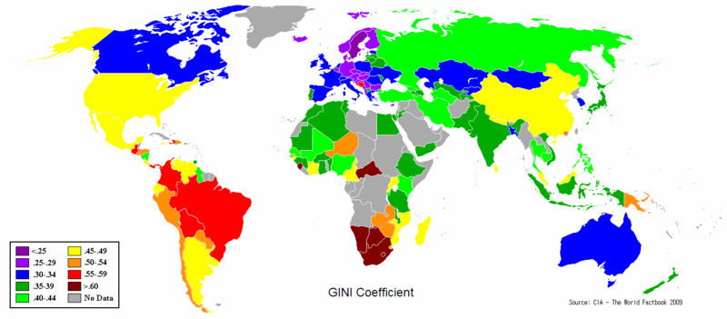
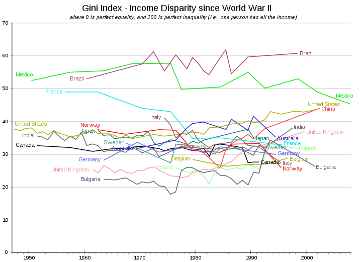

```{r setup, include=FALSE}
knitr::opts_chunk$set(cache=TRUE,echo=TRUE)
```

## Measures of spread/dispersion/variability

- A measure of center needs to be complemented by a measure of spread around this center.

- The definition of averages that we explore naturally lend themselves to measures of variability

- **Variance:** average square distance from the mean
$$\text{V}(x_1,\ldots,x_n)=\frac{1}{n}\sum_{i=1}^n(x_i-\bar{x})^2$$


- **Standard Deviation:**
$$\sqrt{\frac{1}{n}\sum_{i=1}^n(x_i-\bar{x})^2}$$

- Note that R actually divides by $n-1$ rather than $n$. This is because when $x_1,\ldots,x_n$ are a sample from a larger population of possible values,  dividing by $n-1$ one has a "better" estimator for the population quantity.


## A note: data with frequencies

- Often data is summarized so that we have counts of occurrences of the same values: we have a set $v_1,\ldots, v_m$ of possible values, with their frequencies $f_i$

$$\begin{array}{cccc}
v_1 & v_2& \cdots & v_m\\
f_1 & f_2 &\cdots & f_m
\end{array}
$$
- Calculating averages and standard deviations has to adapt to this different set-up

$$\bar{v}=\frac{1}{\sum_{i=1}^m f_i}\sum_{i=1}^mv_if_i$$

$$\text{Variance}=\frac{1}{\sum_{i=1}^m f_i}\sum_{i=1}^m(v_i-\bar{v})^2f_i$$

## A note: the maximal variance of $x_1,\ldots,x_n$

- Generally speaking, the variance of a dataset can be arbitrarily large

- Let's consider some restrictions that make the statement meaningful 
    - $x_i\geq 0 \;\;\forall i$
    - fix the total sum of values $\displaystyle\sum_{i=1}^nx_i=n\bar{x}$
    
\vspace*{-.5cm}
\begin{eqnarray*}\sum_{i=1}^n(x_i-\bar{x})^2& = & \sum_{i=1}^n(x_i^2+\bar{x}^2-2x_i\bar{x})\\
&=& \sum_{i=1}^nx_i^2 +\sum_{i=1}^n\bar{x}^2-2\bar{x}\sum_{i=1}^nx_i\\
&=& \sum_{i=1}^nx_i^2 +n\bar{x}^2 -2\bar{x}(n\bar{x})\\
& = & \sum_{i=1}^nx_i^2 -n\bar{x}^2 \end{eqnarray*}


## A note: the maximal variance of $x_1,\ldots,x_n$

So, $\text{V}(x_1,\ldots,x_n)=(\displaystyle\sum_{i=1}^nx_i^2 -n\bar{x}^2)/n$. Now,
$$\sum_{i=1}^nx_i^2 -n\bar{x}^2\leq (\sum_{i=1}^nx_i)^2 -n\bar{x}^2 = n^2\bar{x}^2-n\bar{x}^2= \bar{x}^2n(n-1)$$
Which means that 
$$\text{V}(x_1,\ldots,x_n)\leq \bar{x}^2(n-1)$$

- Can we imagine a set of values of $x_1,\ldots,x_n$ for which the variance is actually equal to this max?

## Index of concentration

The opposite of spread-out is "concentrated."

Let's consider variables like the one we just talked about, that is with only positive values.
One such variable might be the **income of households** in a nation.

It is interesting to study how "concentrated" or not such income is. One can imagine that the total income of a nation is the **total amount of a resource that one could distribute**.


## Income inequality in the media


## Income inequality in politics


## How can we measure "income inequality"?

- Let's think we have a population with $n$ individuals, each with income $x_1, \ldots x_n$. 

- $n\bar{x}$ is the total income in the population (with $\bar{x}=\sum_{i=1}^nx_i/n$)

- What would be the values of $x_1, \ldots x_n$ in the case of maximal "income equality"?

- What would be the values of $x_1, \ldots x_n$ in the case of maximal "income inequality"?

- How are we going to judge cases in the middle? 

- Any known measure?

- Any measure we can come up with given what we already know?

## A graphical display for income distribution

We take the values $x_1, \ldots x_n$ and order them

$$ x_{(1)}\leq x_{(2)}\leq \cdots \leq x_{(n)}$$

For simplicity, we are going to drop the parentheses from the index notation, and just remember that $x_1$ is the smallest index.

We now calculate two quantities:

$$F_i=\frac{i}{n}\;\;\;\;\;\;\;\; Q_i=\frac{\sum_{j=1}^ix_j}{\sum_{j=1}^nx_j}$$


- $F_1$ is the fraction of the population that correspond to the bottom earner; $F_2$ is the fraction of the population that correspond to the two bottom earners etc.

- $Q_1$ is the fraction of the national income earned by the bottom earner; $Q_2$ is the fraction of the national income earned by the two bottom earners etc.

## A graphical display for income distribution

- Let's think about the relation between $F_i$ and $Q_i$ in the case of perfect income equality

- In general, $Q_i\leq F_i$. To see this, let's look at their definition and multiply by $\sum_{j=1^n}x_j$ and divide by $i$
\begin{eqnarray*}
Q_i &\leq & F_i\\
\frac{\sum_{j=1}^ix_j}{\sum_{j=1}^nx_j} &\leq & \frac{i}{n}\\
\frac{\sum_{j=1}^ix_j}{i} &\leq & \frac{\sum_{j=1}^nx_j}{n}
\end{eqnarray*}
and remember that the $x_i$ are increasing.

## A graphical display for income distribution

Income values = 1,2,3,10,15,15,30,50


## A graphical display for income distribution


How could we use this to construct an Index?

## An idea for the index


## From area to index

- Index varies between 0 and 1

- Area in between curves = 1/2- area under bottom curve

- Area under bottom curve: sum of areas of trapezoids

$$ A= \frac{1}{2} -\sum_{i=1}^n \frac{(F_i-F_{i-1})(Q_i+Q_{i-1})}{2}$$

- Gini's index= $G=\displaystyle \frac{A}{1/2}=1-\sum_{i=1}^n (F_i-F_{i-1})(Q_i+Q_{i-1})$

## How do things change if we have repetition?

- data in the form
\vspace*{-1cm}
\begin{eqnarray*}
&& x_1 \leq x_2\leq \cdots \leq x_k\\
&& n_1   \;\;\;\;     n_2 \;\;\;\; \cdots \;\;\;\; n_k\\
\end{eqnarray*}
\vspace*{-.5cm}
with $\sum_jn_j=n$

- Define
$$F_i=\frac{\sum_{j=1}^in_j}{n}\;\;\; Q_i=\frac{\sum_{j=1}^in_jx_j}{\sum_{j=1}^kn_jx_j}$$

- Everything else stays the same.

## Revisiting the Income data


## Gini index for other data


## Gini index for other data



## Something to note

We can calculate the following summary of "mutual variability"
$$ \Delta=\sum_{i=1}^k\sum_{j=1}^k|x_i-x_j|\frac{n_i}{n}\frac{n_j}{n}$$

And one can show that 
$$G=\frac{\Delta}{2\bar{x}}$$

