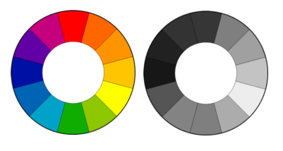

```{r setup, include=FALSE}
#source('http://datascience101.stanford.edu/profile.R')
knitr::opts_chunk$set(echo = TRUE)
library(pacman)
pacman::p_load(plyr,tidyverse,HistData,datasets,weatherData,lubridate,nycflights13,GGally,Quandl)
Quandl.api_key("xnkYAkEf4zLdh8HjQ7La")
```

## Why does visualization matter?

- Large size of data makes it necessary to provide summaries.
- People prefer to look at figures rather than numbers.
- Aids model construction, checking plausibility of model assumptions.

## Tools in R

- Our main tool for visualization will be the `ggplot2` package for `R`
- The design of the package encourages good practices
- Today we will focus on principles for good visualizations
- Much of today's lecture is inspired by the books of **Edward Tufte**
- While not required for the class, the books are highly recommended if you are interested in learning more about visualization
    - The classic "Visual explanations" and "The Visual display of quantitative information"
    - The more recent "Beautiful evidence"


## Two important functions of visualizations

- Communicate information
- Support reasoning about data

## Communicate information

Tufte, "Beautiful evidence," pg. 123


## Support reasoning about data

On January 28, 1986, the space shuttle Challenger exploded
because two rubber O-rings leaked due to the very cold temperatures
at launch day. 


This potential problem was discussed the day before the launch:

- Engineers opposed launching based on data from previous launches, 
and provided 13 charts to NASA
to support their case. 

- However, it is difficult to assess
the relationship between temperature and O-ring damage based on these
charts.

- (One) culprit: what Tufte refers to as "chartjunk" 

- (Another) culprit: what Tufte refers to as "the cognitive style of powerpoint" (I say as I show you a powerpoint-like presentation)

## Support reasoning about data
A visual display of the data from the investigation after the launch.
The poor design and use of chart junk makes it difficult to assess the
relationship between temperature and O-ring damage.


Tufte, "Visual explanations", pg 46

## Support reasoning about about data

A simple but pertinent display supports reasoning about the data.
\medskip


Tufte, "Visual explanations", pg 45

## Basic plot types

- We'll now discuss some basic plot types
    + bar charts
    + histograms
    + boxplots
    + scatter plots
    
- Which plot is appropriate depends somewhat on whether we are visualizing **univariate** or **bivariate** data and whether the variables are **discrete/categorical** or **continuous**
    + Roughly speaking, **discrete** variables take only a few unique values (we might turn them into **factors** in R). For example, in the cars data, the number of cylinders can be 4, 6, or 8 -- this is a **discrete** variable (we can't have $\pi$ cylinders, for example)
    + While **continuous** variables can in theory take infinitely many values (though in the real world resolution is limited by the precision of measuring apparatus). For example, in the cars data, **mpg** is a continuous variable: a car's average fuel economy could in theory be any number between $0$ and $\infty$

- Most of these plot types are easy to make in `ggplot`

- As a rule of thumb, if it is very hard to get `ggplot` to make a particular plot type, then either your data are in the wrong format, or that plot type is probably not an optimal visualization for your data

- There are exceptions, of course, but usually not for "simple" visualizations


## Pie charts...an excel

- Pie chart: the size of the angle is proportional to the frequency.

- One needs to torture ggplot to produce a pie chart...so no code provided

- In general, I don't recommend making pie charts...it is often difficult to see anything

- Tufte on pie charts:

    + _A table is nearly always better than a dumb pie chart; the only worse design than a pie chart is several of them, for then the viewer is asked to compare quantities located in spatial disarray both within and between charts [...] Given their low density and failure to order numbers along a visual    dimension, pie charts should never be used._


- Of course, there probably are times when a pie chart **is** a good idea! But it probably should not be your "go to" visualization for univariate data


<!-- ## Elementary ways to display univariate data -->

<!-- - Bar chart: the height of the bar is proportional to the frequency.  -->

<!--  -->

<!-- General rule: Use a bar graph whenever the data can be ordered, e.g. numbers. -->
<!-- For qualitative data, e.g. colors, a pie chart may be more appropriate. -->

## Basic univariate plot types: bar chart

- Bar chart: the height of the bar is proportional to some **summary statistic** associated with a discrete/categorical variable 

- Example: car data. Could plot number of car models in the data with 4,6,8 cylinder engines

```{r echo=F}
mtcars <- mtcars %>% mutate(cyl=factor(cyl))
ggplot(mtcars, aes(x=cyl)) + geom_bar() + theme(text=element_text(size=24))
```

- Roughly: this is a **visualization** of a tibble you could have created with `dplyr`

## Basic univariate plot types: bar chart

- Bar chart second example: height of the bars proportional to average mpg

```{r}
mm <- mtcars %>% group_by(cyl)%>% summarise(mmpg=mean(mpg))
ggplot(mm, aes(x = cyl, y = mmpg)) + geom_bar(stat = "identity") + 
  theme(text=element_text(size=24))
```

- Again, you can view this as a **visual** version of a tibble. In fact, the code made a tibble.

## Elementary ways to display univariate data

- Histograms: A **histogram** is a visualization of the **distribution** of a single variable

- Usually used for **continuous** variables, or discrete variables with many unique values

- The width of the bars tells you the range of values

- The height of the bars is proportional to the frequency

## Histogram example

- A histogram of daily ozone levels in ppb (average between 1-3pm) in New York, May-Sept 1973. ggplot warns us that there are `NA` values in the data

```{r}
ggplot(airquality,aes(x=Ozone)) + geom_histogram(binwidth=10) +
  theme(text=element_text(size=24))
```


## Histogram example

- Setting the y aesthetic to `..density..` makes the sum of (width of bar * height of bar) add to 1 -- in other words, we visualize a Riemann sum

```{r}
ggplot(airquality,aes(x=Ozone)) + geom_histogram(binwidth=10,aes(y=..density..)) +
  theme(text=element_text(size=24))
```

## Main principles about histograms

- **Area is proportional to frequency**

- The percentage falling into a block can be computed without
a vertical scale since the total area equals 100 percent.

- If we set the vertical scale to *density*, then its unit is *% per unit/100* -- so *% per ppb/100* in above example.


## Information displayed in histogram

- Density: The height of the bar tells how many observations there are
for one unit on the horizontal scale. 

- For example, the highest **density** is around 15-25 ppb as $2.5*10=25\%$ of all (non-missing) observations have values in the range 15-25 ppb. 

- Thus it also displays **relative frequency**

```{r echo=F}
ggplot(airquality,aes(x=Ozone)) + geom_histogram(binwidth=10,aes(y=..density..)) +
  theme(text=element_text(size=24))
```

- We can also specify the number of bins instead of the bin width. For example, if we want 20 bins, we would replace `binwidth=10` with `bins = 20`, giving
`ggplot(airquality,aes(x=Ozone)) + geom_histogram(bins=20,aes(y=..density..))`

## Box plot

- The box plot (or: box-and-whisker plot) is convenient for displaying **bivariate** data (two variables), where one variable is **continuous** and the other is **categorical**

- `ggplot` produces box plots using the default style of John Tukey, 

- For each value of the **categorical** variable, it depicts the following information about the **continuous** variable:
  
    - The median
    - The first and third quartiles; these are the **hinge** values, which represent the extent of the box
    - The smallest observation **greater than** the first quartile **less** 1.5 times the interquartile range **or** the minimum, whichever is larger; this is the extent of the **lower whisker**
    - The largest observation **less than** the third quartile **plus** 1.5 times the interquartile range **or** the maximum, whichever is smaller; this is the extent of the **upper whisker**
    - Points that lie outside 1.5 times the interquartile range from the **hinges**, as **individual points** (sometimes denoted **outliers**)
    
- This gives a useful summary of the distribution of the **continuous** variable for each value of the **categorical** variable

- Example: mpg of cars displayed by the number of cylinders in the engine

```{r}
ggplot(mtcars,aes(x=factor(cyl),y=mpg)) + geom_boxplot() +
  theme(text=element_text(size=24))
```

## Box plot: second example

- Example: daily maximum temperature at SFO by month

```{r include=F}
SFO2013Summarized$Date <- as.POSIXct(SFO2013Summarized$Date)
SFO2013Summarized <- SFO2013Summarized %>% mutate(Month=month(Date))
```

```{r}
ggplot(SFO2013Summarized,aes(x=factor(Month),y=Max_TemperatureF)) + geom_boxplot() +
  theme(text=element_text(size=24))
```

## Scatter plot

- For bivariate data where both variables are **continuous**, the standard display is the scatterplot. 

- It visualizes association between the two variables.

- We can make a basic scatter plot with `geom_point()` in `ggplot2`

- Example: Galton's famous height data; mean height of parents plotted against height of child

```{r}
ggplot(GaltonFamilies,aes(x=midparentHeight,y=childHeight)) + geom_point() + 
  theme(text=element_text(size=24))
```

## Scatter plot

- If there are many points then one needs to use opacity to by able to see anything

- we can do this in `ggplot` using the `alpha` parameter

- Scatterplot of departure time vs delay (in minutes) for flights departing JFK, EWR, and LGA airports, 2013

```{r}
flights <- flights %>% mutate(dep_time_sched=hour*60+minute)
ggplot(flights,aes(x=as.numeric(dep_time_sched),y=dep_delay)) + geom_point(alpha=.3,size=.5) + 
  theme(text=element_text(size=24)) + labs(x="scheduled departure (minutes after midnight)")
```

## Scatter plot

- For more than two variables, useful visualizations
can be made by combining scatter with  
    + size
    + color
    + shape
    
Example: a single graphic displaying cylinders (cyl), weight (wt), acceleration (qsec), and fuel economy (mpg)

```{r}
ggplot(mtcars,aes(x=mpg,y=wt,size=qsec,col=factor(cyl))) + geom_point() +
  theme(text=element_text(size=24))
```

## Scatter plot: "special" case of time series

- In the case where one of the variables being plotted represents **time**, we usually place it on the **horizontal** axis

- Data of this type are often referred to as "time series"

- Back to our temperature at SFO example

```{r}
ggplot(SFO2013Summarized,aes(x=Date,y=Max_TemperatureF)) + geom_point() +
  theme(text=element_text(size=24))
```

## Scatter plot

- An alternative is the scatter plot matrix

- The package `GGally` makes ggplot-style scatterplot matrices

- Actually, the plot type depends on the type of the variables being considered, so that e.g. a boxplot is chosen when one variable is continuous and the other categorical, as is appropriate

- This differs from the standard scatterplot matrix, which usually ignores variable type and just makes everything a scatter plot

- To produce a plot matrix using GGally, we use the `ggpairs` function

- Plot types are automatically chosen, so long as we convert categorical/discrete variables to factors **first**

```{r}
mtcars <- mtcars %>% mutate(cyl=factor(cyl))
ggpairs(mtcars,columns=c(1,2,5,6))
```

## Small multiples

- **Small multiples** refers to a series of charts using similar scales and axes, arranged in a lattice or grid. 

- From Tufte, "Envisioning information", pg 67

_At the heart of quantitative reasoning is a single question: Compared to what? Small multiple designs, multivariate and data bountiful, answer directly by visually enforcing comparisons of changes, of the differences among objects, of the scope of alternatives. For a wide range of problems in data presentation, small multiples are the best design solution._

- The pair plot is, loosely speaking, a **small multiple** design 

- More generally, we can produce small multiples in ggplot by **faceting**

## Faceting

- To facet, ggplot wants the data to be **gathered**

- We make a **line plot** -- like a scatter plot but "connecting the dots"

```{r}
SFO2013SummarizedG <- SFO2013Summarized %>% select(-Month) %>% gather(variable,value,-Date)
ggplot(SFO2013SummarizedG,aes(x=Date,y=value)) + geom_line() + facet_grid(~variable) +
  theme(axis.text.x = element_text(angle=90), text=element_text(size=24))
```
 
- Sometimes we want to **smooth** the data in such a plot...we can do this with `geom_smooth()` (more later on what this actually does)

```{r}
SFO2013SummarizedG <- SFO2013Summarized %>% select(-Month) %>% gather(variable,value,-Date)
ggplot(SFO2013SummarizedG,aes(x=Date,y=value)) + geom_point(alpha=.5) + geom_smooth() + 
  facet_grid(~variable) + theme(axis.text.x = element_text(angle=90), text=element_text(size=24))
```


## Faceting 

- Sometimes showing the data on the same horizontal scale makes it harder to interpret

- We can set `scales=free` when faceting
 
```{r}
oil = Quandl("CHRIS/CME_CL1")
oil <- oil %>% select(Date,Open) %>% rename(Oil=Open)
gas = Quandl("CHRIS/CME_NG1")
gas <- gas %>% select(Date,Open) %>% rename(Gas=Open)
og <- oil %>% inner_join(gas,by="Date")
og <- og %>% gather(fuel,price,-Date)
```

- A plot of crude oil and natural gas prices from 1990, positioned on the same **horizontal** axis but with different **vertical** scales

```{r}
ggplot(og,aes(x=Date,y=price)) + geom_point(size=.5) + facet_wrap(~fuel,scales="free",ncol=1) +
  theme(text=element_text(size=24))
```
 
## Maps

- Maps are a specialized and highly useful graphic

- A *choropleth* displays **spatial areal data**

- Example: median per capita income for every county in the United States; this is relatively easy to make with the `choroplethr` package

- Shading/saturation is proportional to median income

- This package is a bit tricky to get working, so I leave the commented out code below and just insert the image


```{r}
#map <- county_choropleth_acs("B19301",num_colors=7)
#map
```
 
## Bad graphics

- Now I'll give some examples of what not to do

- Fortunately, most of what you're about to see is **hard to make** in R using either base graphics or ggplot

- It might be easier to do such things in powerpoint, for example

## Bad graphics

- Graphics software makes it tempting to produce
showy but poor visualizations:


- From the New York Times (4/26/2010): "We Have Met the Enemy and He
Is PowerPoint" by Elisabeth Bumiller. Some choice excerpts:

    - _Gen. Stanley A. McChrystal, the leader of American and NATO forces in Afghanistan, was shown a PowerPoint slide in Kabul last summer that was meant     to portray the complexity of American military strategy, but looked more like a bowl of spaghetti. "When we understand that slide, we’ll have won the      war," General McChrystal dryly remarked, one of his advisers recalled, as the room erupted in laughter._
    
    - _"PowerPoint makes us stupid," Gen. James N. Mattis of the Marine Corps, the Joint Forces commander, said this month at a military conference in           North Carolina_
    
    - _Brig. Gen. H. R. McMaster, who banned PowerPoint presentations when he led the successful effort to secure the northern Iraqi city of Tal Afar in         2005, followed up at the same conference by likening PowerPoint to an internal threat._


## Bad graphics

- "chartjunk:" unnecessary graphics on visualizations, aspects of the visualization that don't convey additional information but distract from the point

- An example from our own newspaper


- Why do we need to have Stanford and Harvard logos on the bars? Why do they have to be 3D? What are the grid lines adding here?

## More chartjunk

- It can be hard to resist "thematically" coordinating the "art" with the visualization...but please do so

- The chart on the left is mostly "chartjunk"


## Summary

- Visualizations should **clarify**, not confuse 

- Sticking to the basic plot types that can be made in R will help significantly when you are starting out

- After making a visualization, ask yourself if **you** understand the data better than you did before looking at it. If the answer is no, then you might consider a different visualization

- Avoid chartjunk and overly "flashy" graphics

<!-- ## Visualize the facts and only the facts -->
<!-- - `Connecting the dots' is often a borderline case: It suggests -->
<!-- there is more information displayed than there really is, but it helps -->
<!-- to visualize trends. -->

<!--  -->

<!-- ## Reduce overhead -->
<!-- - Avoid legend lookup if direct labeling works -->
<!-- - Use faint grid lines: They provide more information if -->
<!-- needed and stay in the background otherwise. -->

<!--  -->

<!-- - Scatterplot of latitude and longitude of visitors to a web site. -->

<!-- ## From Tufte: the Visual Display of Quantitative Information -->

<!--  -->


<!-- ## From Tufte: the Visual Display of Quantitative Information -->

<!--  -->

<!-- ## What is good way to visualize data? -->

<!-- - There are a large number of ways to display data. Which displays are good and why? -->

<!-- - Cleveland (who coined the name `Data Science' around the time you were born) and McGill developed a simple taxonomy based on **graphical perception**.  -->

<!-- - They identified ten **elementary perceptual tasks** and then they did experiments to find out which tasks are easy or difficult for the human brain.  -->

<!-- - This provides a guideline for the use of existing and the construction of new visualization techniques. -->


<!-- ## The 10 elementary perceptual tasks -->

<!--  -->


<!-- ## Examples of the elementary perceptual tasks -->

<!-- - Position on a common scale: bar graph -->
<!-- - Angle: pie chart -->
<!-- - Shading: <font class="emphred"> statistical maps</font> display information as a function of -->
<!-- geographical location: -->

<!--  -->

<!-- ## Ranking of the 10 elementary tasks -->

<!-- <table> -->
<!-- <tr> -->
<!-- <td> -->
<!-- - Position along a common scale -->

<!-- - Position along nonaligned scales -->

<!-- - Length, direction, angle -->

<!-- - Area -->

<!-- - Volume, curvature -->

<!-- - Shading, color saturation -->

<!-- </td> -->
<!-- <td> -->
<!--  -->
<!-- </td> -->
<!-- </tr> -->
<!-- </table> -->


<!-- ## Example #1 -->

<!-- Note that <font class="emphred">assessing length</font> is not ranked -->
<!-- near the top. This task comes up for *curve-difference charts*, -->
<!-- where the vertical difference between two curves has to be assessed: -->


<!--  -->


<!-- ##  -->

<!-- Assessing length is difficult for the eye-brain system. The plots in the right panel show the differences between the pairs of curves in the left panel. -->

<!--  -->

<!-- ## Example #2 -->

<!-- This example illustrates why it is easier to judge position -->
<!-- on an nonaligned scale than to assess length: -->

<!-- <table> -->
<!-- <tr> -->
<!-- <td> -->
<!--  -->
<!-- </td> -->
<!-- <td> -->
<!--  -->
<!-- </td> -->
<!-- </tr> -->
<!-- </table> -->

<!-- - This fact can also be derived from psychophysical theory. It follows from Weber's law that the difficulty in comparing lengths depends on the ratio of the lengths, not their difference. -->
<!-- - Using a bounding box helps as the ratio of the white bars is  -->
<!-- clearly different from 1, while that of the black bars isn't. -->


<!-- ## Which method to use? -->

<!-- This ordering of the elementary tasks leads to the following -->
<!-- important principle for choosing or developing methods for -->
<!-- visualization. Whenever possible, employ tasks that are ranked high on the list: -->

<!-- 1. Position along a common scale -->
<!-- 2. Position along nonaligned scales -->
<!-- 3. Length, direction, angle -->
<!-- 4. Area -->
<!-- 5. Volume, curvature -->
<!-- 6. Shading, color saturation -->

<!-- ## Example #3 -->

<!-- Cleveland McGill advocate replacing a pie chart with a bar graph -->
<!-- or a *dot chart*, because perceiving position on a common scale -->
<!-- is easier than perceiving angles: -->

<!--  -->

<!-- ## Example #4 -->

<!-- Positioning on a nonaligned scale in a divided bar chart can -->
<!-- be replaced by a dot chart with grouping, which uses positioning -->
<!-- on a common scale: -->

<!--  -->


<!-- ## Example #5 -->

<!-- Judging length in a curve-difference chart can be replaced by -->
<!-- plotting the difference on a common scale: -->

<!-- <table> -->
<!-- <tr> -->
<!-- <td> -->
<!--  -->
<!-- </td> -->
<!-- <td> -->
<!--  -->
<!-- </td> -->
<!-- </tr> -->
<!-- </table> -->

<!-- ## Example #6 -->

<!-- Shading can be replaced by positioning on a nonaligned scale: -->

<!-- <table> -->
<!-- <tr> -->
<!-- <td> -->
<!--  -->
<!-- </td> -->
<!-- <td> -->
<!--  -->
<!-- </td> -->
<!-- </tr> -->
<!-- </table> -->

<!-- ## Some important design considerations -->

<!-- - Use perceptually effective encodings per the above ranking -->

<!-- - Visualize the facts and only the facts -->

<!-- - Reduce overhead -->

<!-- - Context is essential for graphical integrity -->

<!-- ## Use perceptually effective encodings per the above ranking. -->
<!-- - Note that color is ranked low and should be avoided. Some guidelines for using color: -->

<!-- 1. Hue (color) is perceived as unordered and should only be used -->
<!-- to label qualitative data. -->
<!-- 2. Value (brightness) is perceived as ordered and can be used to code -->
<!-- quantitative data if the range in values is small. -->

<!--  -->


<!-- ## Information displayed in histogram: relative frequency -->

<!-- - Percentages (relative frequences): Those are given by "area = height x width" -->

<!-- - For example, about $2.5\%$ of all (non-missing) observations fall into the range 105-115 ppb, because the -->
<!-- corresponding area is (10 ppb) x (0.25 \% per ppb)=2.5 \% -->

<!-- ```{r echo=F} -->
<!-- ggplot(airquality,aes(x=Ozone)) + geom_histogram(binwidth=10,aes(y=..density..)) -->
<!-- ``` -->
