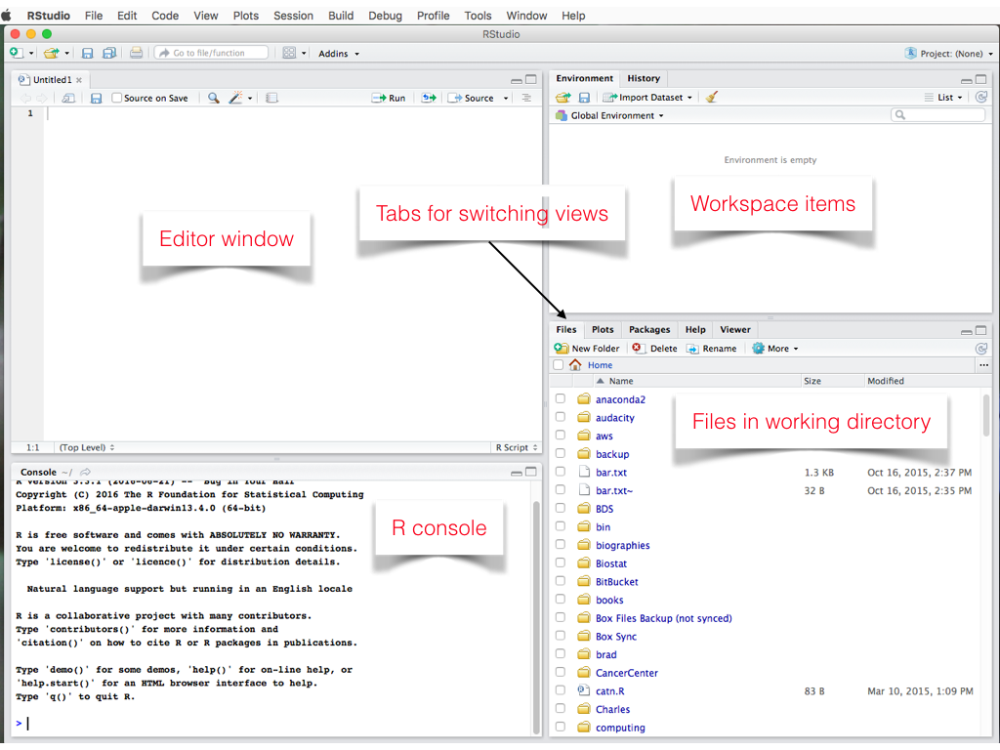
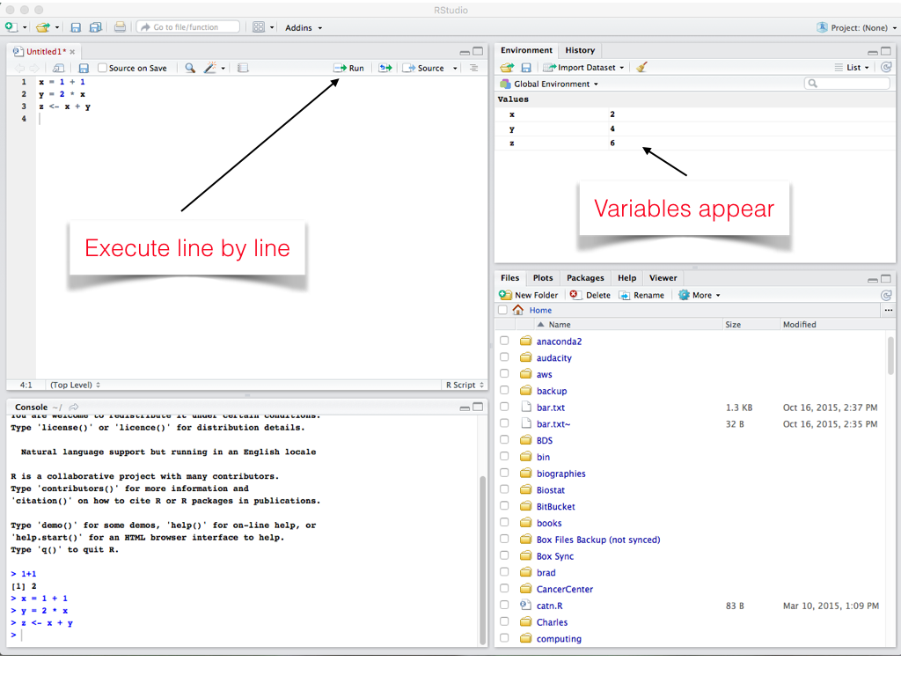
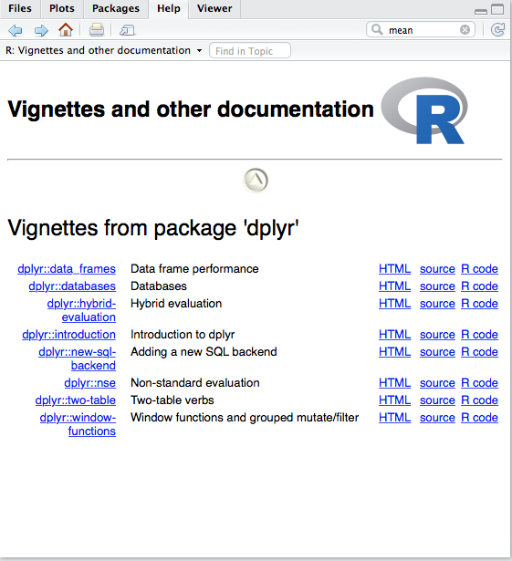
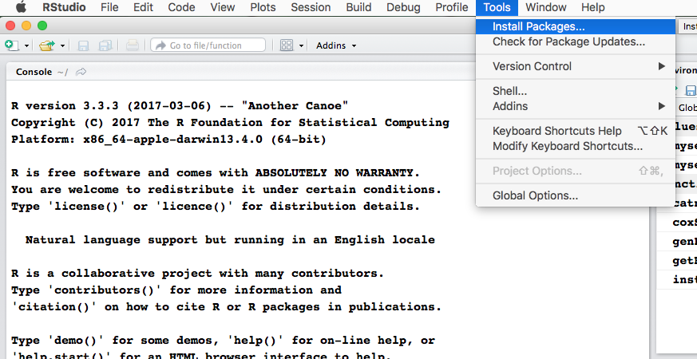
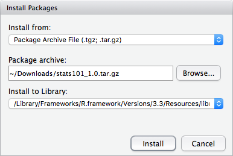
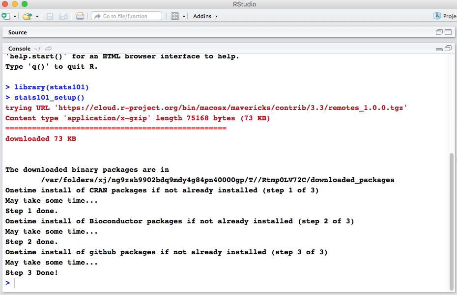
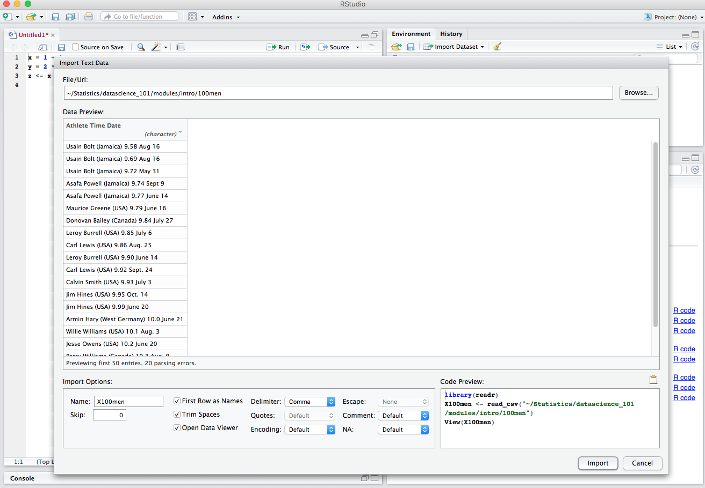
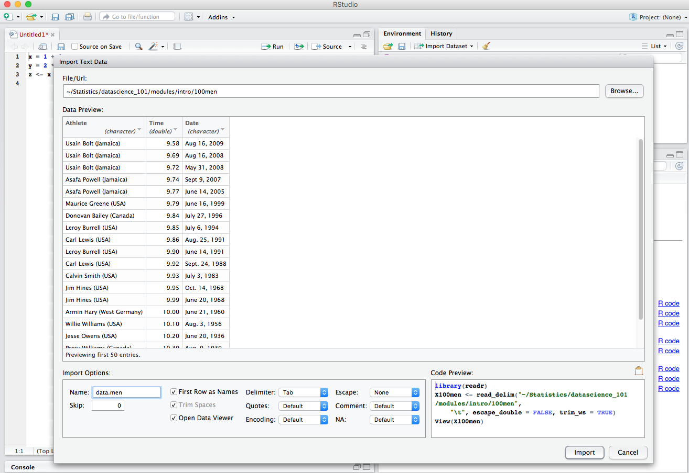
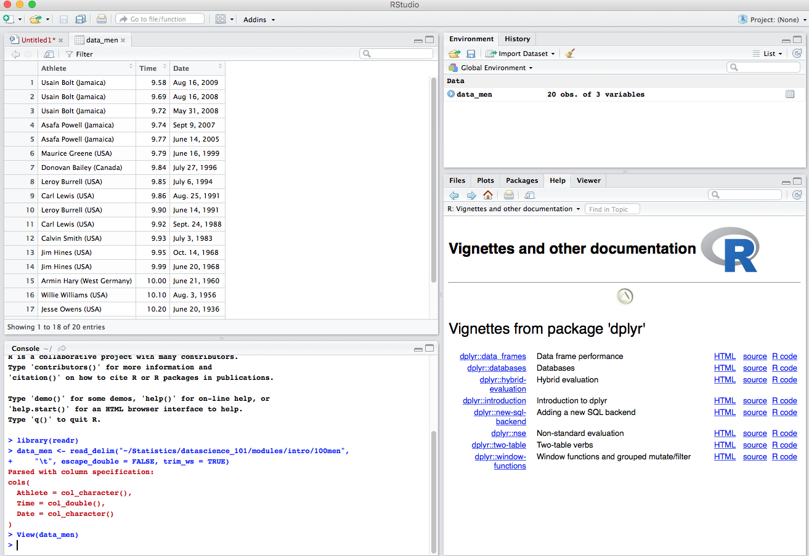

# Introduction to R, RStudio
Data Science Team  

# Introduction

In this class, we will be using the
[R language](https://www.r-project.org) heavily in class notes,
examples and lab exercises. R is free and you can install it like any
other program on your computer.

1. Go to the [CRAN](https://cloud.r-project.org/) website and download
   it for your Mac or PC. (We assume no one is using Linux; if you are
   that advanced, then you already know what to do!)

2. Install the free version of the
[RStudio](https://www.rstudio.com/products/rstudio/download/) Desktop
Software.

RStudio makes it very easy to learn and use R, providing a number of
useful features that many find indispensable.

## About the R language, briefly

If you are used to traditional computing languages, you will find R
different in many ways. The basic ideas behind R date back four
decades and have a strong flavor of exploration: one can grapple with
data, understand its structure, visualize it, summarize it
etc. Therefore, a common way people use R is by typing a command and
immediately see the results. (Of course, scripts can also be written
and fed to R for batch execution.)

The core of R itself is reasonably small, but over time, it has also
become a vehicle for researchers to disseminate new tools and
methodologies via packages. That is one reason for R's popularity:
there are thousands of packages (10,300+ as of this writing) that extend
R in many useful ways.

The [CRAN](https://cloud.r-project.org) website is something you
will consult frequently for both the software, documentation and
packages others have developed.


## RStudio

We can only cover some important aspects of RStudio here. There are
a number of resources online, including Youtube videos that you can
consult outside of class.

When you start RStudio, you will get a view similar to what is shown
below with perhaps slight differences.



One can type commands directly into the console window and see
results. For example, go ahead and type `1+1` to use R as a calculator
and see the result. However, one often wants to write a sequence of
commands, execute them and possibly save the commands to run them
again another time. That's what the editor window is for. You can type
a series of commands into the editor window and RStudio will offer to
save them when you quit, and bring them back when you restart RStudio.

If you type

```r
x = 1 + 1
y = 2 * x
z <- (x + y)
```
into the editor window, you can press the `Run` arrow shown and
execute each line in the R console, one by one. The figure below shows
this and as new variables are created, the workspace panel displays
them.




### Should I use `=` or `<-` for assignment?

In R, both `=` and `<-` can be used for assigning a value to
variables. The various instructors in this class have personal
preferences and so you will see both used.

### Help

A lot of help is available in RStudio in the help tab that you should
feel free to investigate. We merely point out a few.


When anyone installs R, there is a set of recommended packages that is
always installed. So your _installed packages_ will reflect that. As
we proceed, you will have to install many packages and that list will,
of course, grow.

### Installing Packages

There are world-wide R package repositories or Comprehensive R Archive
Network (CRAN) sites that allow packages to be downloaded and
installed. You almost never have to directly work with them since
RStudio makes it easy to install the packages as shown in the figure
below, where we have clicked on the __Packages__ tab and clicked on
the _Install_ button. Note how as you type the name of a package, you
get auto-completion. (In fact, RStudio provides auto-completion even
as you type R commands, showing you various options you can use for
the commands!)


#### Activity

At this point, you should go ahead and install the `dplyr`
package. Press all the buttons necessary to make the install happen.
After you have done the installation, go back to the __Help__ tab
where you can click on the _Installed Packages_ link shown in the
figure below.


####
Navigate to the `dplyr` link and click on it so that you get to the
help on the `dplyr` package. Two kinds of help are displayed:
_Documentation_ and _Help Pages_.


####
The _Help Pages_ document facilities that the package `dplyr` in
detail. The _Documentation_ is often more useful, because they can
contain user guides and _vignettes_ that are very useful for people
learning about the package. So click on the _User guides..._



####
Click on the _Introduction to dplyr_ vignette to see the vignette.


####
_Vignettes, when present, are indispenable in learning
about a package._ Not all packages provide vignettes, however!

#### Activity (to be done outside class)

This needs to be done only once for the entire course.

1. Download the
[stats101 package](https://canvas.stanford.edu/courses/64451/files/folder/Rmaterials/stats101_1.0-1.tar.gz). The
installation of this package is slightly different than the normal one
because this is a package created for this class and is not on CRAN.
Note that you do need to download it as a gzipped file. Your browser might automatically unzip-it (Safari does this if the box "Open safe files after downloading" is checked in the general preferences) and then you would run into errors

2. Install it. The following screenshots should help.

- 2a. Select _Install Packages..._ from the menu



- 2b. Select the _Install From_ as shown and browse to where you
downloaded the package; example is shown.



- 2c. Click _Install_ button and the installation should be displayed
along the lines shown.


- 2d. Finally, at the R console, type the following lines to install
  all the packages that will be used in this course.


```r
library(stats101)
stats101_setup()
```

A transcript of what happens is shown below. In the case below, the
packages were already mostly installed and so there was not much
activity. But a typical fresh install will take anywhere from 5 to 10
minutes. A good time for a cuppa.




### Workspace

As you use RStudio more, you will find yourself creating variables
(like `x`, `y`, `z` above, except far more valuable) and it is
desirable to save them. When you quit RStudio, you will be given a
choice of saving your workspace. It is worth doing so if you have
important things created.

RStudio also a notion of projects and so you can keep project
workspaces separate. Each such project can be designated a working
folder so that `x` from one workspace does not clobber `x` from
another. You can explore these options via the _File_ menu.

Later, we will see facilities to selectively save and restore some
specified objects in our workspace, but not all of them.

## The R Language, in some detail

Instead of giving a deep dive into R, we focus on details that we
expect to be of immediate use, filling in others as needed.

Like other computer languages, R has ways of naming things in the
language. Above, we used `x` as a name for the value 1 and `y` for the
value 2. The names have to follow some rules. It is sufficient to be
aware that they must start with an alphabetic character and can
contain periods and underscores. Also, for obvious reasons, space is
not permitted. (It is common to see names for variables such as
`male.cholesterol` or `male_cholesterol`!)

__Nomenclature__: R users tend to use the word _objects_ to refer to R
variables, functions, datasets, etc.

In R, all the action occurs via _functions_. You can think of
functions as code that takes some inputs and produces some
output. Even something as simple as


```r
1 + 2
```

```
## [1] 3
```
is computed via functions. The rich set of functions in R and the
thousands of R packages make it a very powerful tool for data
science.

There are various types of data structures in R.

### Vectors and Indexing

R can handle both numeric and non-numeric data. Non-numeric data
occurs commonly in the real world and sometimes needs to be cleaned up
and converted to numeric values.


```r
x <- c(1.0, 2)
x
```

```
## [1] 1 2
```

```r
typeof(x)
```

```
## [1] "double"
```


```r
y <- c("abc", "d", "e", 'fgh')
y
```

```
## [1] "abc" "d"   "e"   "fgh"
```

```r
typeof(y)
```

```
## [1] "character"
```


```r
z <- 1:5
z
```

```
## [1] 1 2 3 4 5
```

```r
typeof(z)
```

```
## [1] "integer"
```


```r
w <- c(TRUE, FALSE, TRUE, TRUE)
w
```

```
## [1]  TRUE FALSE  TRUE  TRUE
```

```r
typeof(w)
```

```
## [1] "logical"
```

The `c` stands for the _combine_ function and it creates a vector of
two numbers for `x` and a vector of four strings for `y`. Note how
both single and double quotes may be used (useful when we have quotes
within strings). For `z` we use a shortcut `1:5` for creating a
sequence of integers from 1 to 5. And finally, `w` is a logical
vector; R recognizes the symbols `TRUE` and `FALSE` as special
symbols; you cannot have a variable named `TRUE` for example! (The
`typeof` function is useful to understand basic underlying types.)

Character data can be treated differently in R, depending on the
context. An important notion is that of a _factor_, which is basically
a way of stating that variable has categorical semantics. Declaring a
variable as factor causes R to treat it in differently in certain
contexts, particularly model fitting. To create a factor, one uses the
`factor` function.


```r
gender <- factor(c("Male", "Female", "Female", "Male"))
gender
```

```
## [1] Male   Female Female Male  
## Levels: Female Male
```
Factors always print in a special way; above, there are two categories
or `Levels` for `gender` namely `Female` and `Male`. The variable
`gender` itself has four values the first and last being `Male`. The
unique categories represented by a factor variable can be queried
using the `levels` function:


```r
levels(gender)
```

```
## [1] "Female" "Male"
```
By default, the categories appear in _lexicographic_ order but can be
forced to be any other order.


Often, one needs to access a part, or a subset or a slice of a
vector. This is done by specifying indices indexing construct


```r
## The first element; indexing begins from 1
x[1]
```

```
## [1] 1
```

```r
## The third element of y
y[3]
```

```
## [1] "e"
```

```r
## The second to fourth element of z
z[2:4]
```

```
## [1] 2 3 4
```

```r
## The first and last element of y
y[c(1, length(y))]
```

```
## [1] "abc" "fgh"
```

```r
## The first and last gender
gender[c(1, length(gender))]
```

```
## [1] Male Male
## Levels: Female Male
```
Note the use of the function `length` that returns the length of `y`
(4 for us).

Nothing stops one from combining types.


```r
## Combine x and y into one
c(x, y)
```

```
## [1] "1"   "2"   "abc" "d"   "e"   "fgh"
```

Note, however, that the last combine operation silently coerces
everything to strings. This is because vectors contain _homogeneous_
elements. That seems limiting, because sometimes you may have both
types of data and you don't want to be converting things back and
forth.

Lists are versatile data structures that can grow or shrink and
contain heterogeneous data. They are constructed using the `list`
function:


```r
aList <- list(1, 2, list(1, 2, "abc"))
aList
```

```
## [[1]]
## [1] 1
## 
## [[2]]
## [1] 2
## 
## [[3]]
## [[3]][[1]]
## [1] 1
## 
## [[3]][[2]]
## [1] 2
## 
## [[3]][[3]]
## [1] "abc"
```
Note how a list prints differently. Individual elements of the list,
unlike the vectors above, are accessed using the double bracket
notation, suggested by the printing. Note also that there is no
coercion of types.


```r
## The second element
aList[[2]]
```

```
## [1] 2
```

```r
## The third element, which is itself a list!
aList[[3]]
```

```
## [[1]]
## [1] 1
## 
## [[2]]
## [1] 2
## 
## [[3]]
## [1] "abc"
```

```r
## The second element of the third element
aList[[3]][[2]]
```

```
## [1] 2
```

With lists, the single bracket indexing behaves differently from
double bracket indexing.


```r
aList[[2]]
```

```
## [1] 2
```

```r
aList[2]
```

```
## [[1]]
## [1] 2
```
The difference is clear from the way each is printed: the former is
just the second element of the list whereas the latter is another
list whose second element is from the original list.

The rule is simple: single bracket indexing returns the same type of
object.


```r
typeof(aList[[2]])
```

```
## [1] "double"
```

```r
typeof(aList[2])
```

```
## [1] "list"
```

Negative indexing is a convenient way to drop some elements from a
vector.


```r
## Drop the first element of x
x[-1]
```

```
## [1] 2
```

```r
## Drop the last element of y
y[-length(y)]
```

```
## [1] "abc" "d"   "e"
```

```r
## Drop the first and last element of aList
aList[c(-1, -length(aList))]
```

```
## [[1]]
## [1] 2
```

Mixing of negative and non-negative indices is not permitted.


```r
## This results in an error
y[c(-1, 3:4)]
```

```
## Error in y[c(-1, 3:4)]: only 0's may be mixed with negative subscripts
```

R also allows logical indexing:


```r
## Select y elements where w is TRUE
y[w]
```

```
## [1] "abc" "e"   "fgh"
```
will select the first, third and fourth elements and drop the
rest. Selecting elements based on conditions is very useful and we
will see further examples.

### Missing and null values

R has a notion of a missing value that can be used to indicate data is
missing for some cases, an all too real phenomenon. It is denoted by
`NA`.


```r
miss1 <- c(1.0, NA, 2.0)
2 * miss1
```

```
## [1]  2 NA  4
```
Notice how the last operation did the appropriate thing with the
missing value. It is extremely convenient to be able to use missing
values as you would any other object in R. But numerical computations
will have to provide hints on how to handle the missing values. For
example, the `mean` function computes the average of a set of numbers.


```r
## No hint to process missing values
mean(miss1)
```

```
## [1] NA
```

```r
## Remove missing values before processing
mean(miss1, na.rm = TRUE)
```

```
## [1] 1.5
```

Another value `NULL` is used to indicate _nothing is present_. Note
that it is semantically different from a missing value.


```r
NULL
```

```
## NULL
```

```r
## Combine nothing
c()
```

```
## NULL
```
One can check for missing-ness or nullity using the `is` family of
functions.


```r
is.null(c())
```

```
## [1] TRUE
```

```r
is.null(NA)
```

```
## [1] FALSE
```

```r
## This should produce a warning
is.na(c())
```

```
## Warning in is.na(c()): is.na() applied to non-(list or vector) of type
## 'NULL'
```

```
## logical(0)
```

```r
is.na(NA)
```

```
## [1] TRUE
```
There are many others: `is.numeric`, `is.list`, `is.vector`, etc.

### Arithmetic and logical operations

The standard operations are all available: `+`, `-`, `*`
(multiplication), `/` division. In R, when you perform arithmetic on
vectors, the operations happen on all elements.


```r
## Add two vectors
1:3 + 2:4
```

```
## [1] 3 5 7
```

```r
## Multiply a vector by 2
2 * 1:3
```

```
## [1] 2 4 6
```

```r
## Better to have parenthesis
2 * (1:3)
```

```
## [1] 2 4 6
```

```r
## Divide
c(2, 4, 6) / c(2, 4, 6)
```

```
## [1] 1 1 1
```

```r
## Halve
c(2, 4, 6) / 2
```

```
## [1] 1 2 3
```

```r
## R recycles shorter vector to match length
c(2, 4, 6, 8) / c(1, 2)
```

```
## [1] 2 2 6 4
```

```r
## Above is same as
c(2, 4, 6, 8) / c(1, 2, 1, 2)
```

```
## [1] 2 2 6 4
```

```r
## Warning, but not error below
c(2, 4, 6) / c(1, 2)
```

```
## Warning in c(2, 4, 6)/c(1, 2): longer object length is not a multiple of
## shorter object length
```

```
## [1] 2 2 6
```
The last operation shows how R tries to make two vectors conform in
length and provides a warning. _Good code avoids relying on such
behaviors as they can cause unpredictable errors._

The usual comparison operators are available: `==` for equality, `!=`
for not equal to, `>=` for greater than or equal to, etc.


```r
xx <- 1:3
xx == xx
```

```
## [1] TRUE TRUE TRUE
```

```r
## 1 is expanded to match length of xx
xx > 1
```

```
## [1] FALSE  TRUE  TRUE
```

Comparison operators can be used to select subsets of vectors.  Some
examples with the understanding that `a %% 2` returns the reminder
upon division of a by 2.


```r
xx <- 1:10
## Pick all numbers >= 5
xx[ xx >= 5]
```

```
## [1]  5  6  7  8  9 10
```

```r
## Pick even numbers from 1 to 10
xx[ xx %% 2 == 0]
```

```
## [1]  2  4  6  8 10
```

```r
## Pick odd numbers from 1 to 10
xx[ xx %% 2 != 0]
```

```
## [1] 1 3 5 7 9
```

### Coercion

We saw above that some functions, can silently coerce the results to
something meaningful. In many case, such coercions can be useful.

How many even numbers between 1 and 10?


```r
xx <- 1:10
xx %% 2 == 0
```

```
##  [1] FALSE  TRUE FALSE  TRUE FALSE  TRUE FALSE  TRUE FALSE  TRUE
```

```r
sum(xx %% 2 == 0)
```

```
## [1] 5
```
Here `xx %% 2 == 0` is a list of 10 logical values with `TRUE`
wherever we have an even number. The function `sum` converts `TRUE`
values to 1 and `FALSE` values to 0 and results to provide the answer.

R usually coerces the results where possible to the type that can
accomodate the result. If it cannot, it signals an error.

There are many explicit coercion functions such as `as.numeric`,
`as.integer`, as`as.list`.


```r
xx <- 1:5
as.integer(xx %% 2 == 0)
```

```
## [1] 0 1 0 1 0
```

```r
as.character(xx)
```

```
## [1] "1" "2" "3" "4" "5"
```

```r
as.list(xx)
```

```
## [[1]]
## [1] 1
## 
## [[2]]
## [1] 2
## 
## [[3]]
## [1] 3
## 
## [[4]]
## [1] 4
## 
## [[5]]
## [1] 5
```

Although we have not discussed dates and times, the function `as.Date`
will convert a character string to a date object. It needs a hint as
to the date format and assumes an international format (more below)
for dates by default.


```r
## February date is wrong, just to illustrate
as.Date(c("2016-06-15", "2016-02-30"))
```

```
## [1] "2016-06-15" NA
```

```r
as.Date("9/27/2016", format = "%m/%d/%Y")
```

```
## [1] "2016-09-27"
```

```r
Sys.timezone()
```

```
## [1] "America/Los_Angeles"
```
The last function returns the current time zone. (Using zone
information automatically takes daylight savings time in arithmetic!)

Coercion functions are useful when processing external data for
computational work.

### Dates and Times

Dates and times occur often in data and R is well-equipped to handle
them. There are functions in base R (`strptime`, coercion functions
`as.Date`, `as.POSIXlt`) that can convert from strings to date-time
objects and vice-versa. These often require a format string that
specifies how the way the date is formatted, something that can vary
all the time. The exact details of the format string (`%m` for month,
`%d` for day, `%Y` for year including century, etc.) are described in
the documentation for the `strptime` function.

For this class, we recommend the package `lubridate` as it offers many
convenient functions for arithmetic with dates. The vignette for the
package is a good introduction, and we merely provide a few quick
examples.


```r
library(lubridate)
```

```
## 
## Attaching package: 'lubridate'
```

```
## The following object is masked from 'package:base':
## 
##     date
```

```r
ymd(c("20160927", "20160230"))
```

```
## Warning: 1 failed to parse.
```

```
## [1] "2016-09-27" NA
```

```r
mdy(c("6/12/16", "2/9/16"))
```

```
## [1] "2016-06-12" "2016-02-09"
```

```r
dmy(c("1/9/2016", "26/9/16"))
```

```
## [1] "2016-09-01" "2016-09-26"
```

```r
parse_date_time("9/27/2016 10:30:00",
                orders = "%m/%d/%y %H:%M:%S",
                tz = Sys.timezone())
```

```
## [1] "2016-09-27 10:30:00 PDT"
```
The format string used by `lubridate` is described in detail in the
documentation/help for the function `parse_date_time`.


### Naming

R allows one to add _names_ to objects.


```r
named_x <- c(a = 1.02, b = 2, 3)
named_x
```

```
##    a    b      
## 1.02 2.00 3.00
```
Above, only two of the three elements were named. This makes the third
element have an empty name. The function `names` allows one to
retrieve the names of an object.


```r
names(named_x)
```

```
## [1] "a" "b" ""
```
The naming facility allows one to access elements of vectors using
names rather than indices.


```r
## Equivalent to named_x[2]
named_x["b"]
```

```
## b 
## 2
```

```r
## Equivalent to named_x[1:2]
named_x[c("a", "b")]
```

```
##    a    b 
## 1.02 2.00
```

Naming is an extremely useful tool in writing readable code. One might
worry about a performance penalty but it is negligible in most cases
and the gains in readability far outweigh any inefficiencies.

Naming works for lists too.


```r
named_list <- list(x = x, y = y, zed = z)
named_list[c("x", "zed")]
```

```
## $x
## [1] 1 2
## 
## $zed
## [1] 1 2 3 4 5
```

With lists, the individual _elements_ can also be accessed using the
_dollar_ (`$`) notation.


```r
named_list$zed
```

```
## [1] 1 2 3 4 5
```

Much of R code and functions exploit naming; many functions return
more than one value and they are often stuffed into a named vector or
list.


```r
aSummary <- summary(1:10)
aSummary
```

```
##    Min. 1st Qu.  Median    Mean 3rd Qu.    Max. 
##    1.00    3.25    5.50    5.50    7.75   10.00
```

```r
names(aSummary)
```

```
## [1] "Min."    "1st Qu." "Median"  "Mean"    "3rd Qu." "Max."
```

```r
typeof(aSummary)
```

```
## [1] "double"
```

```r
aSummary["Median"]
```

```
## Median 
##    5.5
```


### Matrices

The function `matrix` can be used for creating matrices which are
two-dimensional arrays.


```r
## Create a 3 by 2 matrix.
m <- matrix(1:6, nrow = 3)
m
```

```
##      [,1] [,2]
## [1,]    1    4
## [2,]    2    5
## [3,]    3    6
```

Another way is to use existing vectors to _bind_ into a matrix.

```r
xx <- 1:3
yy <- 4:6
## Bind by columns
m2 <- cbind(xx, yy)
## Bind by rows
rbind(xx, yy)
```

```
##    [,1] [,2] [,3]
## xx    1    2    3
## yy    4    5    6
```

The matrix `m2` has the same content as `m` above, but the columns
have names `xx` and `yy` which can be used in subsetting indexing again.


```r
## Access element in row 1, column 2
m[1, 2]
```

```
## [1] 4
```

```r
## Access second column
m[ , 2]
```

```
## [1] 4 5 6
```

```r
## Do the same with matrix m2
m2[, "yy"]
```

```
## [1] 4 5 6
```

```r
## Access the third row of m
m[3, ]
```

```
## [1] 3 6
```

### Datasets

R comes with many datasets built in. These are part of the `datasets`
package that is always loaded in R. For example, the `mtcars` dataset
is a well-known dataset from Motor Trend magazine, documenting fuel
consumption and vehicle characteristics for a number of vehicles. At
the R console, typing `mtcars` will print the entire dataset.

You can find help on datasets as usual using the _Help_ tab in
RStudio, clicking on the `Packages` link and navigating to the
`datasets` package.

### Import data

To do any real work, one has to load data from an external
source. RStudio makes it easy to import data.

Consider the data set that will be used in Lab 2, which is the 100m
times for men and women. We will illustrate importing this data set,
step by step.

#### Step 1

From the _Import Dataset_ menu, select _From CSV_ to get a dialog as
shown below and navigate to the folder containing the `100men` file.


Note that the import dialog has a number of options and on the right
buttom it shows a preview of the code that will be used to import the
data. If one cut and pasted the code into the R console, the result
would be the same as what one would get via the dialogs.

RStudio also take care to name the variable that will hold data
according R conventions using `X100men`!

#### Step 2

When you open the file, RStudio shows a preview of the data in the
viewer window.



This is of course not what we want since a cursory inspection shows
that the data appears to contain three columns. So obviously, we have
specified something wrong.

#### Step 3

In the _Import Options_ panel, change the delimeter to `Tab` and while
we are at it, change the name to `data.men`.  Notice how the code
preview reflects changes made to these options.



#### Step 4

Press the _Import_ button to get the data into R.



The result of the import is a variable called `data.men` that contains
the data. Data formatted this way (either tab-delimeted, or
comma-separated, or spread-sheet like) is so common that R has a
abstraction for it: the _data frame_. You will have more opportunity
to learn about data frames in the data parts of the course.

#### Avoiding dialogs

As one becomes more and more familiar with R, direct code becomes
preferable to the slower interactive dialogs. This is one reason that
RStudio gives you the code preview, to aid in your learning
process. So, to get the same effect as the above dialog process did,
one could have pasted the RStudio code into an R console to get the
same result.


```r
library(readr)
data.men <- read_delim("data/100men", "\t", escape_double = FALSE, trim_ws = TRUE)
```

```
## Parsed with column specification:
## cols(
##   Athlete = col_character(),
##   Nation = col_character(),
##   Time = col_double(),
##   Date = col_date(format = "")
## )
```

That would create the same data set.

With more complex structures like data frames, the function `str` (for
structure) is a good way to examine them.


```r
str(data.men)
```

```
## Classes 'tbl_df', 'tbl' and 'data.frame':	20 obs. of  4 variables:
##  $ Athlete: chr  "Usain Bolt" "Usain Bolt" "Usain Bolt" "Asafa Powell" ...
##  $ Nation : chr  "Jamaica" "Jamaica" "Jamaica" "Jamaica" ...
##  $ Time   : num  9.58 9.69 9.72 9.74 9.77 9.79 9.84 9.85 9.86 9.9 ...
##  $ Date   : Date, format: "2009-08-16" "2008-08-16" ...
##  - attr(*, "spec")=List of 2
##   ..$ cols   :List of 4
##   .. ..$ Athlete: list()
##   .. .. ..- attr(*, "class")= chr  "collector_character" "collector"
##   .. ..$ Nation : list()
##   .. .. ..- attr(*, "class")= chr  "collector_character" "collector"
##   .. ..$ Time   : list()
##   .. .. ..- attr(*, "class")= chr  "collector_double" "collector"
##   .. ..$ Date   :List of 1
##   .. .. ..$ format: chr ""
##   .. .. ..- attr(*, "class")= chr  "collector_date" "collector"
##   ..$ default: list()
##   .. ..- attr(*, "class")= chr  "collector_guess" "collector"
##   ..- attr(*, "class")= chr "col_spec"
```
We see that the data consists of 20 observations on 3 variables:
`Athlete`, `Time`, `Date`. The second is numeric while the others are
character.


#### More on data import

RStudio provides ways to import data directly from spreadsheets like
Excel, etc. You can explore these options on your own.

RStudio makes use of some packages to import data, notably the `readr`
package. Strictly speaking these packages are not necessary for the
job, but such packages include improvements that make them
attractive. For example, a vanilla installation of R provides
functions like `read.csv` and `read.delim` (analogous to `read_csv`,
`read_delim`) that can also be used. However, by default, these
functions perform some conversions, treating character variables as
factors, for example. That can be troublesome (and computationally
expensive) when dealing with large data sets. In this class, some
instructors may use these vanilla R functions with various options to
control the behavior.

### Graphs and Plots

Graphing/plotting are among the great strengths of R. There are
two main  main approaches that are common in building graphs and
plots.

1. Using basic functions provided by R itself via the `graphics`
package which has a number of standard facilities. A quick way to
familiarize yourself with base graphics is to type the command
`demo(graphics)` at the R console to see its capabilities.

2. Using a package like `ggplot2`, which requires a more nuanced
   understanding of a graphics object. You will have to install this
   package. `ggplot2` implements a grammar of graphics and so takes a
   bit more work to use, but is quite powerful.

Both approaches allow for step-by-step building up of complex plots,
and creating PDFs or images that can be included in other documents.
Although `ggplot2` is becoming more popular, many packages may not use
`ggplot2` for plotting. Furthermore, some special plots created by
packages may use one of base graphics or `ggplot2` and so there isn't
a ready made equivalent in the other, although it can be constructed
with extra work. So you will see both bae graphics and `ggplot2` used
in this course.

For ease of use, `ggplot2` provides a function called `qplot` that can
emulate the base graphics `plot` function capabilities. This offers a
quick way to begin using `ggplot2`, initially.


|Description |Base Graphics | `ggplot2`|
|------------|--------------|----------|
|Plot `y` versus `x` using points| `plot(x, y)`| `qplot(x, y)`|
|Plot `y` versus `x` using lines | `plot(x, y, type = "l")`|`qplot(x,
|y, geom = "line")`|
|Plot `y` versus `x` using both points and lines | `plot(x, y, type =
|"b")`|`qplot(x, y, geom = c("point", "line"))`|
|Boxplot of `x`| `boxplot(x)`| `qplot(x, geom = "boxplot")`|
|Side-by-side boxplot of `x` and `y`| `boxplot(x, y)`| `qplot(x, y, geom = "boxplot")`|
|Histogram of `x`| `hist(x)`| `qplot(x, geom = "histogram")`|


#### Examples

It is a good idea to try out the functions using the `example`
function. At the R console type,


```r
example(plot)
```
to see the `plot` examples.

For `ggplot2`, you will have to load the library first and then use
`example`.


```r
library(ggplot2)
example(qplot)
```
