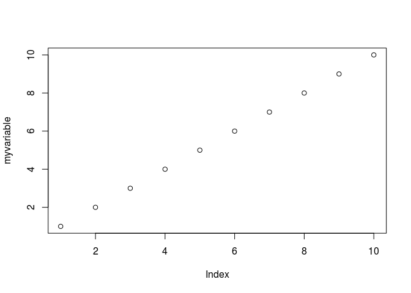
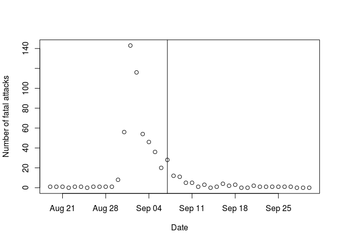
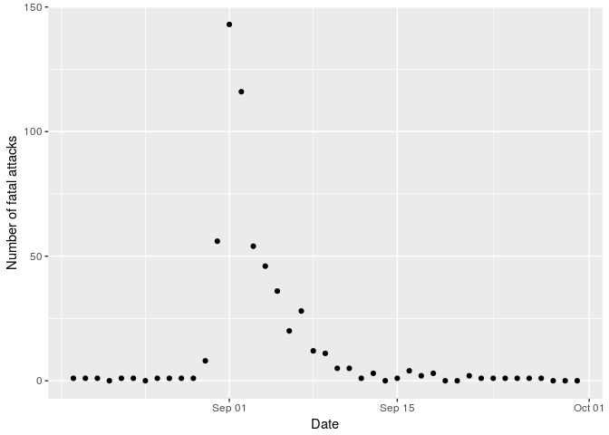
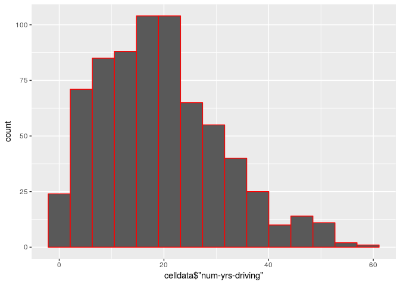
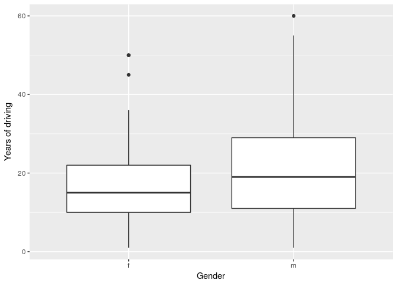
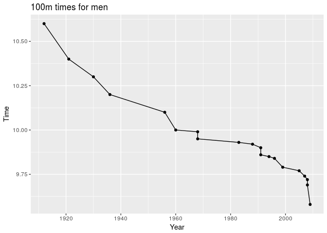
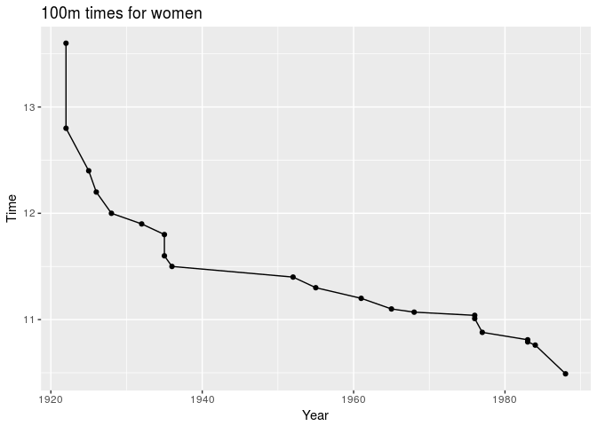
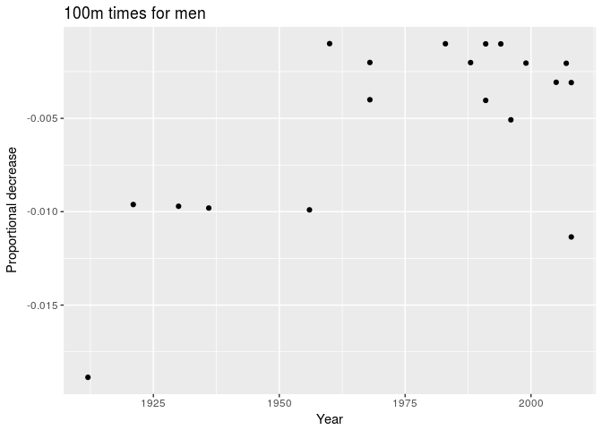
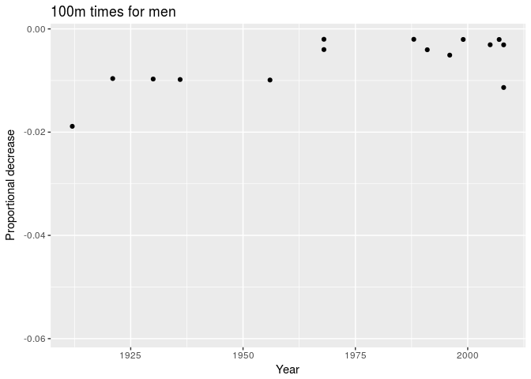

# A First Experience with R and Rstudio
Data Science Team  

### R and R studio

- R is a language for data analysis and computing

- R studio is an "enviroment" that makes the use of R easier

- It can be confusing at first because you need to get familiar both with R and the new environment, but overall it actually should make your life easier 

### Prompt line execution vs Rmd files

- R is an **interactive** language: you do not need to run a script, submit it and wait for answer

- The best way to familiarize oneself with this is to use the **Console** in Rstudio

- Let's start creating a variable


```r
myvariable<-c(1:10)
```

- And plot it

```r
plot (myvariable)
```

<!-- -->

- Note that it is useful to use the **zoom** button 

- To understand which commands to use, and to develop an analysis approach it is often most useful to work on the console.

- On the other hand, it is useful to be able to keep track of commands, so that we could re-run them another time

- And to annotate what one is trying to do, so that the receord is meaningful for everyone.

- This is where the Rmd files come in 

- You can find documentation on Rmd [here](https://www.rstudio.com/wp-content/uploads/2015/02/rmarkdown-cheatsheet.pdf)

- Let's also open the file MyRMarkDown.Rmd

- This file is written in .Rmd

- We will provide .Rmd files for all labs

- In class, however, we will often use Console, to do interactive work.

- Our lectures are also written in .Rmd. When lectures contain significant ammounts of R commands that are not echoed, we will also make available those markdown files

### Outbreak data

We are using these to compare the native R commands and the commands that are redefined in a number of packages developed by the same group that developed Rstudio.

- The native R commands have more intuitive names

- Their syntax is simpler

- The "Rstudio" commands make it easier to carry out a number of tasks that one encounter in data analysis, so that they are often preferred in "data science" environments

- Navigating between the two type of commands can be confusing, but at least at the beginning it is important to orient oneself.

#### We start with the native R commands.


```r
snow1<-read.csv("./data/snow.csv")
snow1$Date<-as.Date(snow1$Date)
plot(snow1$Date,snow1$Case,ylab="Number of fatal attacks",xlab="Date")
abline(v=as.Date("1854-09-07"))
```

<!-- -->

#### "Rstudio commands"

The "Rstudio commands" are what you can get from the functionality of Rstudio. For example, using the "Import Dataset" button, you can see the following commands.


```r
library(readr)
library(ggplot2)
snow1<-read_csv("./data/snow.csv",col_types = cols(Date = col_date(format = "%Y-%m-%d")))
qplot(x=snow1$Date,y=snow1$Case,ylab="Number of fatal attacks",xlab="Date") 
```

```
## Warning: Removed 1 rows containing missing values (geom_point).
```

<!-- -->


### Cell Phone Data

Here we will read in the data from the cell phone/car collision study of
Redelmeier and Tibshirani (1997) , and do some simple analyses in R.
For confidentiality,  some of the data have been randomly perturbed.
However the first 4 variables are untouched.


#### Let's read in the data.
First we see what happens with the "native" R functions


```r
celldata = read.csv("./data/celldataNew.csv")
names(celldata)
```

```
##  [1] "RowNumber"       "dayof.on"        "dayof.noton"    
##  [4] "daybef.on"       "daybef.noton"    "gender"         
##  [7] "HS"              "type.of.job"     "num.yrs.driving"
## [10] "cell.tel.exp"    "type.of.cell"    "Location"
```

```r
summary(celldata)
```

```
##    RowNumber        dayof.on       dayof.noton       daybef.on      
##  Min.   :  1.0   Min.   :0.0000   Min.   :0.0000   Min.   :0.00000  
##  1st Qu.:175.5   1st Qu.:0.0000   1st Qu.:1.0000   1st Qu.:0.00000  
##  Median :350.0   Median :0.0000   Median :1.0000   Median :0.00000  
##  Mean   :350.0   Mean   :0.2432   Mean   :0.7568   Mean   :0.05293  
##  3rd Qu.:524.5   3rd Qu.:0.0000   3rd Qu.:1.0000   3rd Qu.:0.00000  
##  Max.   :699.0   Max.   :1.0000   Max.   :1.0000   Max.   :1.00000  
##   daybef.noton    gender    HS       type.of.job  num.yrs.driving
##  Min.   :0.0000   f:205   no : 87   nonprof:530   Min.   : 1.00  
##  1st Qu.:1.0000   m:494   yes:612   prof   :169   1st Qu.:10.00  
##  Median :1.0000                                   Median :18.00  
##  Mean   :0.9471                                   Mean   :19.22  
##  3rd Qu.:1.0000                                   3rd Qu.:26.00  
##  Max.   :1.0000                                   Max.   :60.00  
##  cell.tel.exp    type.of.cell      Location  
##  1  :229      handheld :150   highspeed:590  
##  2  :  2      handsfree:549   lowspeed :109  
##  2-3:171                                     
##  4-5:154                                     
##  5  :  1                                     
##  >6 :142
```

We can see that 

- the names get modified slighlty, to avoid using a reserved character "-", 

- different variables are interpreted as numerical or factors


Now let's try with the "Rstudio-type" commands


```r
celldata = read_csv("./data/celldataNew.csv")
```

```
## Parsed with column specification:
## cols(
##   RowNumber = col_integer(),
##   `dayof-on` = col_integer(),
##   `dayof-noton` = col_integer(),
##   `daybef-on` = col_integer(),
##   `daybef-noton` = col_integer(),
##   gender = col_character(),
##   HS = col_character(),
##   `type-of-job` = col_character(),
##   `num-yrs-driving` = col_integer(),
##   `cell-tel-exp` = col_character(),
##   `type-of-cell` = col_character(),
##   Location = col_character()
## )
```

```r
names(celldata)
```

```
##  [1] "RowNumber"       "dayof-on"        "dayof-noton"    
##  [4] "daybef-on"       "daybef-noton"    "gender"         
##  [7] "HS"              "type-of-job"     "num-yrs-driving"
## [10] "cell-tel-exp"    "type-of-cell"    "Location"
```

```r
summary(celldata)
```

```
##    RowNumber        dayof-on       dayof-noton       daybef-on      
##  Min.   :  1.0   Min.   :0.0000   Min.   :0.0000   Min.   :0.00000  
##  1st Qu.:175.5   1st Qu.:0.0000   1st Qu.:1.0000   1st Qu.:0.00000  
##  Median :350.0   Median :0.0000   Median :1.0000   Median :0.00000  
##  Mean   :350.0   Mean   :0.2432   Mean   :0.7568   Mean   :0.05293  
##  3rd Qu.:524.5   3rd Qu.:0.0000   3rd Qu.:1.0000   3rd Qu.:0.00000  
##  Max.   :699.0   Max.   :1.0000   Max.   :1.0000   Max.   :1.00000  
##   daybef-noton       gender               HS            type-of-job       
##  Min.   :0.0000   Length:699         Length:699         Length:699        
##  1st Qu.:1.0000   Class :character   Class :character   Class :character  
##  Median :1.0000   Mode  :character   Mode  :character   Mode  :character  
##  Mean   :0.9471                                                           
##  3rd Qu.:1.0000                                                           
##  Max.   :1.0000                                                           
##  num-yrs-driving cell-tel-exp       type-of-cell         Location        
##  Min.   : 1.00   Length:699         Length:699         Length:699        
##  1st Qu.:10.00   Class :character   Class :character   Class :character  
##  Median :18.00   Mode  :character   Mode  :character   Mode  :character  
##  Mean   :19.22                                                           
##  3rd Qu.:26.00                                                           
##  Max.   :60.00
```
We can see that

- Names are left as such

- There is an explicit declaration of what type each of the variables are

- The default interpretation has much more character than factors, so that we would do better modifying it.


We can compute the dimensions of data table


```r
dim(celldata)
```

```
## [1] 699  12
```
Note that when the data is read in, it is converted to a type of object called a dataframe.
This is a convenient block form for data, that allows us to index the rows and columns
easily

```r
is.data.frame(celldata)
```

```
## [1] TRUE
```
Other important kinds of objects include vectors, matrices and lists.
In "Rstudio commands", we actually have created a "tibble," which is just mostly just like a data frame. Here are some other useful things to do when you load a new dataset, to understand what type of data you have.

Print out first few lines of data


```r
celldata[1:2, ]
```

```
## # A tibble: 2 × 12
##   RowNumber `dayof-on` `dayof-noton` `daybef-on` `daybef-noton` gender
##       <int>      <int>         <int>       <int>          <int>  <chr>
## 1         1          1             0           0              1      m
## 2         2          1             0           0              1      m
## # ... with 6 more variables: HS <chr>, `type-of-job` <chr>,
## #   `num-yrs-driving` <int>, `cell-tel-exp` <chr>, `type-of-cell` <chr>,
## #   Location <chr>
```

Look at the first variable

```r
table(celldata$"dayof-on")
```

```
## 
##   0   1 
## 529 170
```
#### Compute histogram of number of years of driving

```r
qplot(celldata$"num-yrs-driving", geom = "histogram", color = I("red"), bins = 15)
```

<!-- -->
_Note_: The color `I("red")` specification shows the bar boundaries,
using mere `color = "red"` will also work, but provide a legend that
we don't need. This is a detail relating to how `ggplot2` works.

#### Make boxplots for  number of years of driving by gender
Note that celldata[,"num-yrs-driving"] and celldata$"num-yrs-driving" are almost equivalent. The first will return a data frame with one variable, while the second a vector of values.


```r
qplot(x = celldata$gender, y = celldata$"num-yrs-driving", geom = "boxplot",xlab="Gender",ylab="Years of driving")
```

<!-- -->


#### Main result, without accounting for "intermittent driving"


  Results| Day before/On Phone | Day before/Not on phone
--- | --- | ---
Day of collision: On phone   | 13 | 157
Day of collision: not on phone  | 24 | 505


```r
table(celldata$"daybef-on", celldata$"dayof-on")
```

```
##    
##       0   1
##   0 505 157
##   1  24  13
```

Now let's define a function to compute the relative risk

```r
relRisk = function(celldata) {
    n1 = sum(celldata[, "dayof-on"] == 0  & celldata[,"daybef-on"] == 1)
    n2 = sum(celldata[, "dayof-on"] == 1  & celldata[,"daybef-on"] == 0)
    out = n2 / n1
    return(out)
}
```
And let's try it out on different portions of the dataset. We start with the entire data:


```r
relRisk(celldata)
```

```
## [1] 6.541667
```

Then restrict to different speeds

```r
hi = celldata[, "Location"] == "highspeed"
relRisk(celldata[hi, ])
```

```
## [1] 8.058824
```

```r
low = celldata[, "Location"] == "lowspeed"
relRisk(celldata[low, ])
```

```
## [1] 2.857143
```


### 100m Sprint Data

Here we will analyze data on men's and women's world records for the 100m sprint.


#### Let's read in the data on men


```r
library(readr)
data.men = read_delim("./data/100men", 
    "\t", escape_double = FALSE, col_types = cols(Date = col_date(format = "%Y-%m-%d")), 
    trim_ws = TRUE)
data.men
```

```
## # A tibble: 20 × 4
##              Athlete       Nation  Time       Date
##                <chr>        <chr> <dbl>     <date>
## 1         Usain Bolt      Jamaica  9.58 2009-08-16
## 2         Usain Bolt      Jamaica  9.69 2008-08-16
## 3         Usain Bolt      Jamaica  9.72 2008-05-31
## 4       Asafa Powell      Jamaica  9.74 2007-09-09
## 5       Asafa Powell      Jamaica  9.77 2005-06-14
## 6     Maurice Greene          USA  9.79 1999-06-16
## 7     Donovan Bailey       Canada  9.84 1996-07-27
## 8      Leroy Burrell          USA  9.85 1994-07-06
## 9         Carl Lewis          USA  9.86 1991-08-25
## 10     Leroy Burrell          USA  9.90 1991-06-14
## 11        Carl Lewis          USA  9.92 1988-09-24
## 12      Calvin Smith          USA  9.93 1983-07-03
## 13         Jim Hines          USA  9.95 1968-10-14
## 14         Jim Hines          USA  9.99 1968-06-20
## 15        Armin Hary West Germany 10.00 1960-06-21
## 16   Willie Williams          USA 10.10 1956-08-03
## 17       Jesse Owens          USA 10.20 1936-06-20
## 18    Percy Williams       Canada 10.30 1930-08-09
## 19   Charles Paddock          USA 10.40 1921-04-23
## 20 Donald Lippincott          USA 10.60 1912-07-06
```
#### Let's read in the data on women


```r
data.women<- read_delim("./data/100women", 
    "\t", escape_double = FALSE, col_types = cols(Date = col_date(format = "%B %d, %Y")), 
    trim_ws = TRUE)
```

#### Extract numerical times and years


```r
time.men = data.men$Time
date.men = data.men$Date
time.men
```

```
##  [1]  9.58  9.69  9.72  9.74  9.77  9.79  9.84  9.85  9.86  9.90  9.92
## [12]  9.93  9.95  9.99 10.00 10.10 10.20 10.30 10.40 10.60
```

```r
year.men =as.numeric(format(date.men,'%Y'))

time.women = data.women$Time
date.women = data.women$Date
year.women = as.numeric(format(date.women,'%Y'))
time.women
```

```
##  [1] 13.60 12.80 12.40 12.20 12.00 11.90 11.80 11.60 11.50 11.40 11.30
## [12] 11.20 11.10 11.07 11.04 11.01 10.88 10.81 10.79 10.76 10.49
```

```r
year.women
```

```
##  [1] 1922 1922 1925 1926 1928 1932 1935 1935 1936 1952 1955 1961 1965 1968
## [15] 1976 1976 1977 1983 1983 1984 1988
```

Reverse order of men's data, to be most recent last (as in women)

```r
year.men = rev(year.men)
time.men = rev(time.men)
```

#### Plot data

```r
library(ggplot2)
qplot(x = year.men, y = time.men,
      geom = c("point", "line"),
      xlab = "Year", ylab = "Time",
      main = "100m times for men")
```

<!-- -->


```r
qplot(x = year.women, y = time.women,
      geom = c("point", "line"),
      xlab = "Year", ylab = "Time",
      main = "100m times for women")
```

<!-- -->


#### Compute and plot  proportional decreases in time for each record

```r
prop.dec.men = diff(time.men) / time.men[-length(time.men)]

qplot(x = year.men[-length(year.men)], y = prop.dec.men,
      xlab = "Year", ylab = "Proportional decrease",
      main = "100m times for men")
```

<!-- -->


```r
prop.dec.women = diff(time.women) / time.women[-length(time.women)]
qplot(x = year.women[-length(year.women)], y = prop.dec.women,
      xlab = "Year", ylab = "Proportional decrease",
      main = "100m times for women")
```

<!-- -->

 Let's plot the men with the same vertical range as women, to make comparison easier


```r
qplot(x = year.men[-length(year.men)], y = prop.dec.men,
      xlab = "Year", ylab = "Proportional decrease",
      ylim = range(prop.dec.women),
      main = "100m times for men")
```

```
## Warning: Removed 4 rows containing missing values (geom_point).
```

<!-- -->


