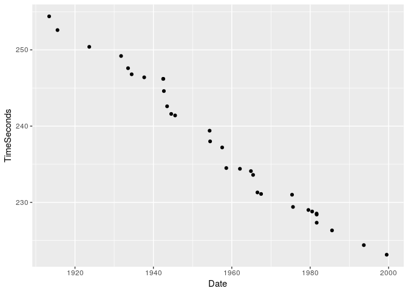

# Parsing complicated time data
JEJ  
April 6, 2016  

## Parsing milemen data

read the data. This is a **tab-delimited** text file, so we use `read_tsv` from `readr`


```r
require('tidyverse')
```

```
## Loading required package: tidyverse
```

```
## Loading tidyverse: ggplot2
## Loading tidyverse: tibble
## Loading tidyverse: tidyr
## Loading tidyverse: readr
## Loading tidyverse: purrr
## Loading tidyverse: dplyr
```

```
## Conflicts with tidy packages ----------------------------------------------
```

```
## filter(): dplyr, stats
## lag():    dplyr, stats
```

```r
format.dates <- "%d %B %Y"
# put the path to your "milemen" file here
milemen <- read_tsv(file="/home/james/Documents/GitHub/datascience_101/sandbox/jej/Week01/Week01/data/milemen",
                    col_types = cols(Time=col_character(),Date=col_datetime(format=format.dates)))
```

The time formats differ in that some of them recorded in tenths of a second and others in hundredths.
So we do this in two pieces


```r
time.str <- milemen$Time
len.tm <- nchar(time.str)
is.hundredths <- len.tm==max(len.tm)
```

First we read the ones in tenths.


```r
options(digits.secs=1) # set it to expect one digit past the decimal
tmp1 <- strptime(milemen$Time[!is.hundredths],"%M:%OS")
time.in.seconds1 <- as.numeric(strftime(tmp1,"%OS"))+60*as.numeric(strftime(tmp1,"%M"))
```

Now the ones with data recorded in hudredths.


```r
options(digits.secs=2) # change to two digits past the decimal
tmp2 <- strptime(milemen$Time[is.hundredths],"%M:%OS")
time.in.seconds2 <- as.numeric(strftime(tmp2,"%OS"))+60*as.numeric(strftime(tmp2,"%M"))
```

Assemble into a vector and store in the tibble. Plot the record vs. date.


```r
time.in.seconds <- c(time.in.seconds1,time.in.seconds2)
milemen <- milemen %>% mutate(TimeSeconds=time.in.seconds)
ggplot(milemen,aes(x=Date,y=TimeSeconds))+geom_point()
```

<!-- -->

